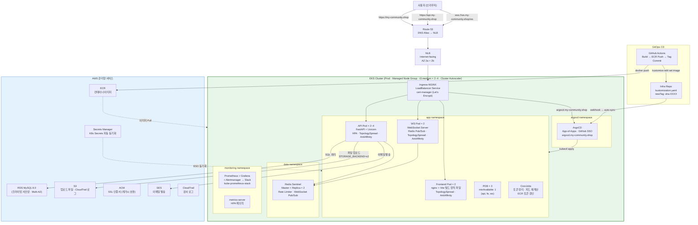
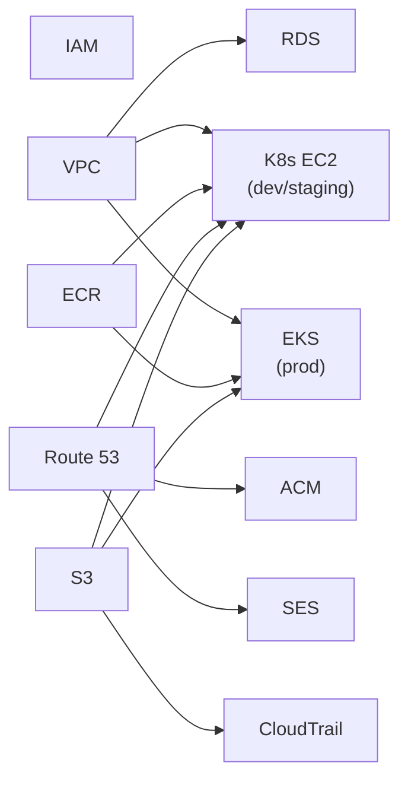
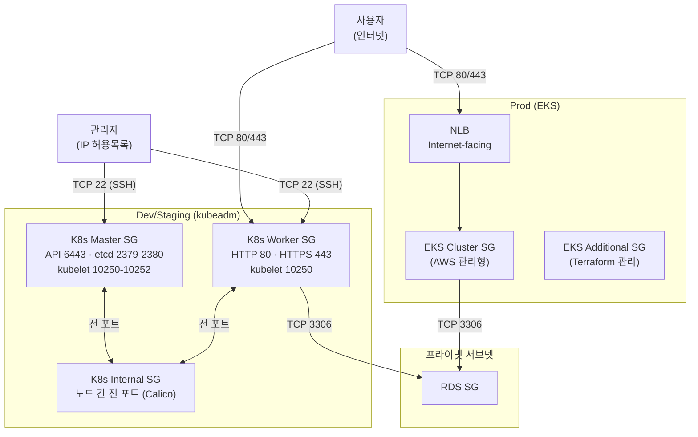

# 2-cho-community-infra

커뮤니티 포럼 **"Camp Linux"**의 AWS 인프라를 Terraform으로 관리하는 저장소입니다.

12개의 활성 Terraform 모듈 + 1개 부트스트랩으로 구성되며, 3개 환경(dev/staging/prod)을 지원합니다. **Prod는 EKS (Managed Node Group)**, **Dev/Staging은 kubeadm 기반 K8s 클러스터**로 운영합니다. Prod 환경은 NLB + Ingress-NGINX를 통해 트래픽을 라우팅하며, PodDisruptionBudget·TopologySpreadConstraints·PodAntiAffinity로 고가용성을 확보합니다.

## 목표 (Goals)

- Prod: EKS Managed Node Group으로 백엔드(FastAPI), 프론트엔드(nginx), WebSocket을 컨테이너로 운영한다.
- Dev/Staging: kubeadm K8s 클러스터로 동일 워크로드를 운영한다.
- MySQL(RDS)을 프라이빗 서브넷에 격리하고 K8s 노드에서만 접근한다.
- 파일 업로드를 S3에 저장한다 (IRSA/IAM 역할 기반 인증).
- 환경별(dev/staging/prod) 리소스 규모를 차등 적용하여 비용을 최적화한다.
- Prometheus + Grafana로 클러스터 모니터링하고, CloudTrail로 AWS API를 감사한다.
- ArgoCD App-of-Apps 패턴으로 GitOps CD를 구축한다.

## 사전 요구사항

- [Terraform](https://developer.hashicorp.com/terraform/downloads) >= 1.5.0
- [AWS CLI](https://aws.amazon.com/cli/) v2 (설정 완료)
- AWS 자격 증명 (최초 배포 시 루트 계정 또는 AdministratorAccess 필요)
- 도메인: `my-community.shop` (Route 53 호스팅 영역)
- Docker (컨테이너 이미지 빌드용, `--platform linux/amd64` 필수)
- kubectl (K8s 클러스터 관리용)

### 초기 설정

```bash
# Git hooks 활성화 (terraform fmt 자동 검사)
git config core.hooksPath .githooks
```

## 계획 (Plan)

### 1. 시스템 아키텍처



#### 모듈 의존 관계



배포 순서: IAM → VPC → S3 → Route 53 → ACM → SES → ECR → RDS → CloudTrail → K8s EC2 (dev/staging) 또는 EKS (prod) → DNS 레코드

### 2. 모듈 설계 (활성 12개 + Bootstrap 1개)

| # | 모듈 | 설명 | 상태 |
|---|------|------|------|
| 0 | `iam` | IAM 사용자/그룹/정책 | 활성 |
| 1 | `vpc` | 네트워크 + 보안 그룹 | 활성 |
| 2 | `s3` | 업로드 파일 + CloudTrail 로그 | 활성 |
| 3 | `route53` | DNS 호스팅 영역 | 활성 |
| 4 | `acm` | SSL 인증서 | 활성 |
| 5 | `ses` | 이메일 발송 (인증·비밀번호) | 활성 |
| 6 | `ecr` | 컨테이너 이미지 레지스트리 | 활성 |
| 7 | `rds` | MySQL 데이터베이스 | 활성 |
| 8 | `cloudtrail` | 감사 로그 | 활성 |
| 9 | `k8s_ec2` | kubeadm K8s 클러스터 (Dev/Staging: 1M+2W) | 활성 |
| 10 | `eks` | EKS Managed Node Group (Prod) | 활성 |
| - | `tfstate` | Terraform 원격 상태 백엔드 | Bootstrap |

> **레거시 모듈** (ec2, efs, lambda, api_gateway, cloudwatch, cloudfront, dynamodb, api_gateway_websocket, lambda_websocket, eventbridge): K8s 마이그레이션 전 서버리스 아키텍처용. 삭제 완료. git history에 보존.

#### 디렉토리 구조

```text
2-cho-community-infra/
├── modules/                    # Terraform 모듈 (활성 12개 + Bootstrap 1개)
│   ├── iam/
│   ├── vpc/
│   ├── s3/
│   ├── route53/
│   ├── acm/
│   ├── ses/
│   ├── ecr/
│   ├── rds/
│   ├── cloudtrail/
│   ├── k8s_ec2/               # kubeadm K8s 클러스터 (dev/staging)
│   ├── eks/                   # EKS Managed Node Group (prod)
│   └── tfstate/
│
├── k8s/                        # K8s 매니페스트 (Kustomize base/overlay)
│   ├── base/                   # 환경 공통 매니페스트
│   │   ├── kustomization.yaml
│   │   ├── namespaces.yaml     # 4개: ingress-system, app, data, monitoring
│   │   ├── app/                # Deployment, Service, Ingress, CronJob, HPA, PDB
│   │   │   ├── api-deployment.yaml, api-service.yaml, api-hpa.yaml, api-pdb.yaml
│   │   │   ├── ws-deployment.yaml, ws-service.yaml, ws-pdb.yaml
│   │   │   ├── fe-deployment.yaml, fe-service.yaml, fe-pdb.yaml
│   │   │   ├── ingress.yaml, configmap.yaml, networkpolicy.yaml
│   │   │   ├── api-servicemonitor.yaml
│   │   │   ├── secret-store.yaml, external-secret.yaml
│   │   │   └── cronjob-{token-cleanup,feed-recompute,ecr-refresh}.yaml
│   │   ├── cert/               # ClusterIssuer (cert-manager)
│   │   ├── network/            # NetworkPolicy (data namespace)
│   │   └── storage/            # StorageClass
│   ├── overlays/               # 환경별 패치 + 리소스
│   │   ├── dev/
│   │   │   ├── kustomization.yaml
│   │   │   ├── configmap-patch.yaml, ingress-patch.yaml
│   │   │   ├── mysql.yaml, cronjob-mysql-backup.yaml
│   │   │   └── storage/       # PV/PVC (환경별 경로·용량)
│   │   ├── staging/
│   │   │   ├── kustomization.yaml
│   │   │   ├── configmap-patch.yaml, ingress-patch.yaml
│   │   │   └── storage/
│   │   └── prod/
│   │       ├── kustomization.yaml
│   │       ├── configmap-patch.yaml, ingress-patch.yaml
│   │       └── storage/       # Prometheus·Redis PV만 (uploads PV/PVC 미사용)
│   ├── argocd/                 # ArgoCD 설정
│   │   ├── install/            # Helm values, namespace, networkpolicy
│   │   ├── projects/           # AppProject (dev/staging/prod)
│   │   ├── config/             # RBAC, notifications
│   │   ├── app-of-apps/        # 환경별 Application (dev/staging/prod)
│   │   └── root-app.yaml
│   └── helm-values/            # Helm 차트 설정 (환경별)
│       ├── cert-manager.yaml, ingress-nginx.yaml
│       ├── mysql.yaml, redis.yaml, redis-prod.yaml, metrics-server.yaml
│       ├── cluster-autoscaler.yaml, external-secrets.yaml
│       └── kube-prometheus-stack-{dev,staging,prod}.yaml
│
├── environments/               # 환경별 설정
│   ├── bootstrap/              # 상태 백엔드 + OIDC 부트스트랩 (로컬 상태)
│   ├── dev/
│   ├── staging/
│   └── prod/
│
├── docs/                       # 인프라 여정 문서
└── .github/workflows/          # Terraform CI/CD
```

### 3. 네트워크 설계

각 환경에 독립 VPC를 할당하여 CIDR 충돌을 방지합니다.

#### VPC CIDR 계획

| 환경 | VPC CIDR | 퍼블릭 서브넷 | 프라이빗 서브넷 |
|------|----------|---------------|-----------------|
| Dev | `10.0.0.0/16` | `10.0.0.0/24`, `10.0.1.0/24` | `10.0.100.0/24`, `10.0.101.0/24` |
| Staging | `10.1.0.0/16` | `10.1.0.0/24`, `10.1.1.0/24` | `10.1.100.0/24`, `10.1.101.0/24` |
| Prod | `10.2.0.0/16` | `10.2.0.0/24`, `10.2.1.0/24` | `10.2.100.0/24`, `10.2.101.0/24` |

- 가용 영역: `ap-northeast-2a`, `ap-northeast-2b` (2 AZ)
- Dev/Staging: 퍼블릭 서브넷에 kubeadm 노드, 프라이빗 서브넷에 RDS
- Prod: 프라이빗 서브넷에 EKS Worker 노드 + RDS, 퍼블릭 서브넷에 NLB + NAT Gateway

#### NAT Gateway 전략

| 환경 | NAT Gateway | 비용 | 장애 내성 |
|------|-------------|------|-----------|
| Dev | 1개 (단일) | ~$32/월 | AZ 단일 장애점 |
| Staging | 1개 (단일) | ~$32/월 | AZ 단일 장애점 |
| Prod | **AZ별 1개 (2개)** | ~$64/월 | AZ 장애 시에도 가용 |

#### 보안 그룹



**Prod (EKS) 보안 그룹:**

| 보안 그룹 | 인바운드 | 소스 |
|-----------|----------|------|
| EKS Cluster SG | AWS 관리형 (노드·Pod 간 통신) | 자동 |
| EKS Additional SG | 사용자 정의 규칙 | Terraform 관리 |
| RDS | TCP 3306 | EKS Cluster SG |

**Dev/Staging (kubeadm) 보안 그룹:**

| 보안 그룹 | 인바운드 | 소스 |
|-----------|----------|------|
| K8s Master | TCP 6443, 2379-2380, 10250-10252 | K8s Internal SG |
| K8s Worker | TCP 80, 443, 10250 | 0.0.0.0/0 (HTTP/S), K8s Internal SG |
| K8s Internal | 전 포트 | 자기 참조 (노드 간 Calico Pod 네트워크) |
| K8s SSH | TCP 22 | `k8s_allowed_ssh_cidrs` (조건부 생성) |
| HAProxy | TCP 6443 | K8s 노드 (API 서버 로드밸런싱, Staging) |
| RDS | TCP 3306 | K8s Worker SG |

### 4. 컴퓨트 및 스토리지

#### K8s 클러스터

| 항목 | Dev (kubeadm) | Staging (kubeadm) | Prod (EKS) |
|------|---------------|-------------------|------------|
| 클러스터 유형 | kubeadm | kubeadm | **EKS Managed** |
| Master/Control Plane | c7i-flex.large × **1** | c7i-flex.large × **1** | **AWS 관리형** |
| Worker/Node Group | c7i-flex.large × 2 | c7i-flex.large × 2 | **t3.medium × 2~4 (ASG)** |
| HAProxy | 없음 | 없음 | 없음 (NLB) |
| API LB | Master 직접 접근 | Master 직접 접근 | **NLB (Internet-facing)** |
| OS | Amazon Linux 2023 | Amazon Linux 2023 | EKS Optimized AMI |
| CNI | Calico (직접 라우팅, ipipMode: Never) | Calico (직접 라우팅, ipipMode: Never) | **VPC CNI** |
| Ingress | nginx (hostNetwork DaemonSet) | nginx | **Ingress-NGINX (LoadBalancer)** |
| 인증서 | cert-manager + Let's Encrypt | cert-manager | cert-manager + Let's Encrypt |
| 모니터링 | Prometheus + Grafana | Prometheus + Grafana | Prometheus + Grafana |
| Cluster Autoscaler | 없음 | 없음 | **활성 (min 2, max 4)** |

#### K8s 워크로드

| 리소스 | 이름 | 설명 |
|--------|------|------|
| Deployment | `community-api` | FastAPI 백엔드 (HPA min 2, max 4 · CPU 70%) |
| Deployment | `community-ws` | WebSocket 서버 (Redis Pub/Sub · 2 replicas) |
| Deployment | `community-fe` | nginx + Vite 빌드 정적 파일 (2 replicas) |
| PDB | `api-pdb` | minAvailable: 1 (API Pod 중단 방지) |
| PDB | `fe-pdb` | minAvailable: 1 (Frontend Pod 중단 방지) |
| PDB | `ws-pdb` | minAvailable: 1 (WebSocket Pod 중단 방지) |
| HPA | `api-hpa` | API Pod 자동 스케일링 (CPU 70%, min 2, max 4) |
| CronJob | `token-cleanup` | 만료 Refresh Token 정리 |
| CronJob | `feed-recompute` | 추천 피드 점수 재계산 |
| CronJob | `ecr-refresh` | ECR Pull 토큰 자동 갱신 |
| Ingress | `community-ingress` | HTTP/HTTPS 라우팅 + TLS 종단 |

**Prod 고가용성 설정:**
- 모든 Deployment에 `topologySpreadConstraints` (DoNotSchedule, AZ 분산) 적용
- 모든 Deployment에 `podAntiAffinity` (동일 노드 회피) 적용
- 3개 PDB로 롤링 업데이트 시 최소 1개 Pod 가용 보장
- ASG min 2, max 4 노드
- Prod REDIS_URL: `redis.data.svc.cluster.local:6379` (Sentinel 서비스명, overlay configmap-patch로 설정)

#### Cluster Autoscaler (Prod)

- **설치**: `autoscaler/cluster-autoscaler` Helm 차트 (v1.31.0, EKS 버전 매칭)
- **IRSA**: Terraform EKS 모듈에서 `cluster-autoscaler` ServiceAccount에 IAM Role 자동 바인딩
- **동작**: Pod Pending 감지 → ASG DesiredCapacity 자동 조정 (min 2, max 4)
- **스케일 다운**: 10분 유휴 후 불필요 노드 자동 제거

#### RDS (데이터베이스)

| 설정 | Dev | Staging | Prod |
|------|-----|---------|------|
| 인스턴스 | `db.t3.micro` | `db.t3.micro` | `db.t3.medium` |
| 초기 스토리지 | 20 GB | 20 GB | 50 GB |
| 최대 스토리지 | 20 GB | 100 GB | 200 GB |
| Multi-AZ | No | No | **Yes** |
| 백업 보존 | 1일 | 1일 | **14일** |
| 삭제 보호 | No | No | **Yes** |

#### 파일 업로드 스토리지

모든 환경에서 S3를 사용합니다 (`STORAGE_BACKEND=s3`).

- Prod: IRSA (IAM Roles for Service Accounts)로 S3 접근. `UPLOAD_DIR=""` (로컬 스토리지 없음)
- Dev/Staging: K8s 노드 IAM 역할에 S3 업로드 권한 자동 부여
- S3 uploads 버킷에 버전 관리(versioning) 활성화 — 실수 삭제 시 이전 버전에서 복구 가능

#### ECR (컨테이너 이미지)

| 환경 | 이미지 보존 수 | 레포지토리 |
|------|---------------|-----------|
| Dev | 3개 | `backend-k8s`, `frontend-k8s` |
| Staging | 10개 | `backend-k8s`, `frontend-k8s` |
| Prod | 20개 | `backend-k8s`, `frontend-k8s` |

### 5. DNS 및 인증서

#### Route 53

**Prod (EKS + NLB):** Route 53 **Alias 레코드** → NLB DNS

| 레코드 | 유형 | 대상 | 설명 |
|--------|------|------|------|
| `my-community.shop` | A (Alias) | NLB | 프론트엔드 (nginx Pod) |
| `api.my-community.shop` | A (Alias) | NLB | 백엔드 API (FastAPI Pod) |
| `ws.my-community.shop` | A (Alias) | NLB | WebSocket (WS Pod) |
| `argocd.my-community.shop` | A (Alias) | NLB | ArgoCD UI |

**Dev/Staging (kubeadm):** A 레코드 → Worker 노드 퍼블릭 IP

| 레코드 | 설명 |
|--------|------|
| `dev.my-community.shop` 등 | 프론트엔드·API·WS (Worker IP 직접) |
| `grafana.k8s.my-community.shop` | Grafana 대시보드 |

#### 인증서

- Prod/Dev/Staging: cert-manager가 Let's Encrypt에서 TLS 인증서를 자동 발급·갱신
- Terraform ACM 모듈: 레거시 호환용으로 유지

#### SES (이메일 발송)

- **도메인 인증**: `my-community.shop` (Route 53 TXT + DKIM CNAME 자동 생성)
- **발신 주소**: `noreply@my-community.shop`
- **용도**: 이메일 인증, 임시 비밀번호 발급

### 6. 보안 설계

#### IAM

- **관리자 사용자**: `terraform.tfvars`의 `admin_username`으로 생성
- **관리자 그룹**: `AdministratorAccess` 정책 연결
- **EKS IRSA**: S3 업로드용 ServiceAccount에 IAM 역할 바인딩 (Prod)
- **Cluster Autoscaler IRSA**: `cluster-autoscaler` ServiceAccount에 ASG 조정 권한 바인딩
- **K8s 노드 역할**: ECR Pull + S3 업로드 권한 (Dev/Staging)
- **부트스트랩 순서**: 최초 `terraform apply`는 루트 자격 증명 필수

#### 민감 변수 관리

`db_username`, `db_password`는 `terraform.tfvars`에 포함하지 않습니다.

| 방법 | 명령어 |
|------|--------|
| CLI 플래그 | `terraform apply -var="db_password=xxx"` |
| 별도 파일 | `terraform apply -var-file="secret.tfvars"` |
| 환경 변수 | `export TF_VAR_db_password=xxx` |

`secret.tfvars`는 `.gitignore`에 포함되어 있으며, `k8s_allowed_ssh_cidrs`, `db_password` 등을 관리합니다.

#### K8s NetworkPolicy

- **app namespace**: data namespace(Redis)로만 egress 허용
- **data namespace**: app namespace에서만 ingress 허용, `ipBlock: 10.0.0.0/8`으로 멀티 VPC CIDR 허용 (hostNetwork Ingress 대응)

#### External Secrets Operator (Prod)

- **동작**: AWS Secrets Manager → K8s Secret 자동 동기화 (IRSA 인증, 1시간 갱신 주기)
- **관리 대상**: `community-secrets` (5개 키) — DB 자격 증명, JWT 비밀키 등이 Secrets Manager에서 자동 관리됨
- **구성 파일**: `k8s/base/app/secret-store.yaml` (SecretStore), `k8s/base/app/external-secret.yaml` (ExternalSecret)
- **Helm**: `external-secrets/external-secrets` 차트, `k8s/helm-values/external-secrets.yaml`

#### Terraform 상태 관리

S3 + DynamoDB 원격 백엔드를 사용합니다. 단일 S3 버킷(`my-community-tfstate`)에 환경별 키(`dev/`, `staging/`, `prod/`)로 분리 저장합니다. 부트스트랩 환경은 로컬 상태를 영구 사용합니다 (OIDC provider 포함 — 절대 destroy 금지).

### 7. 모니터링

#### Prometheus + Grafana (K8s)

- **설치**: kube-prometheus-stack Helm 차트
- **metrics-server**: HPA 자동 스케일링 메트릭
- **ServiceMonitor**: FastAPI 앱의 Prometheus 메트릭 자동 수집
- **Alertmanager**: Slack webhook 연동으로 알림 전송
  - 알림 규칙: PodCrashLooping, PodPending, NodeCPUHigh, NodeMemoryHigh, APIHighErrorRate
  - Slack webhook URL은 K8s Secret(`slack-webhook`)으로 관리

#### 부하 테스트 검증 (Prod)

- **도구**: Locust
- **결과**: 100명 동시 접속, 에러율 0% (Rate Limit 제외), P95 100ms, HPA 2→4 자동 스케일링 확인

#### CloudTrail (AWS)

- API 감사 로그 → S3 버킷 저장
- 멀티리전: 모든 AWS 리전의 API 호출 감사

### 8. 배포 전략

#### 부트스트랩 (최초 1회)

```bash
cd environments/bootstrap
terraform init
terraform plan -var-file=terraform.tfvars
terraform apply -var-file=terraform.tfvars
```

> **주의**: bootstrap은 OIDC provider를 관리합니다. 절대 `terraform destroy`하지 마세요.

#### Terraform 초기화 및 적용

```bash
cd environments/prod   # 또는 dev, staging
terraform init
terraform validate
terraform plan -var-file=terraform.tfvars -var-file=secret.tfvars
terraform apply -var-file=terraform.tfvars -var-file=secret.tfvars
```

#### EKS 클러스터 초기 설정 (Prod)

Terraform이 EKS 클러스터와 Managed Node Group을 생성하면, kubeconfig를 업데이트하고 Helm 차트를 설치합니다.

```bash
# kubeconfig 업데이트
aws eks update-kubeconfig --name my-community-prod --region ap-northeast-2

# Helm 차트 설치
helm install cert-manager jetstack/cert-manager -f k8s/helm-values/cert-manager.yaml -n cert-manager
helm install ingress-nginx ingress-nginx/ingress-nginx -f k8s/helm-values/ingress-nginx.yaml -n ingress-system
helm install redis bitnami/redis -f k8s/helm-values/redis-prod.yaml -n data
helm install external-secrets external-secrets/external-secrets -f k8s/helm-values/external-secrets.yaml -n external-secrets
helm install prometheus prometheus-community/kube-prometheus-stack -f k8s/helm-values/kube-prometheus-stack-prod.yaml -n monitoring

# K8s 매니페스트 적용 (Kustomize overlay)
kubectl apply -k k8s/overlays/prod/
```

#### kubeadm 클러스터 초기화 (Dev/Staging)

Terraform이 EC2를 생성하면 User Data 스크립트가 kubeadm, kubelet, Calico CNI를 자동 설치합니다. 이후 Master 노드에서 `kubeadm init`으로 클러스터를 초기화하고, Worker 노드를 조인합니다.

```bash
# Helm 차트 설치 (Master 노드에서)
helm install cert-manager jetstack/cert-manager -f k8s/helm-values/cert-manager.yaml -n cert-manager
helm install ingress-nginx ingress-nginx/ingress-nginx -f k8s/helm-values/ingress-nginx.yaml -n ingress-system
helm install mysql bitnami/mysql -f k8s/helm-values/mysql.yaml -n data
helm install redis bitnami/redis -f k8s/helm-values/redis.yaml -n data
helm install prometheus prometheus-community/kube-prometheus-stack -f k8s/helm-values/kube-prometheus-stack.yaml -n monitoring

# K8s 매니페스트 적용
kubectl apply -k k8s/overlays/dev/
```

#### ArgoCD (GitOps CD)

```bash
# ArgoCD 네임스페이스 + Helm 설치
kubectl apply -f k8s/argocd/install/namespace.yaml
helm install argocd argo/argo-cd -f k8s/argocd/install/helm-values.yaml -n argocd

# RBAC + Notifications 설정
kubectl apply -k k8s/argocd/config/

# AppProject + App-of-Apps
kubectl apply -k k8s/argocd/projects/
kubectl apply -f k8s/argocd/root-app.yaml
```

#### K8s 배포 (롤링 업데이트)

```bash
# 방법 1: GitHub Actions deploy-k8s.yml (권장)
# CI → ECR push → kustomize edit set image → infra repo 태그 커밋 → ArgoCD 자동 sync

# 방법 2: 수동 배포
# 이미지 빌드 (x86_64 필수)
docker build --platform linux/amd64 -t backend-k8s -f Dockerfile.k8s .
docker tag backend-k8s:latest <ECR_URL>:latest
docker push <ECR_URL>:latest

# 롤링 업데이트
kubectl -n app rollout restart deployment/community-api
```

> **주의**: 로컬 Mac(ARM64)에서 빌드한 이미지는 K8s 노드(x86_64)에서 `exec format error` 발생.

#### CI/CD 워크플로우 (리포지토리별)

| 리포지토리 | 워크플로우 | 설명 |
|-----------|-----------|------|
| `2-cho-community-be` | `python-app.yml` | CI: pytest + mypy + ruff |
| `2-cho-community-be` | `deploy-k8s.yml` | K8s CD: api/ws 컴포넌트 |
| `2-cho-community-be` | `promote.yml` | Staging → Prod 프로모션 (staging 배포/검증 → 승인 게이트 → prod 배포/검증) |
| `2-cho-community-fe` | `deploy-k8s.yml` | K8s CD: 프론트엔드 |
| `2-cho-community-fe` | `promote.yml` | Staging → Prod 프로모션 (staging 배포/검증 → 승인 게이트 → prod 배포/검증) |
| `2-cho-community-infra` | `deploy-infra.yml` | Terraform plan/apply |

모든 CD 워크플로우는 GitHub Actions OIDC로 AWS에 인증합니다 (장기 자격 증명 없음).

#### RDS 접속 (K8s Pod 경유)

```bash
# 임시 mariadb 클라이언트 Pod로 RDS 접속 (대화형 프롬프트)
kubectl run mysql-client --rm -it --image=mariadb:lts --restart=Never -n app -- \
  mariadb -h "$DB_HOST" -u "$DB_USER" -p
```

## 환경별 설정 요약

| 항목 | Dev | Staging | Prod |
|------|-----|---------|------|
| 클러스터 유형 | kubeadm (1M + 2W) | kubeadm (1M + 2W) | **EKS Managed Node Group** |
| 노드 | c7i-flex.large × 3 | c7i-flex.large × 3 | **t3.medium × 2~4 (ASG)** |
| 파일 스토리지 | S3 | S3 | S3 (IRSA) |
| WebSocket | WS Pod + Redis | WS Pod + Redis | WS Pod + Redis Sentinel (3-node HA) |
| Rate Limiter | Redis | Redis | Redis |
| VPC CIDR | `10.0.0.0/16` | `10.1.0.0/16` | `10.2.0.0/16` |
| NAT Gateway | 1개 | 1개 | AZ별 1개 (2개) |
| RDS | `db.t3.micro` | `db.t3.micro` | `db.t3.medium` |
| RDS Multi-AZ | No | No | **Yes** |
| RDS 백업 보존 | 1일 | 1일 | **14일** |
| ECR 이미지 보존 | 3개 | 10개 | 20개 |
| 고가용성 | 없음 | 없음 | **PDB + TopologySpread + AntiAffinity + Cluster Autoscaler + Alertmanager + Redis Sentinel + ESO** |
| 모니터링 | Prometheus + Grafana | Prometheus + Grafana | Prometheus + Grafana |
| Kustomize overlay | `overlays/dev/` | `overlays/staging/` | `overlays/prod/` |
| 삭제 보호 (RDS) | No | No | **Yes** |

> **배포 상태**: Prod 환경은 EKS에서 운영 중 (`my-community.shop`). Dev 환경은 kubeadm에서 운영 중. **Staging 환경은 kubeadm (1M+2W)에서 운영 중** (`staging.my-community.shop`, ArgoCD: `argocd-staging.my-community.shop`).

## 주의사항

- **민감 변수**: `db_password`, SSH CIDR 등은 절대 `terraform.tfvars`에 넣지 않기 — `secret.tfvars` 사용
- **Cross-platform Docker**: Mac(ARM64)에서 K8s용 이미지 빌드 시 `--platform linux/amd64` 필수
- **Terraform `count` 변경 주의**: 모듈의 `count` 제거 시 리소스 주소 변경 → 전체 destroy+recreate 위험
- **Terraform 모듈 제거 시 DNS 연쇄 삭제**: DNS 레코드를 관리하는 모듈 제거 시 해당 DNS도 삭제됨
- **GitHub Actions `workflow_dispatch`**: 워크플로우 파일이 default branch에 존재해야 트리거 가능
- **K8s metrics-server**: kubeadm 환경에서 `--kubelet-insecure-tls` 플래그 필수
- **hostNetwork Ingress + NetworkPolicy**: `hostNetwork: true` Ingress는 노드 IP에서 트래픽 발생 → `ipBlock: 10.0.0.0/8`으로 멀티 VPC CIDR 허용 (dev/staging)
- **EKS → RDS SG**: EKS Cluster SG(`eks describe-cluster --query cluster.resourcesVpcConfig.clusterSecurityGroupId`)를 RDS SG 인바운드에 추가 필요. Terraform eks 모듈이 생성한 SG와 다름
- **환경 파일 동기화**: `main.tf`는 맹목적 복사 금지 — `backend.key`, 활성 모듈이 환경마다 다름 (prod는 eks, dev/staging은 k8s_ec2)
- **부트스트랩**: `environments/bootstrap/`은 영구 로컬 상태. OIDC provider 포함 — 절대 destroy 금지
- **ArgoCD RBAC scopes**: 개인 GitHub 계정은 `groups` claim이 비어있음. `argocd-rbac-cm`에 `scopes: "[email, groups, preferred_username]"` 필수
- **ArgoCD 설정 변경 시 클러스터 적용 필요**: helm-values/RBAC ConfigMap 변경 후 `helm upgrade` 또는 `kubectl apply` 수동 실행 필수. Git push만으로는 반영 안 됨
- **GitHub Environment 보호 규칙**: prod environment에 Required Reviewers 설정됨. `promote.yml` 워크플로우의 승인 게이트로 사용
- **`git pull --rebase` 필수**: CD 워크플로우(`deploy-k8s.yml`)가 infra repo에 자동 태그 커밋을 push하므로 로컬 브랜치와 분기 발생 가능. `git pull --rebase`로 동기화
