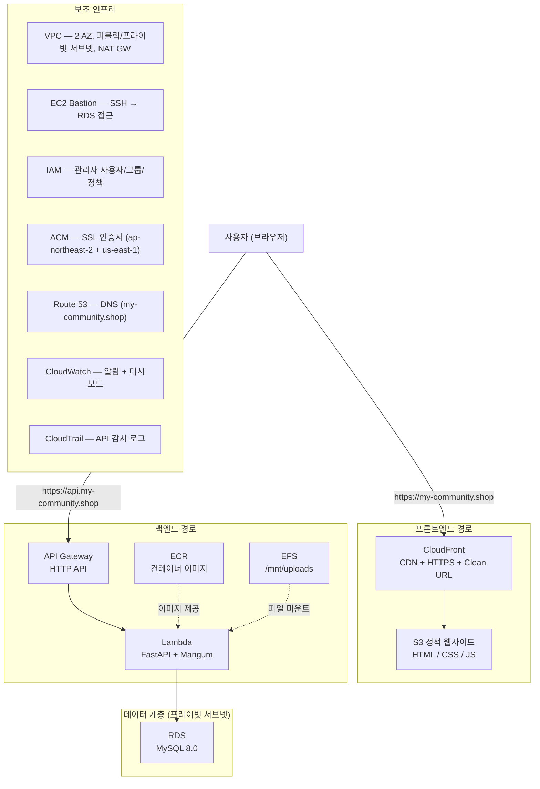
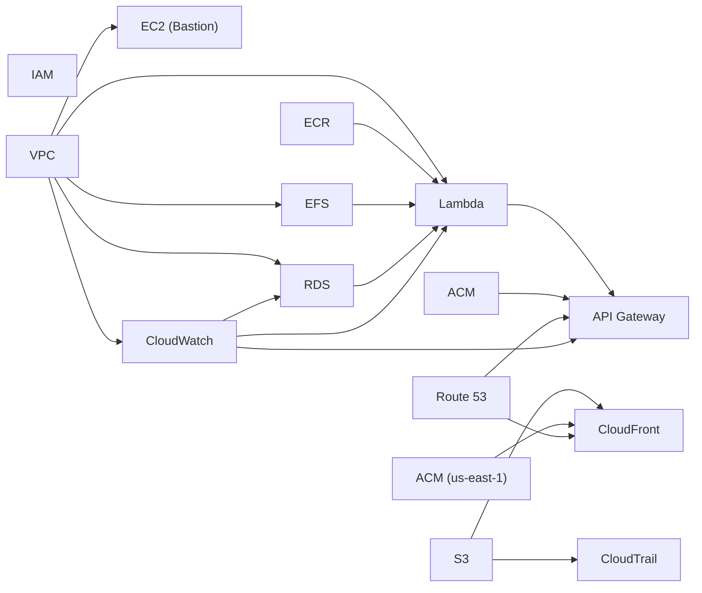
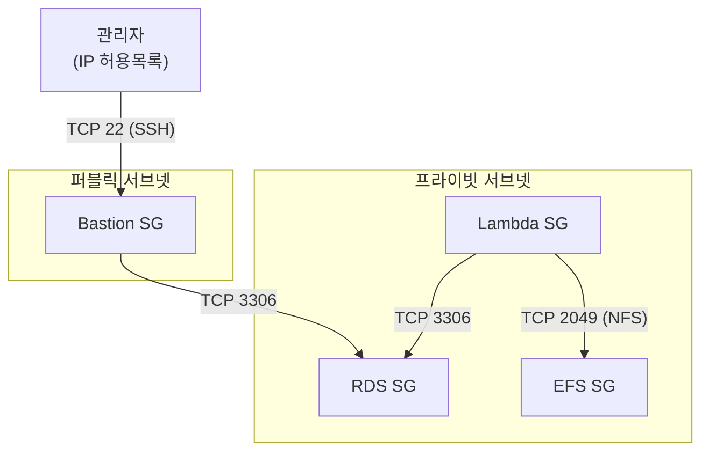

# 2-cho-community-infra

AWS AI School 2기: 커뮤니티 포럼 "아무 말 대잔치" AWS 인프라

## 요약 (Summary)

- 커뮤니티 포럼 "아무 말 대잔치"의 AWS 인프라를 Terraform으로 관리하는 저장소입니다.
- 15개의 재사용 가능한 Terraform 모듈로 구성되며, 3개 환경(dev/staging/prod) + 1개 부트스트랩 환경을 지원합니다.
- 서버리스 아키텍처(CloudFront + Lambda + API Gateway)를 채택하여 운영 부담을 최소화하고, 환경별 리소스 규모를 차등 적용하여 비용을 최적화합니다.

## 배경 (Background)

- 커뮤니티 서비스의 프론트엔드(Vanilla JS)와 백엔드(FastAPI)가 각각 별도 저장소(`2-cho-community-fe`, `2-cho-community-be`)로 개발 완료되었습니다.
- AWS 클라우드에 배포하기 위한 인프라의 규모가 점점 커져 이를 코드로 관리할 필요가 있으며, 환경별(개발/스테이징/프로덕션) 일관된 인프라 구성이 요구됩니다.

수동 콘솔 작업 대신 Terraform을 선택한 이유:
- **재현성**: 동일한 코드로 3개 환경을 일관되게 구성
- **버전 관리**: 인프라 변경 이력을 Git으로 추적
- **모듈화**: 15개 모듈을 독립적으로 개발 및 테스트 가능

## 목표 (Goals)

- 프론트엔드 정적 파일을 S3 + CloudFront로 HTTPS 서빙한다.
- 백엔드 FastAPI 앱을 Lambda 컨테이너로 서버리스 배포한다.
- MySQL(RDS)을 프라이빗 서브넷에 격리하고 Bastion Host로만 직접 접근한다.
- 파일 업로드를 EFS에 영구 저장한다 (Lambda 컨테이너가 다시 생성되어도 파일 보존).
- 환경별(dev/staging/prod) 리소스 규모를 차등 적용하여 비용을 최적화한다.
- CloudWatch 알람/대시보드와 CloudTrail 감사 로그로 모니터링한다.

## 목표가 아닌 것 (Non-Goals)

- 멀티 리전 배포
- Kubernetes/ECS 컨테이너 오케스트레이션
- WAF (Web Application Firewall) 적용
- 자동 스케일링 정책 (Lambda Provisioned Concurrency만 사용)

## 사전 요구사항

- [Terraform](https://developer.hashicorp.com/terraform/downloads) >= 1.5.0
- [AWS CLI](https://aws.amazon.com/cli/) v2 (설정 완료)
- AWS 자격 증명 (최초 배포 시 루트 계정 또는 AdministratorAccess 필요)
- 도메인: `my-community.shop` (Route 53 호스팅 영역)
- Docker (Lambda 컨테이너 이미지 빌드용)

## 계획 (Plan)

### 1. 시스템 아키텍처



#### 모듈 의존 관계



배포 순서: IAM → VPC → S3 → Route 53 → ACM → ECR → RDS → EFS → Lambda → API Gateway → CloudWatch → EC2 → CloudTrail → ACM (us-east-1) → CloudFront

### 2. 모듈 설계 (15개)

| # | 모듈 | 설명 | 주요 리소스 |
|---|------|------|-------------|
| 0 | `iam` | IAM 사용자/그룹/정책 | IAM User, Group, Policy |
| 1 | `vpc` | 네트워크 + 보안 그룹 | VPC, Subnet, NAT GW, SG |
| 2 | `s3` | 프론트엔드 호스팅 + 로그 저장 | S3 Bucket (website, logs) |
| 3 | `route53` | DNS 호스팅 영역 | Hosted Zone |
| 3 | `acm` | SSL 인증서 (API Gateway용) | ACM Certificate |
| 4 | `ecr` | 컨테이너 이미지 레지스트리 | ECR Repository |
| 5 | `rds` | MySQL 데이터베이스 | RDS Instance, Subnet Group |
| 6 | `efs` | 파일 업로드 스토리지 | EFS File System, Access Point |
| 7 | `lambda` | 백엔드 함수 | Lambda Function, IAM Role |
| 8 | `api_gateway` | API 라우팅 + 커스텀 도메인 | HTTP API, Stage, Domain |
| 9 | `cloudwatch` | 모니터링 | Alarms, Dashboard |
| 10 | `ec2` | Bastion Host | EC2 Instance, EIP, Key Pair |
| 11 | `cloudtrail` | 감사 로그 | CloudTrail |
| 12 | `acm` (us-east-1) | SSL 인증서 (CloudFront용) | ACM Certificate |
| 13 | `cloudfront` | CDN + HTTPS + Clean URL | Distribution, Function |
| 14 | `tfstate` | Terraform 원격 상태 백엔드 | S3 Bucket, DynamoDB Table |

#### 디렉토리 구조

```text
2-cho-community-infra/
├── modules/                    # 재사용 가능한 Terraform 모듈
│   ├── iam/
│   ├── vpc/
│   ├── s3/
│   ├── route53/
│   ├── acm/
│   ├── ecr/
│   ├── rds/
│   ├── efs/
│   ├── lambda/
│   ├── api_gateway/
│   ├── cloudwatch/
│   ├── ec2/
│   ├── cloudtrail/
│   ├── cloudfront/
│   └── tfstate/                # S3 + DynamoDB 원격 상태 백엔드
│
├── environments/               # 환경별 설정
│   ├── bootstrap/              # 상태 백엔드 + OIDC 부트스트랩 (로컬 상태, 1회 실행)
│   ├── dev/
│   │   ├── main.tf             # 모듈 호출 + 프로바이더 설정
│   │   ├── variables.tf        # 변수 선언
│   │   ├── terraform.tfvars    # 변수 값 (비밀 제외)
│   │   ├── outputs.tf          # 출력값 정의
│   │   └── locals.tf           # 공통 태그
│   ├── staging/
│   └── prod/
│
└── README.md
```

### 3. 네트워크 설계

#### VPC CIDR 계획

| 환경 | VPC CIDR | 퍼블릭 서브넷 | 프라이빗 서브넷 |
|------|----------|---------------|-----------------|
| Dev | `10.0.0.0/16` | `10.0.0.0/24`, `10.0.1.0/24` | `10.0.100.0/24`, `10.0.101.0/24` |
| Staging | `10.1.0.0/16` | `10.1.0.0/24`, `10.1.1.0/24` | `10.1.100.0/24`, `10.1.101.0/24` |
| Prod | `10.2.0.0/16` | `10.2.0.0/24`, `10.2.1.0/24` | `10.2.100.0/24`, `10.2.101.0/24` |

- 퍼블릭 서브넷: `cidrsubnet(vpc_cidr, 8, index)` — Bastion, NAT Gateway 배치
- 프라이빗 서브넷: `cidrsubnet(vpc_cidr, 8, index + 100)` — Lambda, RDS, EFS 배치
- 가용 영역: `ap-northeast-2a`, `ap-northeast-2b` (2 AZ)

#### NAT Gateway 전략

| 환경 | NAT Gateway | 비용 | 장애 내성 |
|------|-------------|------|-----------|
| Dev | 1개 (단일) | ~$32/월 | AZ 단일 장애점 |
| Staging | 1개 (단일) | ~$32/월 | AZ 단일 장애점 |
| Prod | **AZ별 1개** | ~$64/월 | AZ 장애 시에도 가용 |

Prod 환경만 `single_nat_gateway = false`로 설정하여 각 AZ에 독립 NAT Gateway를 배치합니다.

#### 보안 그룹



| 보안 그룹 | 인바운드 | 소스 |
|-----------|----------|------|
| Lambda | 없음 (아웃바운드만) | — |
| RDS | TCP 3306 | Lambda SG, Bastion SG |
| EFS | TCP 2049 | Lambda SG |
| Bastion | TCP 22 | `bastion_allowed_cidrs` (IP 허용목록) |

### 4. 컴퓨트 및 스토리지

#### Lambda (백엔드)

| 설정 | Dev | Staging | Prod |
|------|-----|---------|------|
| 메모리 | 256 MB | 512 MB | 1024 MB |
| 타임아웃 | 30초 | 30초 | 30초 |
| Provisioned Concurrency | 0 | 0 | **5** |
| 로그 보존 | 7일 | 14일 | 30일 |

Lambda 환경변수:
- `DB_HOST`, `DB_PORT`, `DB_USER`, `DB_NAME` — RDS 연결
- `DB_PASSWORD_SSM_NAME` — SSM Parameter Store에서 DB 비밀번호 조회 (SecureString)
- `SECRET_KEY_SSM_NAME` — SSM Parameter Store에서 JWT 서명키 조회 (SecureString)
- `ALLOWED_ORIGINS` — CORS 허용 오리진 (JSON 배열)
- `UPLOAD_DIR=/mnt/uploads` — EFS 마운트 경로
- `AWS_LAMBDA_EXEC=true` — 로컬/Lambda 환경 분기
- `HTTPS_ONLY=true` — Secure 쿠키 플래그

#### RDS (데이터베이스)

| 설정 | Dev | Staging | Prod |
|------|-----|---------|------|
| 인스턴스 | `db.t3.micro` | `db.t3.small` | `db.t3.medium` |
| 초기 스토리지 | 20 GB | 20 GB | 50 GB |
| 최대 스토리지 | 20 GB | 100 GB | 200 GB |
| Multi-AZ | No | No | **Yes** |
| 백업 보존 | 1일 | 3일 | 14일 |
| 삭제 보호 | No | No | **Yes** |

#### S3 (프론트엔드 + 로그)

- **프론트엔드 버킷**: 비공개 버킷 (퍼블릭 액세스 전면 차단), CloudFront OAC로만 접근
- **CloudTrail 로그 버킷**: API 감사 로그 저장

#### EFS (파일 업로드)

- 마운트 경로: `/mnt/uploads`
- 접근 방식: Access Point (POSIX UID/GID)
- Lambda IAM 조건부 권한: 파일 시스템 ARN을 Resource로, 액세스 포인트를 Condition으로 지정

#### ECR (컨테이너 이미지)

| 환경 | 이미지 보존 수 |
|------|---------------|
| Dev | 3개 |
| Staging | 10개 |
| Prod | 20개 |

### 5. CDN 및 DNS

#### CloudFront

- **오리진**: S3 버킷 (OAC — Origin Access Control로 접근)
- **SSL**: ACM 인증서 (반드시 `us-east-1` 리전에 생성)
- **Clean URL**: CloudFront Functions로 URL 재작성

```text
요청 경로          →  S3 오브젝트
/                  →  /post_list.html
/main              →  /post_list.html
/login             →  /user_login.html
/signup            →  /user_signup.html
/write             →  /post_write.html
/detail            →  /post_detail.html
/edit              →  /post_edit.html
/password          →  /user_password.html
/edit-profile      →  /user_edit.html
```

CloudFront Function의 `routes` 맵은 프론트엔드 `constants.js`의 `HTML_PATHS`와 반드시 동기화해야 합니다.

#### Route 53

- 호스팅 영역: `my-community.shop`
- A 레코드 (Alias): `my-community.shop` → CloudFront 배포
- A 레코드 (Alias): `api.my-community.shop` → API Gateway 커스텀 도메인

#### ACM 인증서

| 용도 | 리전 | 도메인 | SAN |
|------|------|--------|-----|
| API Gateway | `ap-northeast-2` | `api.my-community.shop` | `my-community.shop` |
| CloudFront | `us-east-1` | `my-community.shop` | — |

### 6. 보안 설계

#### IAM

- **관리자 사용자**: `terraform.tfvars`의 `admin_username`으로 생성
- **관리자 그룹**: `AdministratorAccess` 정책 연결
- **부트스트랩 순서**: 최초 `terraform apply`는 루트 자격 증명 필수 (IAM 사용자가 자신의 권한 생성 불가)
- **MFA CLI 인증**: `aws sts get-session-token --serial-number <arn> --token-code <code>`

#### 민감 변수 관리

`db_username`, `db_password`, `secret_key`는 `terraform.tfvars`에 포함하지 않습니다.

| 방법 | 명령어 |
|------|--------|
| CLI 플래그 | `terraform apply -var="db_password=xxx"` |
| 별도 파일 | `terraform apply -var-file="secret.tfvars"` |
| 환경 변수 | `export TF_VAR_db_password=xxx` |

`secret.tfvars`는 `.gitignore`에 포함되어 있습니다.

#### CORS 이중 레이어

API Gateway의 `cors_configuration`과 Lambda(FastAPI)의 `CORSMiddleware`가 모두 CORS를 처리합니다. `terraform.tfvars`의 `cors_allowed_origins`와 Lambda 환경변수 `ALLOWED_ORIGINS`가 자동으로 동기화됩니다.

### 7. 모니터링

#### CloudWatch

- **Lambda 알람**: 에러율, Duration, Throttle
- **RDS 알람**: CPU, 여유 스토리지, 여유 메모리
- **API Gateway 알람**: 5xx 에러율, Latency
- **대시보드**: 주요 지표 통합 뷰

#### CloudTrail

- API 감사 로그 → S3 버킷 저장
- 관리 이벤트 기록 (리소스 생성/삭제/변경 추적)

#### 로그 보존

| 로그 유형 | Dev | Staging | Prod |
|-----------|-----|---------|------|
| Lambda 실행 로그 | 7일 | 14일 | 30일 |
| API Gateway 액세스 로그 | 7일 | 14일 | 30일 |
| CloudTrail 감사 로그 | 30일 | 60일 | 90일 |

### 8. 배포 전략

#### 부트스트랩 (최초 1회)

S3 버킷, DynamoDB 테이블, GitHub Actions OIDC 프로바이더를 먼저 생성해야 합니다.

```bash
cd environments/bootstrap

terraform init
terraform plan -var-file=terraform.tfvars
terraform apply -var-file=terraform.tfvars

# 출력값 확인 (backend 설정에 사용)
terraform output tfstate_bucket_id       # my-community-tfstate
terraform output dynamodb_table_name     # terraform-locks
terraform output oidc_provider_arn       # GitHub Actions OIDC ARN
terraform output github_actions_role_arns # 환경별 IAM 역할 ARN
```

> **주의**: bootstrap은 OIDC provider를 관리합니다. 절대 `terraform destroy`하지 마세요.

#### 상태 마이그레이션 (로컬 → S3)

기존에 `terraform apply`를 실행한 환경이 있다면, 로컬 상태를 S3로 마이그레이션합니다.

```bash
cd environments/dev

# backend "s3" 블록이 추가된 상태에서 init 실행
# "Do you want to copy existing state to the new backend?" → yes
terraform init

# 마이그레이션 확인 (변경사항 0건이어야 정상)
terraform plan \
  -var="db_username=DB사용자명" \
  -var="db_password=DB비밀번호" \
  -var="secret_key=JWT시크릿키"

# 확인 후 로컬 상태 파일 삭제
rm -f terraform.tfstate terraform.tfstate.backup
```

staging, prod도 동일하게 반복합니다.

#### Terraform 초기화 및 적용

```bash
cd environments/dev

# 초기화 (프로바이더 다운로드)
terraform init

# 설정 검증
terraform validate

# 변경 사항 확인
terraform plan \
  -var="db_username=DB사용자명" \
  -var="db_password=DB비밀번호" \
  -var="secret_key=JWT시크릿키"

# 적용
terraform apply \
  -var="db_username=DB사용자명" \
  -var="db_password=DB비밀번호" \
  -var="secret_key=JWT시크릿키"
```

#### 출력값 확인

```bash
terraform output                              # 전체 출력
terraform output rds_endpoint                  # RDS 엔드포인트
terraform output ecr_repository_url            # ECR URL
terraform output bastion_public_ip             # Bastion IP
terraform output frontend_url                  # 프론트엔드 URL
terraform output -raw admin_initial_password   # 관리자 초기 비밀번호
```

#### 백엔드 배포 (Lambda 컨테이너)

```bash
# ECR 로그인
aws ecr get-login-password --region ap-northeast-2 | \
  docker login --username AWS --password-stdin $(terraform output -raw ecr_repository_url | cut -d/ -f1)

# 이미지 빌드 (--provenance=false 필수)
docker build --provenance=false -t my-community-backend ../2-cho-community-be/

# 태그 및 푸시
ECR_URL=$(terraform output -raw ecr_repository_url)
docker tag my-community-backend:latest $ECR_URL:latest
docker push $ECR_URL:latest

# Lambda 함수 업데이트 (ECR push만으로는 자동 반영 안 됨)
aws lambda update-function-code \
  --function-name $(terraform output -raw lambda_function_name) \
  --image-uri $ECR_URL:latest
```

#### 프론트엔드 배포 (S3 + CloudFront)

```bash
# S3 동기화
aws s3 sync ../2-cho-community-fe/ s3://my-community-dev-frontend \
  --exclude ".git/*" --exclude "node_modules/*" --exclude "tests/*" \
  --exclude "playwright*" --exclude "package*"

# CloudFront 캐시 무효화
aws cloudfront create-invalidation \
  --distribution-id $(terraform output -raw cloudfront_distribution_id) \
  --paths "/*"
```

#### Bastion Host 접속 (RDS 관리)

```bash
# SSH 접속 (Amazon Linux 2023: ec2-user)
ssh -i ~/.ssh/키파일 ec2-user@$(terraform output -raw bastion_public_ip)

# RDS 접속 (bastion에서)
mysql -h <RDS엔드포인트> -u <DB사용자명> -p <DB이름>
```

#### 리소스 제거

```bash
terraform destroy \
  -var="db_username=DB사용자명" \
  -var="db_password=DB비밀번호" \
  -var="secret_key=JWT시크릿키"
```

## 이외 고려 사항들 (Other Considerations)

- **서버리스 vs 컨테이너 오케스트레이션**: ECS/EKS 대신 Lambda + API Gateway를 선택. 운영 부담 최소화, Free Tier 활용, 트래픽이 낮은 커뮤니티 서비스에 적합. 콜드 스타트는 Prod의 Provisioned Concurrency(5)로 완화.
- **Terraform 상태 관리**: S3 + DynamoDB 원격 백엔드 사용. 단일 S3 버킷(`my-community-tfstate`)에 환경별 키(`dev/`, `staging/`, `prod/`)로 분리 저장. DynamoDB 테이블(`terraform-locks`)로 동시 실행 방지. S3 Versioning으로 상태 파일 복구 가능. 부트스트랩 환경(`environments/bootstrap/`)은 로컬 상태를 영구적으로 사용 (chicken-and-egg 문제 회피).

- **VPC 환경 분리**: 각 환경(dev/staging/prod)에 독립 VPC를 할당하여 CIDR 충돌 방지. VPC Peering이 필요한 경우 기존 CIDR(`10.0/1/2.0.0/16`)과 겹치지 않도록 설계.
- **NAT Gateway 비용**: Dev/Staging에서는 단일 NAT Gateway($32/월)로 비용 절감. Prod에서만 AZ별 NAT Gateway 배치로 고가용성 확보.
- **EFS vs S3 for uploads**: Lambda 파일시스템에 직접 마운트 가능한 EFS를 선택. S3는 SDK 호출 필요하고 기존 로컬 파일시스템 코드(`utils/storage.py`)의 수정이 큼.
- **CloudFront Functions vs Lambda@Edge**: 단순 URL 재작성에는 CloudFront Functions가 적합 (비용 1/6, 지연시간 <1ms). 복잡한 로직(인증, 이미지 리사이징)이 필요하면 Lambda@Edge로 전환.

## 환경별 설정 요약

| 항목 | Dev | Staging | Prod |
|------|-----|---------|------|
| VPC CIDR | `10.0.0.0/16` | `10.1.0.0/16` | `10.2.0.0/16` |
| NAT Gateway | 1개 | 1개 | AZ별 1개 |
| Lambda 메모리 | 256 MB | 512 MB | 1024 MB |
| Provisioned Concurrency | 0 | 0 | 5 |
| RDS 인스턴스 | `db.t3.micro` | `db.t3.small` | `db.t3.medium` |
| RDS Multi-AZ | No | No | Yes |
| RDS 백업 보존 | 1일 | 3일 | 14일 |
| EC2 Bastion | `t3.micro` | `t4g.micro` | `t4g.micro` |
| ECR 이미지 보존 | 3개 | 10개 | 20개 |
| 로그 보존 | 7일 | 14일 | 30일 |
| 삭제 보호 (RDS) | No | No | Yes |

## 주의사항

- **민감 변수**: `db_password`, `secret_key`는 절대 `terraform.tfvars`에 넣지 않기
- **CloudFront ACM**: CloudFront용 인증서는 반드시 `us-east-1` 리전에 생성
- **Docker Lambda**: 이미지 빌드 시 `--provenance=false` 필수 (OCI manifest 거부)
- **Lambda 파일시스템**: `/var/task` 읽기 전용, 쓰기는 `/tmp` 또는 EFS(`/mnt/uploads`)
- **EFS 정책**: resource policy 추가 시 implicit allow 사라짐 → Allow 문 필수
- **EC2 AMI**: Amazon Linux 2023은 루트 볼륨 최소 30GB, SSH 사용자는 `ec2-user`
- **CORS 이중 레이어**: API Gateway와 Lambda(FastAPI) 양쪽 모두 CORS 설정 필요
- **CloudFront Function 동기화**: URL 매핑은 프론트엔드 `constants.js`의 `HTML_PATHS`와 일치해야 함
- **환경 파일 동기화**: `main.tf`, `variables.tf`, `outputs.tf`, `locals.tf`는 3개 환경에서 동일 구조 유지
- **IAM 부트스트랩**: 최초 배포 시 루트 자격 증명 필수 (IAM 사용자가 자신의 권한 생성 불가)
- **점진적 배포**: `main.tf` 모듈 주석 처리 시 `outputs.tf`의 해당 output도 주석 처리 필수
- **Lambda 베이스 이미지**: Python 3.12+는 AL2023(`dnf`), 3.11 이하는 AL2(`yum`)
- **부트스트랩 상태**: `environments/bootstrap/`은 영구 로컬 상태 사용. S3 백엔드로 전환 불가 (자기 자신을 저장할 버킷이 아직 없음). OIDC provider도 bootstrap에서 관리하므로 절대 destroy 금지
- **GitHub Actions OIDC**: `bootstrap/oidc.tf`에서 OIDC provider + 환경별 IAM 역할 관리. OIDC subject claim 형식: `repo:ORG/REPO:environment:ENV`. fork/upstream 분리 설정은 `bootstrap/terraform.tfvars`의 `github_fork_owner`/`github_upstream_owner`
- **backend 블록 리터럴**: `backend "s3" {}` 블록에는 변수/locals 사용 불가. Terraform이 변수 평가 전에 백엔드를 초기화하기 때문
- **DynamoDB `LockID`**: hash_key 이름은 대소문자 구분. 반드시 `"LockID"` (S3 백엔드가 사용하는 고정 키 이름)

## Changelog

### 2026-02 (Feb)

- **02-28: 보안 취약점 수정 (Critical)**
  - S3 프론트엔드: 퍼블릭 웹사이트 호스팅 → 비공개 버킷 + CloudFront OAC
  - Lambda 시크릿: 평문 환경변수(`DB_PASSWORD`, `SECRET_KEY`) → SSM Parameter Store SecureString
  - OIDC IAM: AdministratorAccess → 서비스별 스코프 IAM 정책 (최소 권한)

- **02-28: 코드 리뷰 기반 인프라 정리**
  - OIDC IAM: `iam:CreateRole` 등 Resource를 `${var.project}-*` ARN으로 제한 (권한 상승 방지)
  - S3 모듈: 미사용 `cors_allowed_origins` 변수 제거
  - Lambda SSM 정책: KMS 기본 키 사용 설명 주석 추가

- **02-27: GitHub Actions CI/CD 파이프라인 구축**
  - `deploy-infra.yml`: PR → 3환경 matrix plan + PR 코멘트 / `workflow_dispatch` → plan 또는 apply
  - `bootstrap/oidc.tf`: GitHub Actions OIDC provider + 환경별 IAM 역할 (`for_each`)
  - OIDC 인증 (GitHub → AWS STS AssumeRoleWithWebIdentity), fork/upstream 분리

- **02-26: S3 + DynamoDB 원격 상태 백엔드 전환**
  - `modules/tfstate/` 모듈 추가 (S3 버킷 + DynamoDB 테이블)
  - `environments/bootstrap/` 부트스트랩 환경 추가
  - 3개 환경에 `backend "s3"` 블록 추가, 로컬 → S3 마이그레이션

- **02-26: Terraform 인프라 전체 구축**
  - 14개 모듈 설계 및 3개 환경(dev/staging/prod) 배포
  - 서버리스 아키텍처: CloudFront + Lambda + API Gateway + RDS + EFS
  - CloudFront Functions Clean URL, CORS 이중 레이어 설정
  - 환경별 리소스 차등 적용 (Free Tier → HA 구성)
