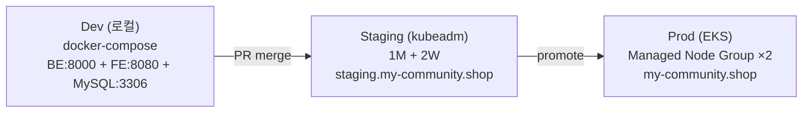
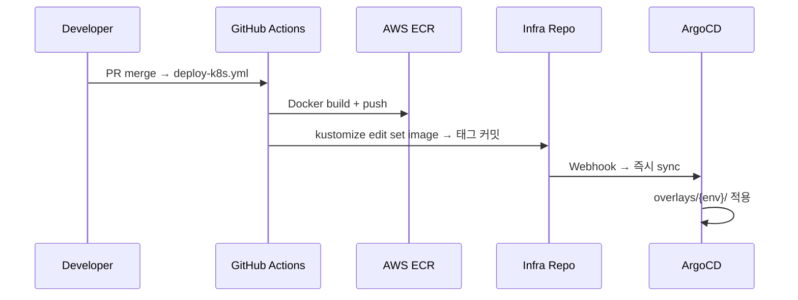

# Infrastructure 아키텍처

Terraform (AWS) + K8s (kubeadm Staging + EKS Prod) + ArgoCD GitOps.

## 환경 구성



## Terraform 모듈

13개 활성 모듈 (`modules/`):

| 모듈 | 역할 |
|------|------|
| `stack` | 9개 공통 모듈의 composition module |
| `iam` | IAM 사용자, 정책, OIDC |
| `vpc` | VPC, 서브넷, SG, NAT Gateway |
| `s3` | S3 버킷 (업로드, 백업) |
| `route53` | DNS 레코드 |
| `acm` | SSL 인증서 |
| `ses` | 이메일 발송 |
| `ecr` | Docker 이미지 레지스트리 |
| `rds` | MySQL RDS |
| `cloudtrail` | API 감사 로그 |
| `k8s_ec2` | kubeadm 노드 (EC2) |
| `eks` | EKS 클러스터 + Managed Node Group |
| `tfstate` | S3 + DynamoDB 원격 상태 (bootstrap) |

## K8s 구조

```
k8s/
  base/                    공통 매니페스트
    namespaces.yaml
    api-deployment.yaml    BE Pod
    ws-deployment.yaml     WebSocket Pod
    fe-deployment.yaml     FE Pod (nginx)
    services.yaml
    configmaps.yaml
    network-policies.yaml
  overlays/
    staging/               Staging 오버레이
    prod/                  Prod 오버레이 (PDB, HPA, TopologySpread)
  argocd/
    install/               Helm values
    projects/              AppProject 정의
    config/                RBAC, Dex SSO
    app-of-apps/           환경별 Application 정의
    root-app.yaml          App-of-Apps 루트
```

## CD 흐름



## Prod 운영 구성

- **HA**: PDB + TopologySpread + AntiAffinity
- **Autoscaling**: Cluster Autoscaler (t3.medium)
- **Monitoring**: kube-prometheus-stack + CloudWatch Exporter
- **Alerting**: Alertmanager → Slack webhook
- **Cache**: Redis Sentinel (Bitnami)
- **Secrets**: External Secrets Operator → AWS Secrets Manager
- **SSL**: cert-manager + Let's Encrypt
- **Ingress**: ingress-nginx (NLB → Route53 Alias)
