# 커뮤니티 서비스 "아무 말 대잔치" — 시스템 아키텍처 보고서

> **작성일**: 2026-03-11
> **프로젝트**: AWS AI School 2기 개인 프로젝트
> **도메인**: my-community.shop
> **리전**: ap-northeast-2 (서울)

---

## 목차

1. [프로젝트 개요](#1-프로젝트-개요)
2. [시스템 아키텍처 설계도](#2-시스템-아키텍처-설계도)
3. [예상 트래픽 기반 장애 시나리오](#3-예상-트래픽-기반-장애-시나리오)
4. [고가용성 구현 방안](#4-고가용성-구현-방안)
5. [결론 및 개선 로드맵](#5-결론-및-개선-로드맵)

---

## 1. 프로젝트 개요

### 1.1 서비스 소개 및 보고서 목적

"아무 말 대잔치"는 수강생 간 학습 경험 공유, 질문/답변, 프로젝트 협업을 위한 커뮤니티 포럼입니다.

본 보고서는 이 서비스의 **인프라 아키텍처 설계, 예상 트래픽 기반 장애 시나리오 분석, 고가용성 구현 방안**을 다룹니다. 단순 기능 설명이 아닌, 실제 서비스 운영을 가정하여 다음 관점에서 작성되었습니다.

- **가용성**: 서비스 중단 없이 안정적으로 운영할 수 있는가?
- **확장성**: 사용자 증가에 따라 인프라가 자동으로 대응할 수 있는가?
- **복구 가능성**: 장애 발생 시 데이터 손실 없이 신속하게 복구할 수 있는가?
- **비용 효율성**: 현재 규모에 맞는 적정 비용으로 운영되고 있는가?

### 1.2 기술 스택

| 계층 | 기술 | 선택 근거 | 운영 고려사항 |
| ------ | ------ | ----------- | ------------- |
| **프론트엔드** | Vanilla JavaScript (MPA, Vite 빌드) | 프레임워크 없이 JS 기본기 학습 | S3 + CloudFront로 정적 배포, 서버 부하 0 |
| **백엔드** | FastAPI (Python 3.13) | 비동기 I/O, 자동 API 문서화 | Lambda 컨테이너 실행, 콜드 스타트 영향 |
| **데이터베이스** | MySQL 8.0 (aiomysql) | FULLTEXT 검색(ngram), 트랜잭션 격리 | 커넥션 풀 관리, Lambda 스케일링 시 폭발 위험 |
| **인증** | JWT (Access 30분 + Refresh 7일) | Stateless 인증, XSS 방어 | 토큰 저장소 DB 의존, 만료 토큰 주기적 정리 |
| **인프라** | AWS (Terraform 19개 모듈) | 서버리스 아키텍처, IaC 재현성 | 3개 환경(Dev/Staging/Prod) 차등 설계 |
| **CI/CD** | GitHub Actions + OIDC | 장기 자격 증명 없는 배포 | Blue/Green 배포 (Lambda Alias), Health check 게이트, 롤백 워크플로우 |
| **부하 테스트** | Locust (gevent 기반) | 3종 사용자 시나리오 | 병목 사전 식별, 50~200 동시 사용자 검증 완료 |

### 1.3 서비스 특성과 인프라 요구사항

서비스의 주요 기능이 인프라에 부과하는 운영 요구사항입니다.

| 서비스 특성 | 인프라 요구사항 | 핵심 대응 |
| ----------- | --------------- | --------- |
| **읽기 중심 워크로드** (게시글 목록·상세 조회가 전체 요청의 ~80%) | DB 읽기 부하 분산, 캐싱 전략 | RDS Read Replica (미적용), CloudFront 캐싱 고려 |
| **이미지 업로드** (게시글당 최대 5장, 프로필 이미지) | 파일 저장소 내구성, 처리량 확보 | EFS 마운트 (3-AZ 자동 복제), 백업 필요 |
| **FULLTEXT 검색** (한국어 ngram 파서) | DB CPU 부하 증가, 인덱스 유지 비용 | MySQL FULLTEXT INDEX, 대량 데이터 시 별도 검색 엔진 고려 |
| **실시간 알림** (WebSocket 푸시 + 폴링 폴백) | WebSocket 연결 관리, 상태 저장소 필요 | DynamoDB 연결 매핑 + API GW Management API, 폴링 자동 폴백 |
| **인증 토큰 관리** (JWT 발급·갱신·폐기) | 토큰 저장소 정합성, 브루트포스 방어 | DB 행 잠금, Rate Limiting (분산 환경 한계 존재) |
| **동시 쓰기** (좋아요·북마크·댓글 동시 요청) | 경쟁 상태 방지, 트랜잭션 격리 | UNIQUE 제약, READ COMMITTED 격리 수준 |
| **계정 정지** (관리자 기간 정지, 신고 연동) | 인증 체인 차단, 자동 만료 | 3중 체크 (로그인·토큰·API), `suspended_until` 비교 |
| **마크다운 렌더링** (marked + DOMPurify + highlight.js) | XSS 방지, 번들 크기 관리 | DOMPurify sanitize → `<template>.innerHTML` 패턴, 코드 스플릿 ~46KB |
| **DM 쪽지** (1:1 비공개 메시지, WebSocket 푸시) | 대화 정규화, soft delete, 차단 연동 | MIN/MAX 참가자 UNIQUE 제약, `last_message_at` 비정규화, MarkdownEditor 컴팩트 모드 |

---

## 2. 시스템 아키텍처 설계도

### 2.1 전체 구성도

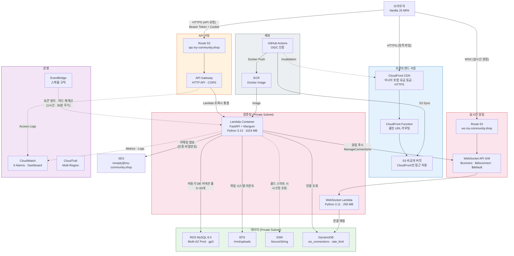

#### 컴포넌트별 역할

| 컴포넌트 | 역할 | 설계 근거 |
| ---------- | ------ | ----------- |
| **CloudFront** | HTTPS 종단, 정적 파일 캐싱, Clean URL 라우팅 | S3 직접 노출 없이 보안 유지, 글로벌 엣지 캐싱으로 지연시간 감소 |
| **S3** | 프론트엔드 정적 파일 호스팅 | 퍼블릭 액세스 전면 차단, OAC(Origin Access Control)로만 접근 허용 |
| **API Gateway** | HTTP API 라우팅, CORS 처리, 접근 로깅 | REST API 대비 비용 70% 절감, Lambda 프록시 통합으로 설정 단순화 |
| **Lambda** | FastAPI 앱 실행 (Mangum 어댑터) | 서버 관리 불필요, 요청량에 따른 자동 스케일링, 유휴 시 비용 0 |
| **RDS** | MySQL 8.0 관계형 데이터 저장 | FULLTEXT 검색(ngram), 트랜잭션 ACID 보장, Private Subnet 격리 |
| **EFS** | 사용자 업로드 파일 저장 | Lambda의 읽기 전용 파일시스템 제약 해결, 3-AZ 자동 복제 |
| **SSM** | DB 비밀번호, JWT 시크릿 키 관리 | Lambda 환경변수에 평문 저장 방지, SecureString 암호화 |
| **SES** | 이메일 인증, 임시 비밀번호 발송 | 도메인 인증(DKIM), Lambda IAM 연동, 프로덕션 이메일 배달 |
| **CloudWatch** | 메트릭 알람, 대시보드, 로그 집계 | Lambda 에러, RDS CPU, 스토리지, 커넥션 수 실시간 모니터링 |
| **CloudTrail** | AWS API 호출 감사 로그 | 멀티리전 추적으로 us-east-1(CloudFront/ACM) 이벤트 포함 |
| **EventBridge** | 스케줄 기반 배치 작업 트리거 | API Destination + Connection으로 Lambda 내부 API 호출, 토큰 정리(1시간)·피드 재계산(30분) |
| **DynamoDB** | WebSocket 연결 매핑 + 분산 Rate Limiter | ws_connections(실시간 알림), rate_limit(Fixed Window Counter, TTL 자동 만료) |

#### API Gateway — Lambda 프록시 통합 (AWS_PROXY)

API Gateway와 Lambda 사이의 통합 방식으로 **AWS_PROXY (Lambda Proxy Integration)** 를 사용합니다. 이는 API Gateway가 수신한 HTTP 요청(메서드, 경로, 헤더, 쿼리 파라미터, 바디, 클라이언트 IP 등)을 **매핑 없이 하나의 JSON 이벤트로 묶어** Lambda에 전달하는 방식입니다.

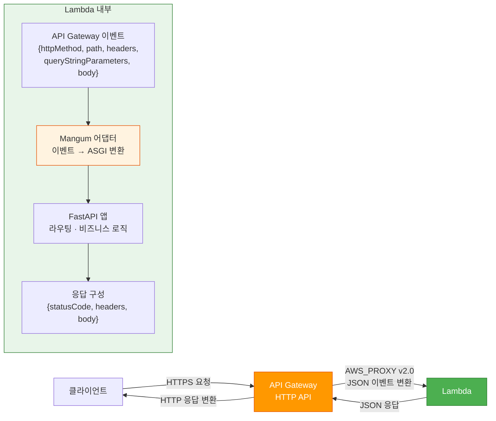

| 비교 항목 | AWS_PROXY (현재) | AWS (Custom Integration) |
| ---------- | ------------------- | -------------------------- |
| **요청 전달** | 원본 HTTP 요청 전체를 그대로 Lambda에 전달 | VTL 매핑 템플릿으로 변환 후 전달 |
| **응답 처리** | Lambda가 `{statusCode, headers, body}`를 직접 구성 | API Gateway가 응답 매핑 템플릿으로 변환 |
| **설정 복잡도** | 낮음 (매핑 불필요) | 높음 (VTL 템플릿 작성 필요) |
| **프레임워크 호환** | Mangum 등 어댑터로 기존 웹 프레임워크 그대로 사용 | 프레임워크 독립적 핸들러 필요 |

**이 프로젝트에서의 동작 방식**:

1. API Gateway가 HTTP 요청을 **v2.0 페이로드 형식**의 JSON 이벤트로 변환하여 Lambda에 전달합니다.
2. Lambda 컨테이너 내부의 **Mangum** 어댑터가 이 이벤트를 ASGI 프로토콜로 변환합니다.
3. **FastAPI**가 일반 웹 서버처럼 요청을 처리하고 응답을 생성합니다.
4. Mangum이 FastAPI 응답을 다시 `{statusCode, headers, body}` 형식으로 역변환하여 API Gateway에 반환합니다.

이 구조 덕분에 로컬에서는 `uvicorn`으로, Lambda에서는 Mangum으로 **동일한 FastAPI 앱을 변경 없이** 실행할 수 있습니다.

### 2.2 네트워크 토폴로지

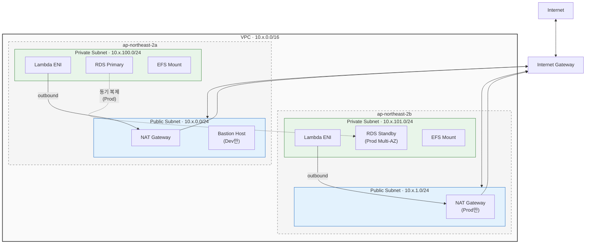

#### 보안 그룹 흐름

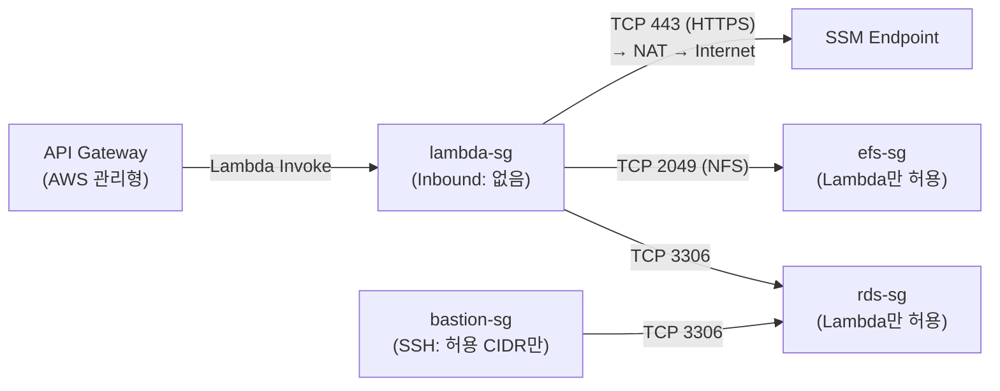

**설계 근거**:

- Lambda는 VPC 내부(Private Subnet)에서 실행되어 RDS/EFS에 직접 접근하되, 외부 통신(SSM 등)은 NAT Gateway를 경유합니다.
- RDS 보안 그룹은 Lambda SG와 Bastion SG만 인바운드 허용하여 최소 권한 원칙을 적용했습니다.
- Bastion Host는 개발 환경에서만 활성화하고, Staging/Prod에서는 비활성화하여 비용을 절감합니다.

#### 환경별 VPC 설정

| 환경 | VPC CIDR | NAT Gateway | AZ 수 | Bastion |
| ------ | ---------- | ------------- | ------- | --------- |
| Dev | `10.0.0.0/16` | 1개 (비용 절감) | 2 | 활성화 |
| Staging | `10.1.0.0/16` | 1개 (비용 절감) | 2 | 비활성화 |
| Prod | `10.2.0.0/16` | AZ당 1개 (2개) | 2 | 비활성화 |

#### Bastion Host (점프 서버)

**Bastion Host**는 외부(인터넷)에서 Private Subnet 내부의 리소스에 접근하기 위한 **유일한 중계 지점(점프 서버)** 입니다. RDS는 보안을 위해 Private Subnet에 배치되어 인터넷에서 직접 접속이 불가능하므로, 개발자가 DB를 관리하려면 Public Subnet에 위치한 Bastion Host를 경유해야 합니다.

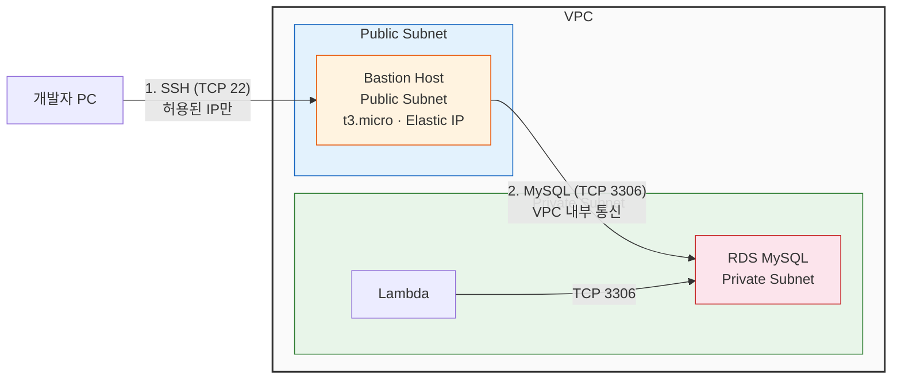

**SSH 터널링을 통한 DB 접속 방식**:

개발자는 Bastion Host에 직접 로그인하는 대신 **SSH 터널(포트 포워딩)** 을 사용하여 로컬 PC에서 RDS에 접속합니다. 이 방식은 Bastion Host에 DB 클라이언트를 설치하지 않아도 되고, 로컬의 GUI 도구(MySQL Workbench 등)를 그대로 사용할 수 있는 장점이 있습니다.

```text
# SSH 터널 생성: 로컬 3306 → Bastion → RDS 3306
ssh -i key.pem -L 3306:<rds-endpoint>:3306 ec2-user@<bastion-eip>

# 별도 터미널에서 로컬처럼 RDS 접속
mysql -h 127.0.0.1 -u community_manager -p community_service
```

**이 프로젝트에서의 설정**:

| 항목 | 설정 |
| ------ | ------ |
| **인스턴스** | `t3.micro` (Free Tier 대상) |
| **OS** | Amazon Linux 2023 (아키텍처에 따라 x86/ARM 자동 선택) |
| **퍼블릭 IP** | Elastic IP 고정 할당 (재시작 시에도 IP 유지) |
| **SSH 접근** | `bastion_allowed_cidrs` 변수로 허용 IP 제한 (민감 정보 — `secret.tfvars`에서 관리) |
| **초기 설정** | User Data 스크립트로 MariaDB 클라이언트 자동 설치 |
| **조건부 생성** | `create_bastion` 변수로 제어 (`count = var.create_bastion ? 1 : 0`) |

**환경별 운영 전략**: Dev 환경에서만 활성화하고, Staging/Prod에서는 `create_bastion = false`로 리소스 자체를 생성하지 않아 비용과 공격 표면을 동시에 줄입니다. 프로덕션 DB 관리가 필요한 경우에는 AWS Systems Manager Session Manager를 통한 접근을 고려합니다.

### 2.3 인증 흐름

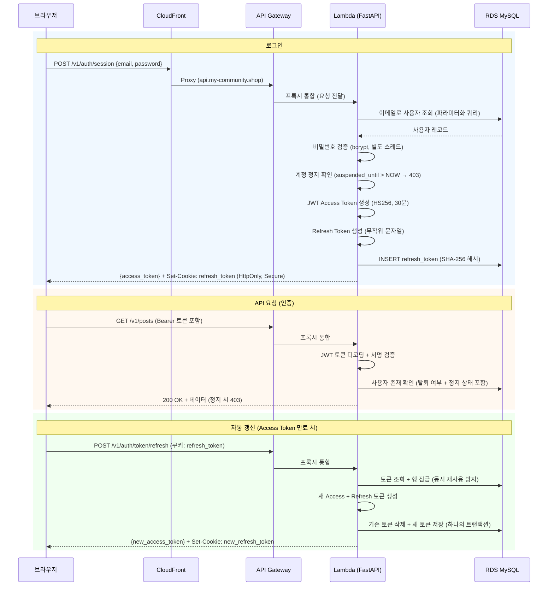

**보안 설계 포인트**:

- Access Token은 JavaScript 변수(메모리)에 저장하여 XSS 공격 시에도 브라우저 저장소보다 안전합니다.
- Refresh Token은 HttpOnly + Secure 쿠키로 JavaScript에서 직접 접근할 수 없게 차단합니다.
- DB 조회 시 행 잠금(`SELECT ... FOR UPDATE`)으로 동시 토큰 재사용 공격을 방지합니다.
- bcrypt 비밀번호 해싱은 별도 스레드에서 실행하여 다른 요청 처리를 지연시키지 않습니다.
- 존재하지 않는 이메일로 로그인 시에도 동일한 비밀번호 검증 절차를 수행하여, 응답 시간 차이로 이메일 존재 여부를 추측하는 공격(타이밍 공격)을 방지합니다.
- 계정 정지(`suspended_until`)는 로그인, 토큰 갱신, API 요청(`_validate_token`) 3개 지점에서 검사하며, 만료 시 자동 해제됩니다(별도 배치 작업 불필요).

### 2.4 CI/CD 파이프라인

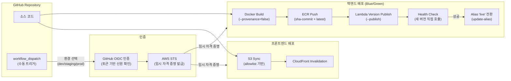

**설계 근거**:

- **OIDC 인증**: 장기 자격 증명(AWS Access Key) 대신 GitHub Actions가 임시 토큰으로 AWS에 인증합니다. 키 유출 위험이 원천 차단됩니다.
- **`--provenance=false`**: Docker 빌드 시 생성되는 출처 증명 메타데이터를 Lambda가 지원하지 않으므로 비활성화해야 합니다.
- **SHA 태그**: `sha-<커밋해시>` 형식의 고유 태그로 Lambda를 업데이트하여 동시 배포 충돌을 방지합니다. `latest` 태그도 병행 push합니다.
- **Blue/Green 배포 (Lambda Alias)**: 새 Lambda 버전을 `--publish`로 발행한 뒤, `/health` 직접 호출로 검증을 거쳐 Alias `live`를 전환합니다. Health check 실패 시 alias가 이전 버전을 유지하므로 서비스 영향 없이 안전하게 롤백됩니다.
- **허용 목록 기반 S3 동기화**: `*.html`, `*.css`, `*.js`, 이미지, 폰트만 업로드하여 불필요한 파일(.git 등)이 배포되지 않습니다.
- **Prod 배포 제한**: 프로덕션 환경은 upstream 레포지토리에서만 배포 가능하도록 OIDC 조건을 설정했습니다.
- **동시 배포 방지**: GitHub Actions `concurrency` 그룹으로 같은 환경에 대한 병렬 배포/롤백을 차단합니다.

### 2.5 기술 스택 정리표

| 카테고리 | 서비스/기술 | 용도 |
| ---------- | ------------ | ------ |
| **CDN** | CloudFront (아시아 포함 요금 등급) | HTTPS 종단, 정적 파일 캐싱, 클린 URL |
| **정적 호스팅** | S3 (비공개 + CloudFront 전용 접근) | HTML/CSS/JS 저장 |
| **DNS** | Route 53 | 도메인 관리, ACM DNS 검증 |
| **SSL** | ACM (서울 + 버지니아) | API Gateway용 + CloudFront용 인증서 |
| **API 라우팅** | API Gateway (HTTP API) | CORS, Lambda 프록시, 접근 로깅 |
| **실시간 알림** | API Gateway (WebSocket API) + DynamoDB (ws_connections) | WebSocket 연결 관리, 실시간 이벤트 푸시 |
| **컴퓨팅** | Lambda (Container Image) | FastAPI + Mangum 실행 |
| **컨테이너 레지스트리** | ECR | Docker 이미지 저장, 라이프사이클 관리 |
| **데이터베이스** | RDS MySQL 8.0 (gp3) | 관계형 데이터, FULLTEXT 검색 |
| **파일 스토리지** | EFS (범용 모드) | 사용자 업로드 이미지 |
| **시크릿 관리** | SSM Parameter Store | DB 비밀번호, JWT 시크릿 (암호화 저장) |
| **이메일** | SES (Simple Email Service) | 이메일 인증, 임시 비밀번호 발급 (도메인 DKIM 인증) |
| **모니터링** | CloudWatch | 6개 알람, 4개 위젯 대시보드 |
| **감사** | CloudTrail (멀티리전) | AWS API 호출 로그 |
| **접근 관리** | IAM (MFA 강제) | 최소 권한 원칙, OIDC 역할 |
| **네트워크** | VPC (2-AZ) | Private Subnet 격리, NAT Gateway |
| **배포** | GitHub Actions + OIDC | 장기 자격 증명 없는 CI/CD |
| **배치 작업** | EventBridge (스케줄 규칙 + API Destination) | 토큰 정리(1시간), 피드 점수 재계산(30분) |
| **분산 Rate Limiting** | DynamoDB (rate_limit 테이블) | Fixed Window Counter, TTL 자동 만료, fail-open 정책 |
| **IaC** | Terraform (>= 1.5.0) | 19개 모듈, 3개 환경 |

---

## 3. 예상 트래픽 기반 장애 시나리오

### 3.1 트래픽 가정

#### 현재 규모 (학교 커뮤니티)

| 지표 | 추정치 | 근거 |
| ------ | -------- | ------ |
| 등록 사용자 | ~100명 | AWS AI School 수강생 규모 |
| 일일 활성 사용자(DAU) | ~30명 | 수강생의 30% 일일 접속 가정 |
| 피크 동시 접속 | ~10명 | 수업 후 시간대 집중 |
| 일일 게시글 | ~20건 | 학습 공유, 질문 |
| 일일 API 요청 | ~3,000건 | DAU × 평균 100 요청 |

#### 성장 시나리오

| 단계 | DAU | 피크 동시 접속 | 일일 API 요청 | 트리거 이벤트 |
| ------ | ----- | --------------- | -------------- | -------------- |
| **현재** | 30 | 10 | 3,000 | — |
| **Stage 1** | 300 | 50 | 30,000 | 교육 기관 확대 |
| **Stage 2** | 3,000 | 500 | 300,000 | 외부 공개 |
| **Stage 3** | 30,000 | 5,000 | 3,000,000 | 바이럴 성장 |

부하 테스트에서 확인한 기준: 50~200 동시 사용자, 요청 타임아웃 15초(Lambda 콜드 스타트 감안).

### 3.2 병목 지점 분석

#### 3.2.1 Lambda 동시성 및 콜드 스타트

| 지표 | 현재 설정 | 한계 |
| ------ | ----------- | ------ |
| Provisioned Concurrency (Prod) | 5 | 5개 초과 동시 요청은 콜드 스타트 발생 |
| On-demand 동시성 | 계정 기본 1,000 | 리전 계정 한도에 의존 |
| 콜드 스타트 소요 시간 | 3~10초 | VPC ENI 프로비저닝 + SSM 조회 + 앱 초기화 |
| 메모리 (Prod) | 1,024 MB | CPU는 메모리에 비례 배분 |

**영향**: Stage 2(피크 500명) 이상에서 Provisioned Concurrency 5개가 부족하여 대부분의 요청이 콜드 스타트를 경험합니다. 콜드 스타트 3~10초는 사용자 경험에 직접적인 영향을 줍니다.

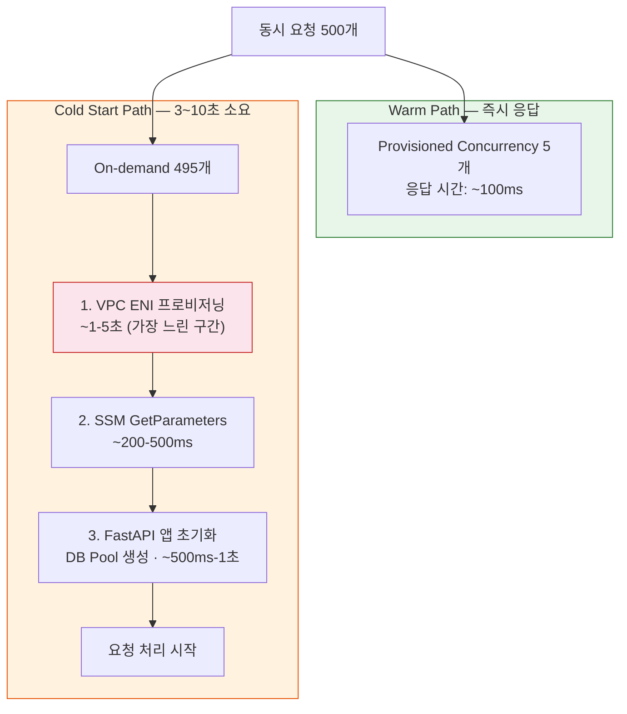

#### 3.2.2 RDS 단일 인스턴스 병목

| 지표 | Dev | Staging | Prod | 한계 |
| ------ | ----- | --------- | ------ | ------ |
| 인스턴스 | db.t3.micro | db.t3.small | db.t3.medium | vCPU 2, 4GB RAM |
| 최대 커넥션 (추정) | ~60 | ~120 | ~120 | `max_connections` = RAM 의존 |
| 앱 커넥션 풀 | 5~50 | 5~50 | 5~50 | Lambda 인스턴스당 |
| CloudWatch 알람 | — | — | > 40 커넥션 | 경고 기준 |
| 스토리지 (gp3) | 20 GB 고정 | 20~100 GB | 50~200 GB | 자동 확장 |

**핵심 문제**: Lambda가 수평 확장되면 각 인스턴스가 독립적인 커넥션 풀(최대 50개)을 생성합니다. Lambda 인스턴스 20개가 동시에 실행되면 이론적으로 최대 1,000개의 DB 커넥션이 요청되어 RDS 한도를 초과합니다.

```text
Lambda 인스턴스 수 × 풀 최대 크기 = 잠재적 DB 커넥션 수
      20        ×    50     =     1,000 (RDS 한도 초과!)
```

#### 3.2.3 Rate Limiter의 분산 환경 한계

Rate Limiter는 로컬(인메모리)과 분산(DynamoDB) 두 가지 백엔드를 지원합니다. 프로덕션에서는 DynamoDB Fixed Window Counter를 사용하여 Lambda 인스턴스 간 상태를 공유하지만, DynamoDB 장애 시 fail-open 정책으로 요청을 허용합니다.

| 설계 | 인메모리 (로컬) | DynamoDB (프로덕션) | 잔여 한계 |
| ------ | ------------- | ------------------- | --------- |
| 로그인 제한 | 5 × N회/60초 (인스턴스별) | 5회/60초 (전역) | DynamoDB 장애 시 fail-open |
| 게시글 작성 | 10 × N회/60초 (인스턴스별) | 10회/60초 (전역) | DynamoDB 장애 시 fail-open |

**영향**: DynamoDB 백엔드 도입으로 정상 상황에서는 정확한 전역 제한이 가능하지만, DynamoDB 장애 시에는 가용성 우선(fail-open)으로 제한이 무효화됩니다. WAF 등 상위 계층 방어를 추가하면 이 잔여 위험을 완화할 수 있습니다.

#### 3.2.4 EFS 처리량 한계

| 모드 | 기본 처리량 | 버스트 크레딧 |
| -------- | ---------------------- | ---------------------------------------- |
| Bursting | 50 KB/s per GiB stored | 100 MiB/s (크레딧 소진 시 기본으로 복귀) |

**영향**: 저장 데이터가 적을 때(1 GiB 미만) 기본 처리량이 50 KB/s 이하로 떨어질 수 있어, 다중 이미지 업로드가 동시에 발생하면 지연이 발생합니다.

### 3.3 장애 전파 구조

#### 시나리오 1: RDS 장애

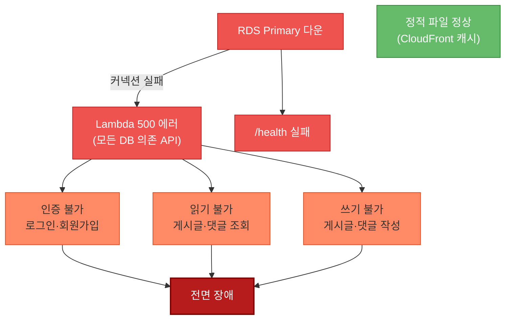

**영향 범위**: 전면 장애. RDS는 단일 의존점(Single Point of Failure)으로, 모든 API가 DB에 의존합니다.
**복구**: Multi-AZ(Prod) 환경에서는 자동 페일오버(60~120초). Dev/Staging은 수동 복구 필요.

#### 시나리오 2: Lambda 스로틀링

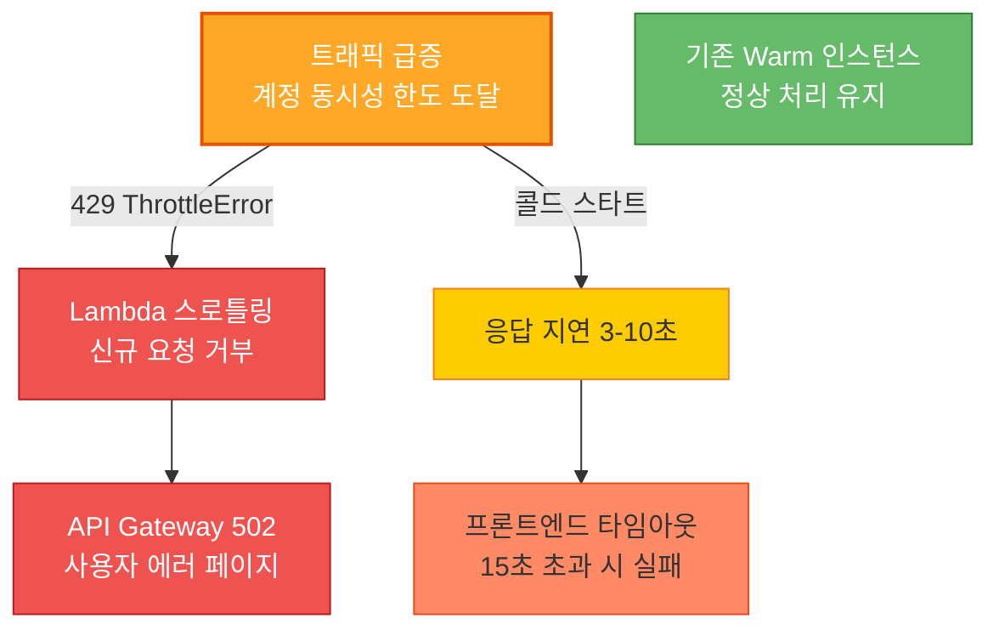

**영향 범위**: 부분 장애. 기존 warm 인스턴스가 처리하는 요청은 정상이지만, 신규 요청이 거부됩니다.
**복구**: 트래픽 감소 시 자동 복구. 계정 한도 증가 요청(AWS Support) 또는 Provisioned Concurrency 증설로 예방.

#### 시나리오 3: NAT Gateway 장애

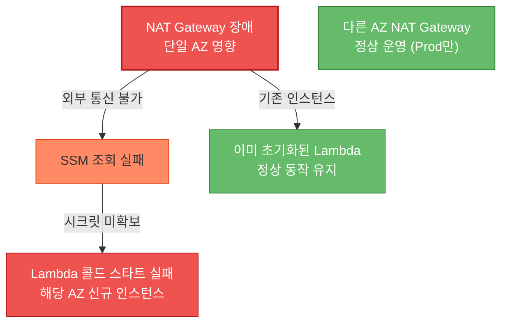

**영향 범위**:

- **Dev/Staging (단일 NAT)**: 전면 장애 — 모든 새 Lambda 인스턴스가 콜드 스타트 실패.
- **Prod (AZ별 NAT)**: 한 AZ만 영향. 다른 AZ는 정상.

---

## 4. 고가용성 구현 방안

### 4.1 현재 구현 상태 (As-Is)

#### 환경별 HA 설정 비교

| 항목 | Dev | Staging | Prod |
| ------ | ----- | --------- | ------ |
| **가용 영역** | 2-AZ | 2-AZ | 2-AZ |
| **NAT Gateway** | 1개 (단일 AZ) | 1개 (단일 AZ) | 2개 (AZ당 1개) |
| **RDS Multi-AZ** | 비활성화 | 비활성화 | **활성화** |
| **RDS 백업 보존** | 1일 | 3일 | **14일** |
| **RDS 삭제 보호** | 비활성화 | 비활성화 | **활성화** |
| **RDS Final Snapshot** | 비활성화 | 비활성화 | **활성화** |
| **Lambda Provisioned** | 0 | 0 | **5** |
| **EFS 마운트 타겟** | 2-AZ | 2-AZ | 2-AZ |
| **CloudFront** | 글로벌 | 글로벌 | 글로벌 |
| **S3 내구성** | 99.999999999% | 99.999999999% | 99.999999999% |
| **CloudWatch 알람** | 6개 | 6개 | 6개 |
| **Log 보존** | 7일 | 14일 | **30일** |
| **CloudTrail** | 30일 | 60일 | **90일** |
| **ECR 이미지 보존** | 3개 | 10개 | **20개** |

#### 이미 적용된 HA 요소

1. **Prod RDS Multi-AZ**: Primary 장애 시 Standby로 자동 페일오버 (60~120초)
2. **Prod NAT Gateway Per-AZ**: 한 AZ의 NAT 장애 시 다른 AZ 정상 운영
3. **EFS 3-AZ 자동 복제**: 파일 시스템 자체가 다중 AZ에 자동 분산
4. **CloudFront 글로벌 엣지**: AWS 관리형 HA, 200+ 엣지 로케이션
5. **S3 99.999999999% 내구성**: 99.999999999% 데이터 내구성
6. **Lambda 자동 스케일링**: 요청량에 따라 자동으로 인스턴스 생성
7. **Terraform State 보호**: S3 버전 관리 + DynamoDB 동시 수정 잠금
8. **Blue/Green 배포**: Lambda Alias `live` 기반 즉시 트래픽 전환 + Health check 게이트 + 수동 롤백 워크플로우

### 4.2 가용 영역 분산 전략

#### 현재 상태

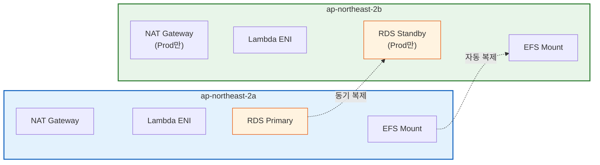

#### 개선안: 3-AZ 확장

| 항목 | 현재 (2-AZ) | 개선 (3-AZ) | 비용 증가 |
| ------ | ------------- | ------------- | ----------- |
| Private Subnet | 2개 | 3개 | VPC 무료 |
| NAT Gateway | 2개 (Prod) | 3개 | +~$32/월 |
| EFS Mount Target | 2개 | 3개 | 무료 (EFS 자동) |
| RDS | Multi-AZ (2) | Multi-AZ (자동) | 변동 없음 |

**권장**: 현재 2-AZ 구성은 대부분의 장애 시나리오에 충분합니다. Stage 3(DAU 30,000) 진입 시 3-AZ로 확장을 고려합니다.

### 4.3 Auto Scaling / Load Balancer 활용 방안

#### 4.3.1 Lambda Provisioned Concurrency Auto Scaling

현재 Prod에서 Provisioned Concurrency가 5로 고정되어 있습니다. Application Auto Scaling을 적용하면 트래픽에 따라 자동 조절할 수 있습니다.

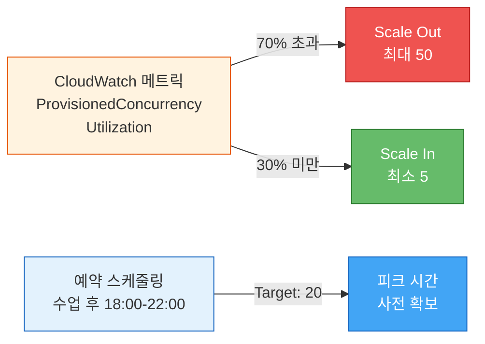

**구현 방법** (Terraform):

```hcl
resource "aws_appautoscaling_target" "lambda" {
  max_capacity       = 50
  min_capacity       = 5
  resource_id        = "function:${lambda_function_name}:${lambda_alias}"
  scalable_dimension = "lambda:function:ProvisionedConcurrency"
  service_namespace  = "lambda"
}

resource "aws_appautoscaling_policy" "lambda" {
  name               = "lambda-concurrency-tracking"
  policy_type        = "TargetTrackingScaling"
  resource_id        = aws_appautoscaling_target.lambda.resource_id
  scalable_dimension = aws_appautoscaling_target.lambda.scalable_dimension
  service_namespace  = aws_appautoscaling_target.lambda.service_namespace

  target_tracking_scaling_policy_configuration {
    target_value = 0.7  # 70% 사용률 유지
    predefined_metric_specification {
      predefined_metric_type = "LambdaProvisionedConcurrencyUtilization"
    }
  }
}
```

**비용 영향**: Provisioned Concurrency는 할당된 만큼 과금됩니다 ($0.000004646/GiB-초). 50개 유지 시 월 ~$160 (1024MB 기준).

#### 4.3.2 RDS Read Replica + 읽기 분리

| 작업 유형 | 비율 (추정) | 대상 |
| ----------- | ------------ | ------ |
| 읽기 (GET) | ~80% | 게시글 목록, 상세, 댓글, 알림 |
| 쓰기 (POST/PUT/DELETE) | ~20% | 게시글 작성, 댓글, 좋아요, 북마크 |

**구현 방법**: RDS Read Replica를 추가하고, 애플리케이션에서 읽기/쓰기 커넥션 풀을 분리합니다.


**비용 영향**: `db.t3.medium` Read Replica 추가 시 월 ~$49.

#### 4.3.3 Load Balancer에 대한 고려

현재 아키텍처(API Gateway → Lambda)에서는 **ALB(Application Load Balancer)가 불필요**합니다.

| 비교 항목 | API Gateway (현재) | ALB + Lambda |
| ----------- | ------------------- | ------------- |
| 비용 모델 | 요청당 과금 ($1/백만 요청) | 고정비 + LCU |
| 관리 부담 | 완전 관리형 | 타겟 그룹, 헬스체크 설정 |
| 기능 | CORS, 인증, 스테이지, 접근 로깅 내장 | L7 라우팅, 가중 타겟 그룹 |
| 적합 시나리오 | 서버리스, 저~중 트래픽 | 컨테이너(ECS/EKS), 고트래픽 |

**결론**: Stage 2까지는 API Gateway가 비용 효율적입니다. Stage 3에서 ECS/EKS 마이그레이션 시 ALB 도입을 고려합니다.

### 4.4 데이터 이중화 및 백업 전략

#### 4.4.1 데이터 계층별 백업 현황

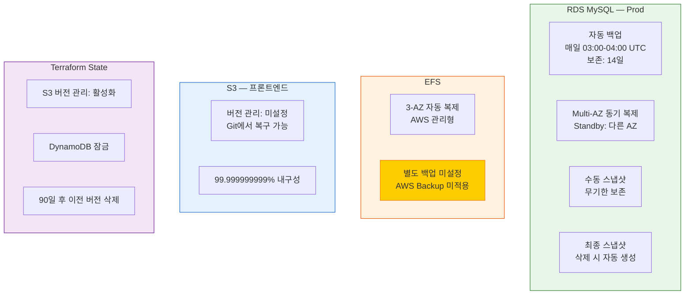

#### 4.4.2 RDS 백업 상세

| 설정 | Dev | Staging | Prod |
| ------ | ----- | --------- | ------ |
| 자동 백업 | 1일 보존 | 3일 보존 | **14일 보존** |
| 백업 윈도우 | 03:00-04:00 UTC | 03:00-04:00 UTC | 03:00-04:00 UTC |
| Multi-AZ | 미적용 | 미적용 | **적용** |
| 삭제 보호 | 미적용 | 미적용 | **적용** |
| 최종 스냅샷 | 미적용 | 미적용 | **적용** |
| 스토리지 암호화 | AES-256 | AES-256 | AES-256 |
| 스토리지 자동 확장 | 미적용 | 최대 100 GB | **최대 200 GB** |

#### 4.4.3 개선 권장사항

| 항목 | 현재 | 개선안 | 우선순위 |
| ------ | ------ | -------- | --------- |
| EFS 백업 | 미설정 | AWS Backup으로 일일 스냅샷 (7일 보존) | 높음 |
| S3 프론트엔드 버전 관리 | 미설정 | S3 Versioning 활성화 + 30일 Noncurrent 만료 | 중간 |
| RDS 크로스리전 백업 | 미설정 | 크로스리전 스냅샷 복사 (재해 복구) | 낮음 (비용 고려) |

### 4.5 장애 복구 전략 (RTO/RPO)

#### 4.5.1 컴포넌트별 RTO/RPO 매트릭스

| 컴포넌트 | RPO (데이터 손실 허용) | RTO (복구 시간 목표) | 복구 방법 |
| ---------- | ---------------------- | -------------------- | --------- |
| **CloudFront** | 0 (AWS 관리형) | ~0 (자동) | AWS 글로벌 인프라 자동 복구 |
| **S3 (프론트엔드)** | 0 (99.999999999%) | ~0 (자동) | Git에서 재배포 가능 (< 5분) |
| **API Gateway** | 0 (AWS 관리형) | ~0 (자동) | AWS 관리형 자동 복구 |
| **Lambda** | 0 (Stateless) | **~10초** | Alias 전환으로 즉시 롤백 (Blue/Green) |
| **RDS (Prod)** | ~0 (동기 복제) | **60~120초** | Multi-AZ 자동 페일오버 |
| **RDS (Dev/Stg)** | **최대 24시간** | **수 시간** | 자동 백업에서 수동 복원 |
| **EFS** | 0 (3-AZ 복제) | ~0 (자동) | AWS 관리형 자동 복구 |
| **EFS 데이터** | **최대 24시간** | **수 시간** | 백업 미설정 — 복구 불가 (개선 필요) |
| **SSM 파라미터** | 0 (AWS 관리형) | ~0 | AWS 관리형, 별도 백업 불필요 |

#### 4.5.2 주요 장애 복구 절차

##### Lambda 장애 복구 (Blue/Green 롤백)

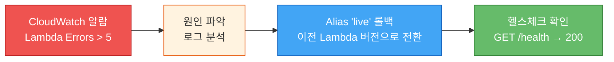

```bash
# 방법 1: GitHub Actions 롤백 워크플로우 (권장)
# Actions → rollback-backend.yml → 환경 선택 → 버전 지정 (선택)

# 방법 2: CLI로 직접 alias 전환
# 현재 alias가 가리키는 버전 확인
aws lambda get-alias \
  --function-name my-community-prod-backend \
  --name live

# 이전 버전으로 alias 전환 (즉시 적용)
aws lambda update-alias \
  --function-name my-community-prod-backend \
  --name live \
  --function-version {prev_version}
```

**RTO**: ~10초 (Alias 전환 즉시, 콜드 스타트 없음 — 이전 버전이 이미 warm 상태)
**RPO**: 0 (Stateless)

##### RDS 장애 복구

**Prod (Multi-AZ 자동 페일오버)**:

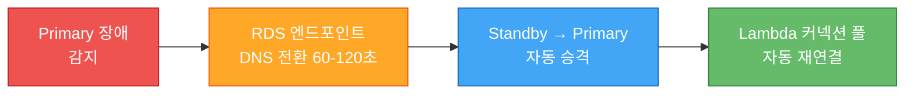

**RTO**: 60~120초 (자동)
**RPO**: ~0 (동기 복제)

**Dev/Staging (수동 복원)**:

```bash
# Point-in-Time 복원 (최대 백업 보존 기간 내)
aws rds restore-db-instance-to-point-in-time \
  --source-db-instance-identifier my-community-dev \
  --target-db-instance-identifier my-community-dev-restored \
  --restore-time "2026-03-02T12:00:00Z"
```

**RTO**: 수 시간 (인스턴스 생성 + 데이터 복원 + DNS 변경)
**RPO**: 최대 24시간 (자동 백업 주기)

##### S3 프론트엔드 복구

```bash
# Git에서 재배포 (GitHub Actions 또는 수동)
aws s3 sync ./html s3://my-community-prod-frontend/ \
  --include "*.html" --include "*.css" --include "*.js"
aws cloudfront create-invalidation \
  --distribution-id {dist_id} --paths "/*"
```

**RTO**: < 5분
**RPO**: 0 (Git 저장소가 원본)

#### 4.5.3 모니터링 → 알람 → 대응 플로우

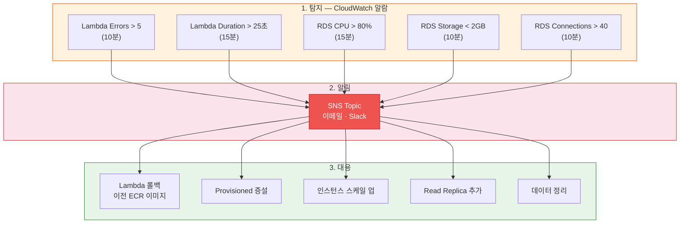

**현재 제한사항**: `alarm_sns_topic_arn`이 미설정 상태로, 알람 발생 시 대시보드에서만 확인 가능합니다. SNS 토픽 생성 및 이메일/Slack 구독 설정이 필요합니다.

---

## 5. 결론 및 개선 로드맵

### 5.1 현재 아키텍처의 강점

| 강점 | 설명 |
| ------ | ------ |
| **완전 서버리스** | Lambda + API Gateway로 서버 관리 부담 제거, 유휴 시 비용 0 |
| **IaC 완전 관리** | Terraform 19개 모듈로 전체 인프라 코드화, 환경 재현 가능 |
| **보안 계층화** | VPC 격리, SSM 시크릿, OIDC 배포, MFA 강제, OAC 전용 S3 |
| **환경별 차등 설계** | Dev(비용 최소) → Staging(중간) → Prod(HA 강화) 단계적 구성 |
| **모니터링 기반** | CloudWatch 6개 알람 + 4개 위젯 대시보드 + CloudTrail 감사 |
| **배포 안전성** | Blue/Green 배포로 Health check 통과 후에만 트래픽 전환, 실패 시 자동 유지 + 수동 롤백 워크플로우 |
| **수평 확장 지원** | 분산 Rate Limiter(DynamoDB) + EventBridge 배치 작업으로 다중 인스턴스 환경 대응 |
| **비용 효율** | Free Tier 활용(t3.micro), 단일 NAT(Dev), Provisioned Concurrency 최소화 |

### 5.2 현재 아키텍처의 약점

| 약점 | 영향 | 위험 시점 | 심각도 |
| ------ | ------ | ---------- | -------- |
| DB 커넥션 폭발 위험 | Lambda 스케일 아웃 시 RDS 커넥션 한도 초과 | Lambda 20+ 동시 인스턴스 | 높음 |
| Rate Limiter fail-open | DynamoDB 장애 시 제한 무효화 (가용성 우선 정책) | DynamoDB 서비스 장애 시 | 중간 |
| EFS 백업 미설정 | 사용자 업로드 이미지 복구 불가 | **즉시** (데이터 손실 시 복구 수단 없음) | 높음 |
| SNS 알림 미설정 | 장애 발생 시 대시보드 수동 확인 필요 | **즉시** (야간 장애 시 인지 지연) | 중간 |
| 캐싱 부재 | 반복 조회(게시글 목록 등) 매번 DB 접근 | DAU 300+ (일일 30,000+ 요청) | 중간 |
| Provisioned Concurrency 고정 | 트래픽 변동에 수동 대응 필요 | 피크 시간대 (수업 후 18-22시) | 낮음 |

### 5.3 개선 로드맵

#### 즉시 (비용 0~$5/월)

| 항목 | 작업 | 효과 |
| ------ | ------ | ------ |
| SNS 알림 설정 | SNS 토픽 생성 + 이메일 구독 | 장애 즉시 인지 |
| EFS 백업 | AWS Backup 일일 스냅샷 (7일 보존) | 업로드 파일 복구 가능 |
| Lambda Insights | CloudWatch Lambda Insights 활성화 | 콜드 스타트, 메모리 사용량 상세 모니터링 |

#### 단기 (Stage 1: DAU 300, 월 ~$50 추가)

| 항목 | 작업 | 효과 |
| ------ | ------ | ------ |
| RDS Proxy | AWS RDS Proxy 도입 | Lambda ↔ RDS 커넥션 풀링, 커넥션 폭발 방지 |
| Provisioned Auto Scaling | Application Auto Scaling 적용 | 트래픽 기반 콜드 스타트 자동 제거 |
| WAF | AWS WAF + API Gateway 연동 | SQL Injection, XSS, Rate Limiting 중앙화 |

#### 중기 (Stage 2: DAU 3,000, 월 ~$200 추가)

| 항목 | 작업 | 효과 |
| ------ | ------ | ------ |
| ElastiCache (Redis) | 게시글 목록/인기 게시글 캐싱 | DB 부하 80% 감소 (읽기) |
| RDS Read Replica | 읽기 전용 복제본 추가 | 쓰기/읽기 분리, DB 성능 2배 |
| CloudFront API 캐싱 | GET /v1/posts 엣지 캐싱 (TTL 30초) | API 응답 속도 개선, Lambda 호출 감소 |
| ~~분산 Rate Limiter~~ | ~~DynamoDB 기반 분산 Rate Limiter~~ | ~~구현 완료~~ (Fixed Window Counter + TTL, fail-open 정책) |

#### 장기 (Stage 3: DAU 30,000)

| 항목 | 작업 | 효과 |
| ------ | ------ | ------ |
| ECS/EKS 마이그레이션 | Lambda → 컨테이너 오케스트레이션 | 커넥션 풀 안정화, 장시간 처리 가능 |
| Aurora Serverless v2 | RDS → Aurora | 자동 스케일링, 최대 128 ACU |
| S3 이미지 마이그레이션 | EFS → S3 + CloudFront | 이미지 CDN 배포, 무제한 확장 |
| 3-AZ 확장 | VPC 서브넷 3개 AZ로 확장 | 가용 영역 장애 내성 강화 |
| ~~실시간 알림~~ | ~~WebSocket (API Gateway WebSocket API)~~ | ~~구현 완료~~ (별도 WebSocket API GW + Lambda + DynamoDB) |

---

> **요약**: 현재 아키텍처는 서버리스 + IaC 기반으로 학교 규모(~100명)에 적합하며, Prod 환경에서 RDS Multi-AZ, Per-AZ NAT, Provisioned Concurrency 등 핵심 HA 요소가 적용되어 있습니다. 성장 단계에 따라 RDS Proxy → ElastiCache → Read Replica → 컨테이너 마이그레이션 순서로 점진적 개선이 가능한 아키텍처입니다.
