# 커뮤니티 서비스 "아무 말 대잔치" — 인프라 아키텍처 및 안정성 설계 보고서

> **작성일**: 2026-03-15
> **프로젝트**: AWS AI School 2기 개인 프로젝트
> **도메인**: my-community.shop
> **리전**: ap-northeast-2 (서울)

---

## 목차

1. [프로젝트 개요](#1-프로젝트-개요)
2. [시스템 아키텍처 설계도](#2-시스템-아키텍처-설계도)
3. [예상 트래픽 기반 장애 시나리오](#3-예상-트래픽-기반-장애-시나리오)
4. [고가용성 구현 방안](#4-고가용성-구현-방안)
5. [결론 및 개선 로드맵](#5-결론-및-개선-로드맵)

---

## 1. 프로젝트 개요

### 1.1 서비스 소개 및 보고서 목적

"아무 말 대잔치"는 수강생 간 학습 경험 공유, 질문/답변, 프로젝트 협업을 위한 커뮤니티 포럼입니다.

본 보고서는 이 서비스의 **인프라 아키텍처 설계, 예상 트래픽 기반 장애 시나리오 분석, 고가용성 구현 방안**을 다룹니다. 단순 기능 설명이 아닌, 실제 서비스 운영을 가정하여 다음 관점에서 작성되었습니다.

- **가용성**: 서비스 중단 없이 안정적으로 운영할 수 있는가?
- **확장성**: 사용자 증가에 따라 인프라가 자동으로 대응할 수 있는가?
- **복구 가능성**: 장애 발생 시 데이터 손실 없이 신속하게 복구할 수 있는가?
- **비용 효율성**: 현재 규모에 맞는 적정 비용으로 운영되고 있는가?

### 1.2 기술 스택

| 계층 | 기술 | 선택 근거 | 운영 고려사항 |
| --- | --- | --- | --- |
| **프론트엔드** | Vanilla JavaScript (MPA, Vite 빌드) | 프레임워크 없이 JS 기본기 학습 | nginx Pod으로 정적 배포 |
| **백엔드** | FastAPI (Python 3.11+, aiomysql) | 비동기 I/O, 자동 API 문서화 | K8s Pod에서 Uvicorn 실행, HPA 자동 스케일링 |
| **데이터베이스** | MySQL 8.0 (RDS + K8s StatefulSet) | FULLTEXT 검색(ngram), 트랜잭션 격리 | RDS 관리형 + K8s 내부 MySQL 이중 구성 |
| **인증** | JWT (Access 30분 + Refresh 7일) | Stateless 인증, XSS 방어 | 토큰 저장소 DB 의존, CronJob 주기적 정리 |
| **인프라** | AWS (Terraform 활성 12개 + 레거시 9개 모듈) + kubeadm K8s | IaC 재현성, 컨테이너 오케스트레이션 학습 | 3개 환경(Dev/Staging/Prod) 통일 아키텍처 |
| **CI/CD** | GitHub Actions + OIDC | 장기 자격 증명 없는 배포 | 리포지토리별 독립 워크플로우, 롤링 업데이트 |
| **모니터링** | Prometheus + Grafana (kube-prometheus-stack) | K8s 네이티브 메트릭 수집 | ServiceMonitor 자동 수집, Alertmanager 연동 |
| **부하 테스트** | Locust (gevent 기반) | 3종 사용자 시나리오 | 병목 사전 식별, 50~200 동시 사용자 검증 완료 |

### 1.3 아키텍처 전환 배경

프로젝트 초기에는 서버리스 아키텍처(Lambda + API Gateway + CloudFront)로 운영했습니다. 학습 목적과 운영 안정성 확보를 위해 kubeadm 기반 K8s 클러스터로 전환했습니다.

| 항목 | 서버리스 (이전) | K8s (현재) |
| --- | --- | --- |
| 컴퓨팅 | Lambda 컨테이너 | EC2 위 K8s Pod |
| 프론트엔드 | S3 + CloudFront | nginx Pod |
| WebSocket | API Gateway WebSocket + Lambda + DynamoDB | WS Pod + Redis Pub/Sub |
| 파일 스토리지 | EFS 마운트 | S3 직접 업로드 |
| Rate Limiter | DynamoDB Fixed Window Counter | Redis |
| 배치 작업 | EventBridge → Lambda 내부 API | K8s CronJob |
| 모니터링 | CloudWatch 알람 + 대시보드 | Prometheus + Grafana |
| 배포 | Blue/Green (Lambda Alias) | 롤링 업데이트 (kubectl) |
| 콜드 스타트 | 3~10초 (VPC ENI + SSM + 앱 초기화) | 없음 (항상 실행 중) |
| 비용 모델 | 요청당 과금 + Provisioned Concurrency | 고정 EC2 비용 |

### 1.4 서비스 특성과 인프라 요구사항

| 서비스 특성 | 인프라 요구사항 | 핵심 대응 |
| --- | --- | --- |
| **읽기 중심 워크로드** (~80%) | DB 읽기 부하 분산 | RDS Read Replica 고려, Redis 캐싱 가능 |
| **이미지 업로드** (게시글당 최대 5장) | 파일 저장소 내구성 | S3 (99.999999999% 내구성) |
| **FULLTEXT 검색** (한국어 ngram) | DB CPU 부하 | MySQL FULLTEXT INDEX, 대규모 시 Elasticsearch 고려 |
| **실시간 알림** (WebSocket) | 연결 관리, 상태 공유 | Redis Pub/Sub, 폴링 자동 폴백 |
| **인증 토큰 관리** | 토큰 정합성, 브루트포스 방어 | DB 행 잠금, Redis Rate Limiter |
| **동시 쓰기** (좋아요·북마크·댓글) | 경쟁 상태 방지 | UNIQUE 제약, READ COMMITTED 격리 |
| **DM 쪽지** (1:1 비공개 메시지) | soft delete, 차단 연동 | WebSocket 실시간 전달 + 폴링 폴백 |

---

## 2. 시스템 아키텍처 설계도

### 2.1 전체 구성도

사용자 요청이 브라우저에서 출발하여 K8s 클러스터 내부에서 처리되고, AWS 관리형 서비스와 연동되는 전체 흐름입니다.

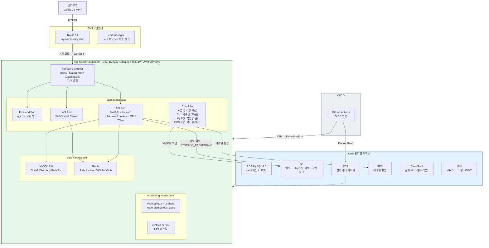

#### 컴포넌트별 역할과 설계 근거

| 컴포넌트 | 역할 | 설계 근거 |
| --- | --- | --- |
| **Ingress (nginx)** | HTTPS 종단, 경로 기반 라우팅, TLS 관리 | hostNetwork DaemonSet으로 외부 LB 없이 직접 트래픽 수신 |
| **cert-manager** | Let's Encrypt TLS 인증서 자동 발급·갱신 | ACM 대비 K8s 네이티브, 비용 0 |
| **API Pod** | FastAPI 앱 실행 (Uvicorn) | HPA로 CPU 70% 기준 2~4개 Pod 자동 스케일링 |
| **WS Pod** | WebSocket 실시간 알림 | Redis Pub/Sub로 Pod 간 이벤트 브로드캐스트 |
| **FE Pod** | nginx + Vite 빌드 정적 파일 서빙 | K8s 내부 직접 서빙, CDN 없이 배포 |
| **MySQL (StatefulSet)** | K8s 내부 MySQL (데이터 계층) | 개발 환경 빠른 접근, RDS와 별도 운영 |
| **Redis** | Rate Limiter, WebSocket Pub/Sub | 인메모리 저장소, DynamoDB 대체 |
| **RDS** | AWS 관리형 MySQL (프라이빗 서브넷) | 자동 백업, Multi-AZ(Prod), 관리 부담 최소화 |
| **S3** | 파일 업로드, MySQL 백업, CloudTrail 로그 | 99.999999999% 내구성, IAM 역할 인증 |
| **ECR** | Docker 이미지 저장 | K8s 노드 IAM 역할로 Pull, lifecycle 정책 |
| **SES** | 이메일 인증, 임시 비밀번호 발송 | 도메인 DKIM 인증, AWS 관리형 |
| **Prometheus + Grafana** | 클러스터 메트릭 수집·시각화 | ServiceMonitor 자동 수집, HPA 연동 |

### 2.2 네트워크 토폴로지

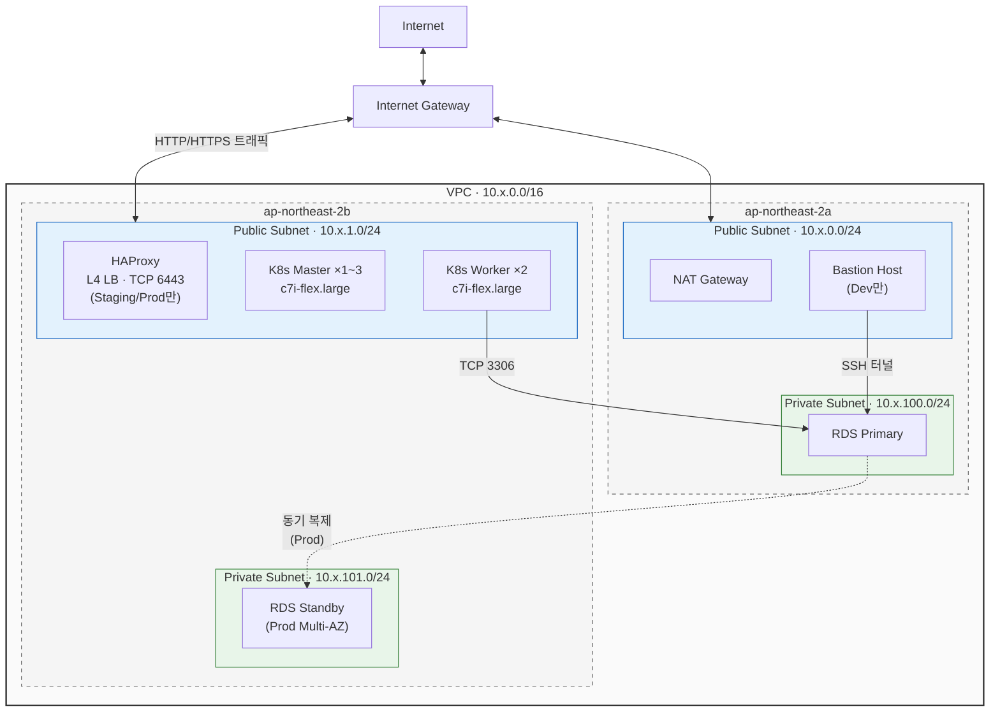

#### 보안 그룹 트래픽 흐름

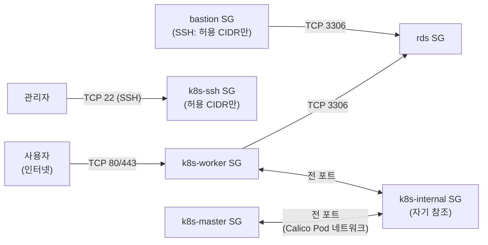

**설계 근거**:

- K8s 노드는 퍼블릭 서브넷에 배치 — Ingress Controller(hostNetwork)가 인터넷 트래픽을 직접 수신합니다.
- K8s Internal SG는 자기 참조(self-referencing)로 노드 간 전 포트 통신을 허용합니다 (Calico CNI 직접 라우팅에 필수).
- RDS는 프라이빗 서브넷에 격리되어 K8s Worker SG와 Bastion SG에서만 접근 가능합니다.
- SSH SG는 `k8s_allowed_ssh_cidrs`가 제공된 경우에만 조건부 생성됩니다.

#### 환경별 VPC 설정

| 환경 | VPC CIDR | NAT Gateway | K8s 토폴로지 | EC2 합계 | Bastion |
| --- | --- | --- | --- | --- | --- |
| Dev | `10.0.0.0/16` | 1개 | 1M + 2W | 3대 | 활성화 |
| Staging | `10.1.0.0/16` | 1개 | **3M + 2W + HAProxy** (HA) | 6대 | 비활성화 |
| Prod | `10.2.0.0/16` | AZ당 1개 | **3M + 2W + HAProxy** (HA) | 6대 | 비활성화 |

### 2.3 서비스 간 통신 흐름

#### 인증 흐름 (JWT)

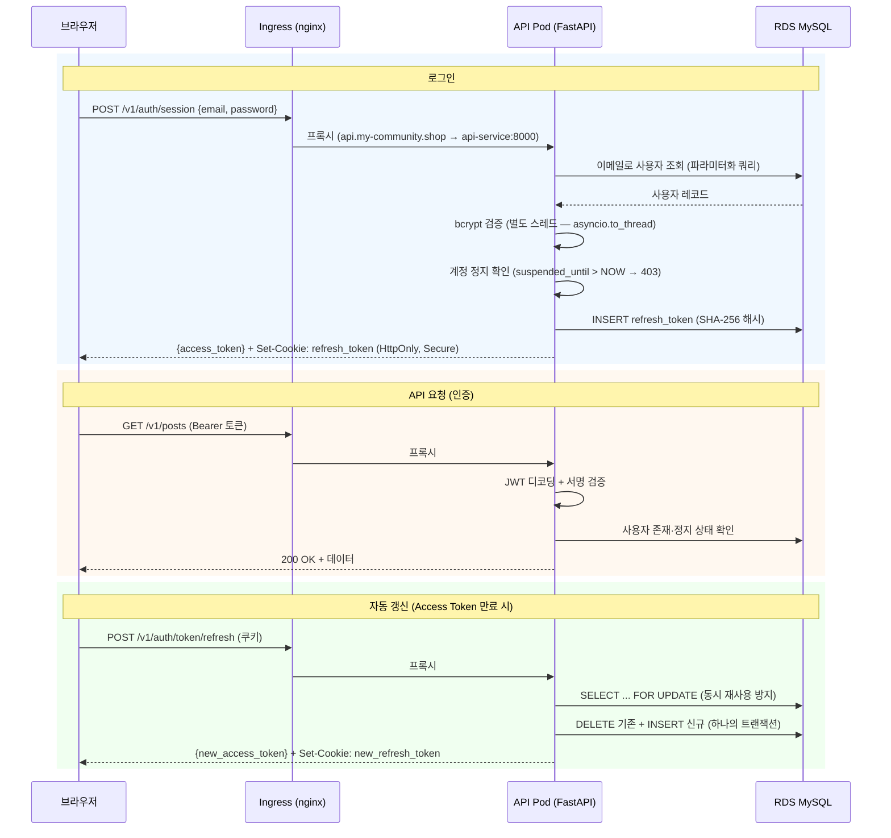

**보안 설계 포인트**:

- Access Token은 JavaScript 메모리에 저장 — XSS 공격 시에도 브라우저 저장소보다 안전합니다.
- Refresh Token은 HttpOnly + Secure 쿠키로 JavaScript 직접 접근을 차단합니다.
- DB 행 잠금(`SELECT ... FOR UPDATE`)으로 동시 토큰 재사용 공격을 방지합니다.
- 타이밍 공격 방지: 존재하지 않는 이메일로 로그인 시에도 동일한 bcrypt 검증을 수행합니다.

#### CI/CD 배포 흐름

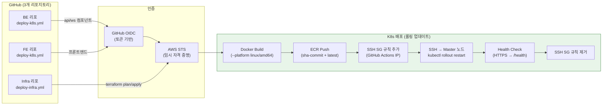

**설계 근거**:

- **OIDC 인증**: 장기 자격 증명(AWS Access Key) 없이 임시 토큰으로 AWS 인증. 자격 증명 유출 위험을 제거합니다.
- **동적 SSH SG 관리**: 배포 시에만 GitHub Actions Runner IP를 SSH SG에 추가하고, 완료 후 즉시 제거합니다.
- **롤링 업데이트**: `kubectl rollout restart`로 무중단 배포. 새 Pod가 Ready 후 기존 Pod를 종료합니다.
- **리포지토리별 독립 워크플로우**: BE(api/ws), FE(프론트엔드), Infra(Terraform)를 분리하여 배포 범위를 제한합니다.

---

## 3. 예상 트래픽 기반 장애 시나리오

### 3.1 트래픽 가정

#### 현재 규모 (학교 커뮤니티)

| 지표 | 추정치 | 근거 |
| --- | --- | --- |
| 등록 사용자 | ~100명 | AWS AI School 수강생 규모 |
| 일일 활성 사용자(DAU) | ~30명 | 수강생의 30% 일일 접속 가정 |
| 피크 동시 접속 | ~10명 | 수업 후 시간대 집중 |
| 일일 게시글 | ~20건 | 학습 공유, 질문 |
| 일일 API 요청 | ~3,000건 | DAU × 평균 100 요청 |

#### 성장 시나리오

| 단계 | DAU | 피크 동시 접속 | 일일 API 요청 | 트리거 이벤트 |
| --- | --- | --- | --- | --- |
| **현재** | 30 | 10 | 3,000 | — |
| **Stage 1** | 300 | 50 | 30,000 | 교육 기관 확대 |
| **Stage 2** | 3,000 | 500 | 300,000 | 외부 공개 |
| **Stage 3** | 30,000 | 5,000 | 3,000,000 | 바이럴 성장 |

### 3.2 병목 지점 분석

#### 3.2.1 K8s 노드 리소스 한계

| 지표 | 현재 설정 | 한계 |
| --- | --- | --- |
| Worker 노드 | c7i-flex.large × 2 (2 vCPU, 4 GB 각) | 총 4 vCPU, 8 GB |
| API Pod (HPA) | min 2 → max 4 (CPU 250m~500m) | 4 Pod × 500m = 2 vCPU (노드 한도) |
| WS Pod | 1개 (고정) | 단일 Pod 장애 시 WebSocket 중단 |

**영향**: Stage 2(피크 500명) 이상에서 Worker 2대의 리소스가 포화됩니다. HPA가 Pod를 max 4까지 증가시켜도 노드 리소스 한도에 도달하면 Pod가 Pending 상태에 머뭅니다.

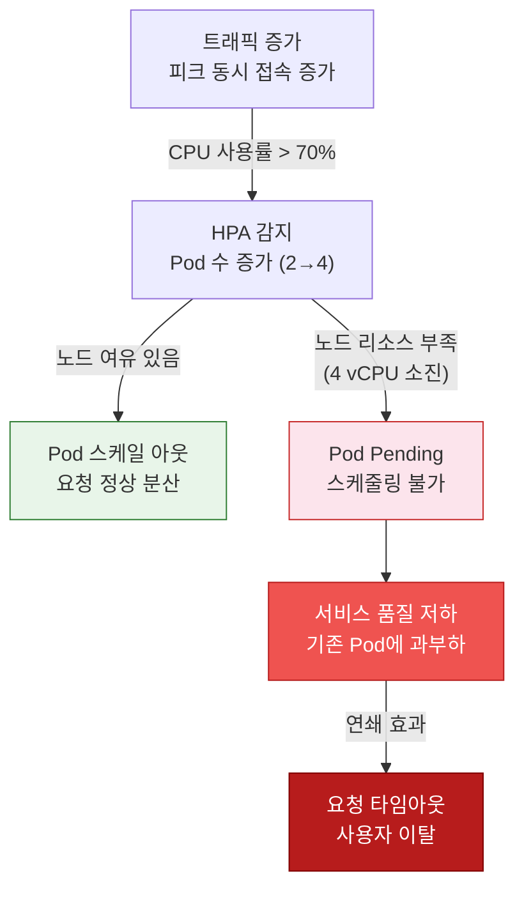

#### 3.2.2 RDS 단일 인스턴스 병목

| 지표 | Dev | Staging | Prod | 한계 |
| --- | --- | --- | --- | --- |
| 인스턴스 | db.t3.micro | db.t3.micro | db.t3.medium | vCPU 2, RAM 4GB |
| 최대 커넥션 (추정) | ~60 | ~60 | ~120 | `max_connections` = RAM 의존 |
| 스토리지 (gp3) | 20 GB 고정 | 20~100 GB | 50~200 GB | 자동 확장 |
| IOPS (gp3 기본) | 3,000 | 3,000 | 3,000 | 프로비저닝 가능 |

**K8s의 DB 커넥션 관리 장점**: Lambda 환경에서는 인스턴스마다 독립적인 커넥션 풀을 생성하여 폭발 위험이 있었습니다. K8s에서는 Pod 수가 HPA로 제어되므로 커넥션 수를 예측할 수 있습니다.

```text
K8s Pod 수 × 풀 최대 크기 = 예측 가능한 DB 커넥션 수
     4     ×    50 (max) =     200 (RDS t3.medium 한도 내)
     4     ×    10 (기본)=      40 (여유 충분)
```

**Stage 2 이상 병목**: 읽기 요청이 80%를 차지하므로, 단일 RDS 인스턴스의 CPU가 FULLTEXT 검색(ngram)과 대량 SELECT로 포화됩니다. Read Replica 도입 시점입니다.

#### 3.2.3 hostPath 스토리지 단일 장애점

K8s 데이터 계층(MySQL StatefulSet, Redis, Prometheus)은 hostPath PV를 사용합니다. 해당 노드 장애 시 데이터 접근이 불가합니다.

| 데이터 | 스토리지 | 백업 | 복구 방법 | 데이터 손실 |
| --- | --- | --- | --- | --- |
| K8s MySQL | hostPath PV | CronJob → S3 | S3에서 복원 | 최대 24시간 |
| Redis | hostPath PV | 없음 (휘발성) | 재시작 시 빈 상태 | 허용 가능 |
| Prometheus | hostPath PV | 없음 | 메트릭 재수집 | 이력 손실 |
| etcd | Master 로컬 | **미설정** | **복구 불가** | **클러스터 손실** |

> **etcd 백업 미설정은 가장 심각한 위험 요소입니다.** Master 노드 장애 시 K8s 클러스터 전체를 재생성해야 합니다.

#### 3.2.4 단일 AZ 배치

현재 K8s 노드는 모두 `ap-northeast-2b`에 배치되어 있습니다. `c7i-flex.large`가 `ap-northeast-2a`를 지원하지 않기 때문입니다. AZ 장애 시 전체 K8s 클러스터가 영향을 받습니다.

### 3.3 장애 전파 구조

#### 시나리오 1: RDS Primary 장애

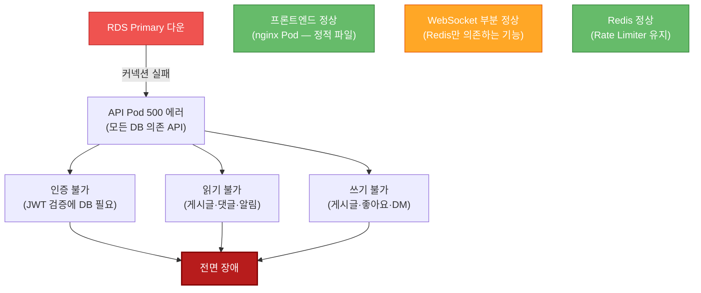

| 항목 | 값 |
| --- | --- |
| **영향 범위** | 전면 장애 — 모든 API가 DB에 의존 |
| **복구 (Prod)** | Multi-AZ 자동 페일오버 60~120초 |
| **복구 (Dev/Staging)** | 수동 복구 — 자동 백업에서 새 인스턴스 생성 (수 시간) |
| **감지** | API Pod 500 에러율 급증 → Prometheus 알림 |

#### 시나리오 2: Worker 노드 1대 장애

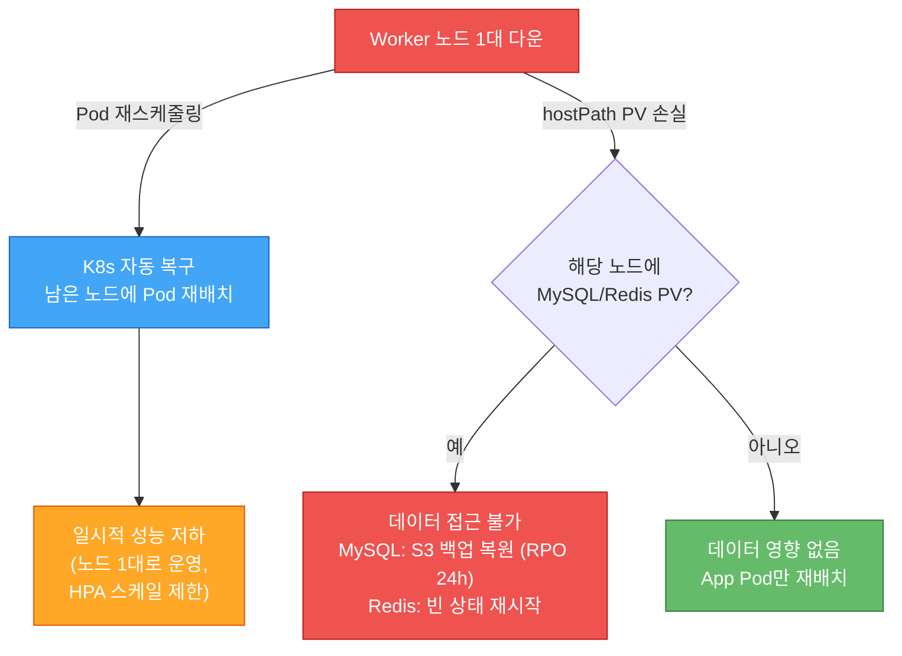

| 항목 | 값 |
| --- | --- |
| **영향 범위** | 부분 장애 — K8s가 Pod를 남은 노드에 자동 재배치 |
| **RTO** | ~30초 (Pod 재스케줄링) |
| **위험** | hostPath PV가 해당 노드에 바인딩된 경우 데이터 손실 |

#### 시나리오 3: AZ 장애 (ap-northeast-2b 전체)

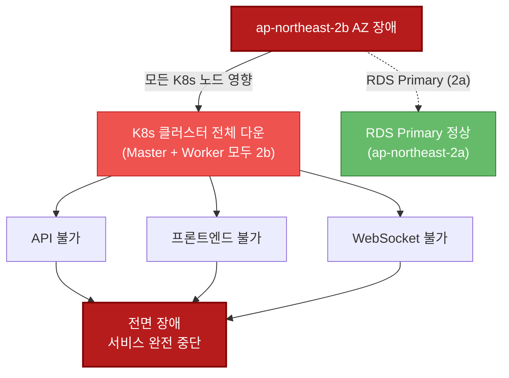

| 항목 | 값 |
| --- | --- |
| **영향 범위** | K8s 전면 장애 — RDS만 다른 AZ에서 생존 |
| **RTO** | 수 시간 (다른 AZ에서 K8s 재구성 필요) |
| **근본 원인** | c7i-flex.large가 ap-northeast-2a 미지원 → 단일 AZ 강제 |
| **완화** | 인스턴스 타입 변경(c6i.large 등) 후 멀티 AZ 배치 |

#### 시나리오 4: 트래픽 급증 (Stage 2 전환기)

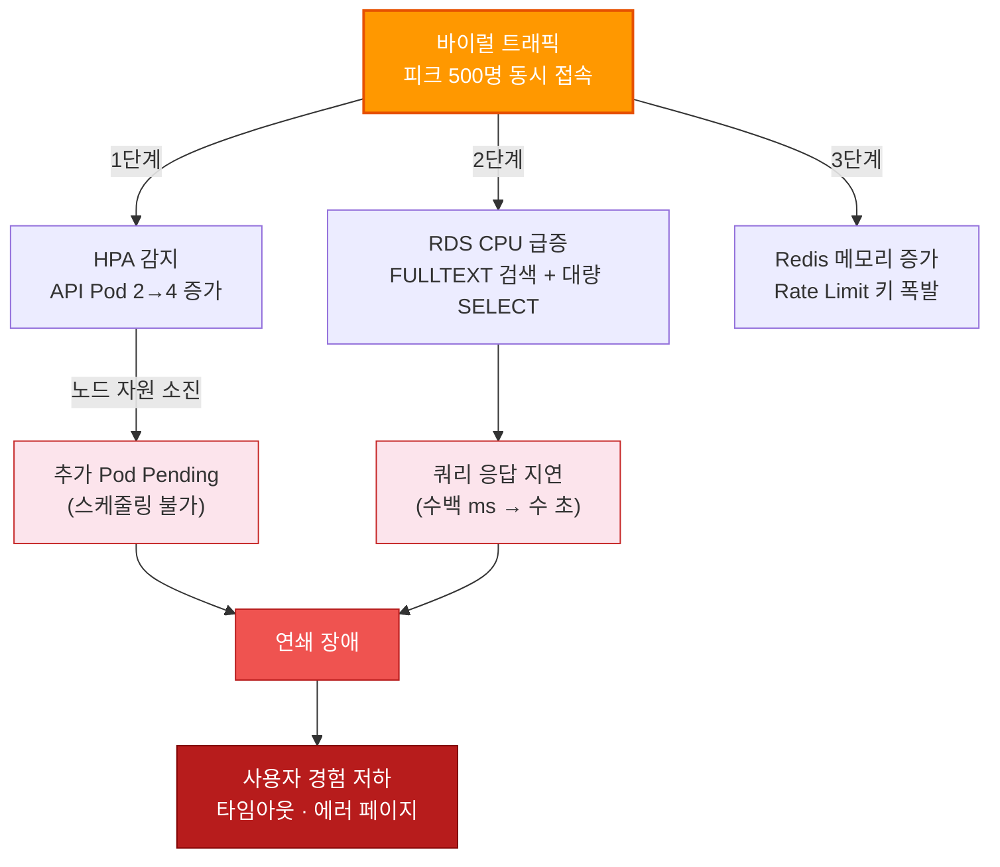

| 병목 지점 | 현재 한도 | 포화 시점 | 완화 방안 |
| --- | --- | --- | --- |
| Worker 노드 CPU | 4 vCPU (2대) | Stage 2 (~500 동시) | Worker 노드 추가 또는 Cluster Autoscaler |
| RDS CPU | 2 vCPU (t3.medium) | Stage 2 | Read Replica 도입 |
| RDS 커넥션 | ~120 (t3.medium) | Stage 2 (Pod 증가 시) | 인스턴스 스케일 업 |
| Redis 메모리 | ~256 MB (기본) | Stage 3 | maxmemory-policy 설정, 스케일 업 |

---

## 4. 고가용성 구현 방안

### 4.1 현재 구현 상태 (As-Is)

#### 환경별 HA 설정 비교

| 항목 | Dev | Staging | Prod |
| --- | --- | --- | --- |
| **K8s 토폴로지** | 3대 (1M + 2W) | **6대 (3M + 2W + HAProxy)** | **6대 (3M + 2W + HAProxy)** |
| **API 서버 HA** | 단일 Master 직접 접근 | **HAProxy L4 LB → 3 Master** | **HAProxy L4 LB → 3 Master** |
| **API Pod HA** | HPA min 2 / max 4 | HPA min 2 / max 4 | HPA min 2 / max 4 |
| **가용 영역** | 단일 AZ (2b) | 단일 AZ (2b) | **멀티 AZ 검토 중** |
| **NAT Gateway** | 1개 | 1개 | 2개 (AZ당 1개) |
| **RDS 인스턴스** | db.t3.micro | db.t3.micro | db.t3.medium |
| **RDS Multi-AZ** | 비활성화 | 비활성화 | **활성화** |
| **RDS 백업 보존** | 1일 | 1일 | **14일** |
| **RDS 삭제 보호** | 비활성화 | 비활성화 | **활성화** |
| **MySQL 백업 (CronJob)** | S3 일일 백업 | S3 일일 백업 | S3 일일 백업 |
| **HPA** | CPU 70% 기준 | CPU 70% 기준 | CPU 70% 기준 |
| **S3 내구성** | 99.999999999% | 99.999999999% | 99.999999999% |
| **모니터링** | Prometheus + Grafana | Prometheus + Grafana | Prometheus + Grafana |
| **CloudTrail 보존** | 30일 | 60일 | **90일** |
| **ECR 이미지 보존** | 3개 | 10개 | **20개** |

#### 이미 적용된 HA 요소

1. **K8s Pod 자동 복구**: 노드 장애 시 Pod를 남은 노드에 자동 재스케줄링
2. **HPA 자동 스케일링**: CPU 70% 기준 API Pod 2~4개 자동 조절
3. **Prod RDS Multi-AZ**: Primary 장애 시 Standby 자동 페일오버 (60~120초)
4. **MySQL S3 백업**: CronJob으로 일일 mysqldump → S3 업로드
5. **S3 99.999999999% 내구성**: 업로드 파일·백업 영구 보존
6. **Prometheus 모니터링**: ServiceMonitor 자동 메트릭 수집 + Grafana 시각화
7. **Terraform State 보호**: S3 버전 관리 + DynamoDB 동시 수정 잠금
8. **롤링 업데이트**: 새 Pod Ready → 기존 Pod 종료 (무중단 배포)
9. **HA 컨트롤 플레인 설계 완료** (Staging/Prod): Master 3대 + HAProxy L4 LB. Terraform `master_count`/`haproxy_enabled` 변수로 환경별 전환. Kustomize overlay로 환경 분기. Free Tier 제약으로 배포 보류 중

#### 서버리스 대비 K8s의 HA 변화

| 항목 | 서버리스 (이전) | K8s (현재) | 평가 |
| --- | --- | --- | --- |
| 콜드 스타트 | 3~10초 | 없음 | **개선** |
| DB 커넥션 관리 | 폭발 위험 (Lambda별 풀) | 예측 가능 (Pod 수 제어) | **개선** |
| 자동 스케일링 범위 | 무제한 (Lambda) | 노드 리소스 한도 | 제약 |
| 관리형 HA | AWS 관리 (Lambda, API GW) | 자체 관리 (kubeadm) | 트레이드오프 |
| AZ 분산 | Lambda ENI 자동 분산 | 단일 AZ (현재) | **약화** |
| 데이터 백업 | EFS 3-AZ 자동 복제 | hostPath + S3 CronJob | **약화** |

### 4.2 가용 영역 분산 전략

#### 현재 상태 (Dev — 배포 완료)

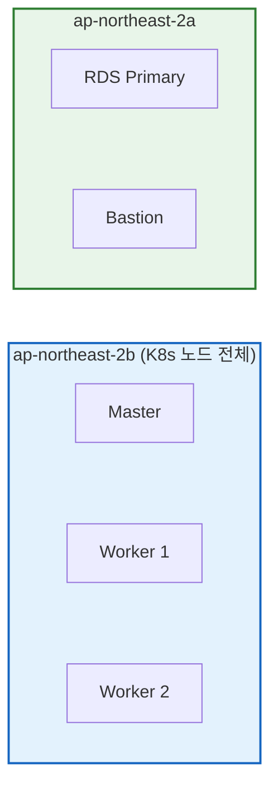

**약점**: K8s 노드 전체가 단일 AZ에 배치 — AZ 장애 시 전면 중단.

#### 설계 완료 (Staging/Prod HA — 배포 보류)

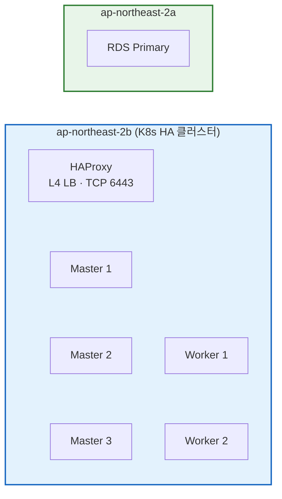

> **배포 보류 사유**: AWS Free Tier EIP 한도(리전당 5개) 초과. HA 클러스터에 EIP 4개 추가 필요 → 계정 업그레이드 또는 Service Quotas 상향 후 배포 가능.

#### 개선안: 멀티 AZ K8s 배치

| 항목 | 현재 (단일 AZ) | 개선 (멀티 AZ) | 비고 |
| --- | --- | --- | --- |
| K8s Worker | 2대 (2b) | 2대 (2a + 2b 분산) | 인스턴스 타입 변경 필요 |
| AZ 장애 영향 | 전면 장애 | 1대 Worker 유지 (성능 저하) | 가용성 확보 |
| 비용 | 동일 | 동일 | 인스턴스 수 불변 |

**제약**: `c7i-flex.large`가 `ap-northeast-2a` 미지원. `c6i.large` 등으로 변경 필요.

### 4.3 Auto Scaling 및 Load Balancer 활용 방안

#### 4.3.1 현재 Auto Scaling (HPA)

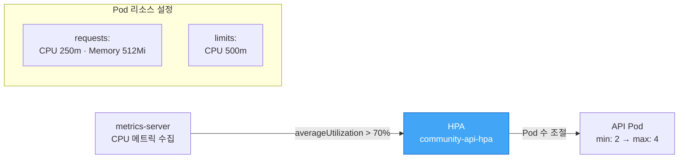

**현재 한계**: HPA는 Pod 수만 조절하며, 노드 수는 고정(2대)입니다. Pod max 4에 도달하거나 노드 리소스가 소진되면 더 이상 스케일링할 수 없습니다.

#### 4.3.2 개선안: Cluster Autoscaler

Cluster Autoscaler를 도입하면 Pod Pending 상태를 감지하여 자동으로 Worker 노드를 추가합니다.

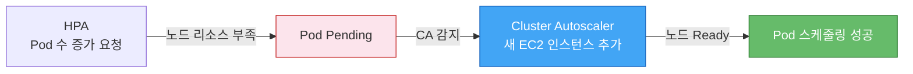

| 항목 | 현재 | CA 도입 후 |
| --- | --- | --- |
| 노드 수 | 2대 (고정) | 2~5대 (동적) |
| Pod Pending 대응 | 수동 노드 추가 | 자동 감지 + 노드 추가 |
| 스케일 다운 | 수동 | 부하 감소 시 자동 노드 제거 |
| 비용 | 고정 ~$106/월 | 부하 비례 ~$106~$265/월 |

#### 4.3.3 Load Balancer 계층

| 계층 | 현재 | 목적 |
| --- | --- | --- |
| **L7 (HTTP)** | nginx Ingress Controller (hostNetwork DaemonSet) | HTTPS 종단, 경로 기반 라우팅 |
| **L4 (TCP)** | HAProxy (Staging/Prod) | K8s API 서버 로드밸런싱 (TCP 6443) |
| **DNS** | Route 53 (A 레코드 → Worker IP) | 도메인 → K8s Worker 매핑 |

**외부 LB 미사용 이유**: hostNetwork DaemonSet으로 Ingress Controller가 노드 IP에 직접 바인딩됩니다. 별도의 AWS ALB/NLB 없이도 트래픽을 수신할 수 있어 비용을 절감합니다.

**개선안 (Stage 2 이상)**: AWS NLB를 도입하면 멀티 AZ 트래픽 분산과 헬스 체크 기반 자동 장애 감지가 가능합니다.

#### 4.3.4 RDS Read Replica + 읽기 분리

| 작업 유형 | 비율 (추정) | 대상 |
| --- | --- | --- |
| 읽기 (GET) | ~80% | 게시글 목록, 상세, 댓글, 알림 |
| 쓰기 (POST/PUT/DELETE) | ~20% | 게시글 작성, 댓글, 좋아요, 북마크 |

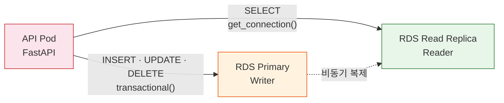

**비용 영향**: `db.t3.medium` Read Replica 추가 시 월 ~$49. 읽기 부하의 80%를 분산하여 Primary의 CPU 사용률을 대폭 절감합니다.

### 4.4 데이터 이중화 및 백업 전략

#### 4.4.1 데이터 계층별 백업 현황

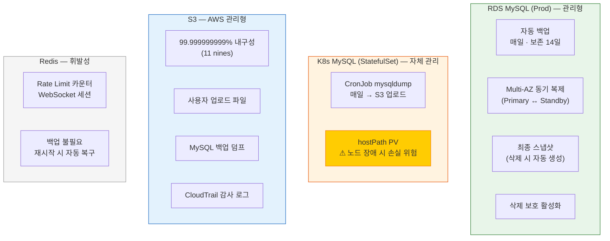

#### 4.4.2 백업 전략 상세

| 데이터 | 백업 방식 | RPO | 보존 기간 | 저장 위치 |
| --- | --- | --- | --- | --- |
| RDS (Prod) | AWS 자동 백업 + Multi-AZ 동기 복제 | ~0 | 14일 | AWS 관리 |
| RDS (Dev/Staging) | AWS 자동 백업 | 최대 24시간 | 1일 | AWS 관리 |
| K8s MySQL | CronJob mysqldump (일일) | 최대 24시간 | S3 lifecycle | S3 |
| 사용자 업로드 | S3 직접 저장 (실시간) | 0 | 무기한 | S3 |
| Terraform State | S3 버전 관리 + DynamoDB 잠금 | 0 | 무기한 | S3 |
| CloudTrail 로그 | AWS 자동 수집 | 0 | 30~90일 (환경별) | S3 |

#### 4.4.3 개선 권장사항

| 항목 | 현재 | 개선안 | 우선순위 | 비용 |
| --- | --- | --- | --- | --- |
| K8s MySQL 스토리지 | hostPath PV | EBS CSI Driver + PVC | **높음** | EBS 비용만 |
| **etcd 백업** | **미설정** | CronJob etcd snapshot → S3 | **높음** | 0 |
| 멀티 AZ 노드 | 단일 AZ | 인스턴스 타입 변경 후 분산 | 중간 | 0 (같은 수) |
| RDS 크로스리전 백업 | 미설정 | 크로스리전 스냅샷 복사 | 낮음 | 스냅샷 용량 |

### 4.5 장애 복구 전략 (RTO/RPO)

#### 4.5.1 컴포넌트별 RTO/RPO 매트릭스

| 컴포넌트 | RPO (데이터 손실 허용) | RTO (복구 시간 목표) | 복구 방법 |
| --- | --- | --- | --- |
| **K8s API Pod** | 0 (Stateless) | **~30초** | K8s 자동 재스케줄링 |
| **K8s Ingress** | 0 | ~30초 | DaemonSet 자동 재배치 |
| **RDS (Prod)** | ~0 (동기 복제) | **60~120초** | Multi-AZ 자동 페일오버 |
| **RDS (Dev/Staging)** | **최대 24시간** | **수 시간** | 자동 백업에서 수동 복원 |
| **K8s MySQL** | **최대 24시간** | **수십 분** | S3 백업에서 복원 |
| **Redis** | 전체 (휘발성) | ~10초 | Pod 재시작 (빈 상태 허용) |
| **S3** | 0 (11 nines) | ~0 | AWS 관리형 자동 복구 |
| **프론트엔드** | 0 (ECR 이미지) | ~5분 | `kubectl rollout restart` |
| **etcd** | **전체 (백업 없음)** | **수 시간~일** | **클러스터 재생성** |

#### 4.5.2 주요 장애 복구 절차

##### RDS 장애 복구 (Prod — Multi-AZ 자동 페일오버)

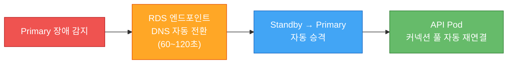

- **RTO**: 60~120초 (DNS 전환 시간)
- **RPO**: ~0 (동기 복제)
- **애플리케이션 영향**: 전환 중 DB 커넥션 에러 → aiomysql 풀이 자동 재연결

##### K8s 배포 롤백

```bash
# 이전 버전으로 즉시 롤백
kubectl -n app rollout undo deployment/community-api

# 특정 리비전으로 롤백
kubectl -n app rollout undo deployment/community-api --to-revision=3

# 롤아웃 상태 확인
kubectl -n app rollout status deployment/community-api
```

- **RTO**: ~30초 (Pod 재생성)
- **RPO**: 0 (Stateless)

##### K8s MySQL 복원

```bash
# S3에서 최신 백업 다운로드
aws s3 cp s3://my-community-dev-uploads/mysql-backups/latest.sql.gz ./

# MySQL Pod에 복원
gunzip latest.sql.gz
kubectl -n data exec -i mysql-0 -- mysql -u root -p < latest.sql
```

- **RTO**: 수십 분 (백업 크기 의존)
- **RPO**: 최대 24시간 (일일 백업 주기)

#### 4.5.3 모니터링 → 알림 → 대응 플로우

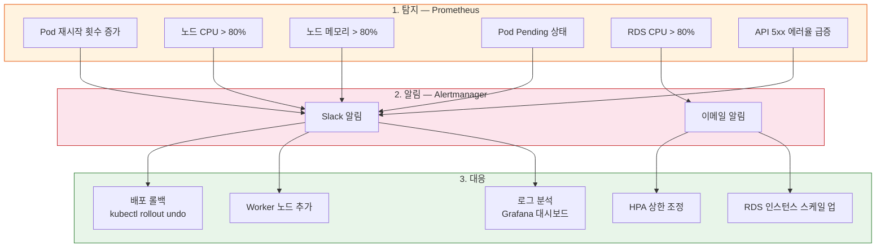

---

## 5. 결론 및 개선 로드맵

### 5.1 현재 아키텍처의 강점

| 강점 | 설명 |
| --- | --- |
| **통일 아키텍처** | 모든 환경이 동일 K8s 기반 + Kustomize overlay — "works in dev" = "works in prod" |
| **콜드 스타트 제거** | Lambda 3~10초 콜드 스타트 완전 해소, 일관된 응답 시간 |
| **예측 가능한 DB 커넥션** | HPA로 Pod 수 제어 → 커넥션 풀 폭발 위험 제거 |
| **IaC 완전 관리** | Terraform 활성 12개 모듈 + K8s 매니페스트로 전체 인프라 코드화 (레거시 9개는 `_legacy/` 보존) |
| **보안 계층화** | VPC 격리, NetworkPolicy, OIDC 배포, 동적 SSH SG 관리 |
| **K8s 네이티브 모니터링** | Prometheus + Grafana + ServiceMonitor 자동 메트릭 수집 |
| **무중단 배포** | 롤링 업데이트 + 즉시 롤백 (`kubectl rollout undo`) |

### 5.2 현재 아키텍처의 약점과 위험도

| 약점 | 영향 | 위험 시점 | 심각도 |
| --- | --- | --- | --- |
| **etcd 백업 미설정** | Master 장애 시 클러스터 복구 불가 | 즉시 (Master 장애 시) | **Critical** |
| **단일 AZ 배치** | AZ 장애 시 전면 중단 | 즉시 (AZ 장애 시) | **High** |
| **hostPath PV 데이터 손실** | 노드 장애 시 MySQL/Prometheus 유실 | 즉시 (노드 장애 시) | **High** |
| **Alertmanager 미설정** | 장애 인지 지연 (Grafana 수동 확인만) | 즉시 (야간 장애 시) | **Medium** |
| kubeadm 자체 관리 부담 | 버전 업그레이드, 인증서 갱신 수동 | K8s 버전 EOL 시 | Medium |
| Worker 2대 고정 | Stage 2 이상에서 리소스 부족 | DAU 3,000+ | Medium |

### 5.3 개선 로드맵

#### 즉시 (비용 0~$5/월)

| 항목 | 작업 | 효과 |
| --- | --- | --- |
| **etcd 백업** | CronJob → S3 스냅샷 | Master 장애 시 클러스터 복구 가능 |
| **Alertmanager 설정** | Slack/이메일 알림 연동 | 장애 즉시 인지 |
| **Pod Disruption Budget** | API/WS Pod PDB 설정 | 유지보수 시 최소 가용성 보장 |

#### 단기 — Stage 1 (DAU 300)

| 항목 | 작업 | 효과 | 비용 |
| --- | --- | --- | --- |
| **EBS CSI Driver** | hostPath → EBS PVC | 노드 장애 시 데이터 보존 | EBS 용량만 |
| **멀티 AZ 노드** | 인스턴스 타입 변경 (c6i.large) | AZ 장애 내성 확보 | 0 (같은 수) |
| **HA 배포** | Staging/Prod 코드 활성화 | 컨트롤 플레인 이중화 | EIP 비용 |

#### 중기 — Stage 2 (DAU 3,000, 월 ~$100 추가)

| 항목 | 작업 | 효과 | 비용 |
| --- | --- | --- | --- |
| Worker 노드 추가 | 3~4대 | Pod 스케줄링 여유 확보 | ~$53/대·월 |
| Redis Sentinel | Redis HA 구성 | Redis 단일 장애점 제거 | 0 (Pod 추가) |
| RDS Read Replica | 읽기 전용 복제본 | 읽기 부하 80% 분산 | ~$49/월 |
| CDN 도입 | CloudFront → FE Pod 캐싱 | 정적 파일 응답 속도 개선 | ~$10/월 |

#### 장기 — Stage 3 (DAU 30,000)

| 항목 | 작업 | 효과 |
| --- | --- | --- |
| **EKS 마이그레이션** | kubeadm → EKS | 관리형 컨트롤 플레인, 자동 업그레이드 |
| **Cluster Autoscaler** | 노드 자동 스케일링 | Pod Pending 자동 해소 |
| **Aurora Serverless v2** | RDS → Aurora | 자동 스케일링, 최대 128 ACU |
| **Elasticsearch** | MySQL FULLTEXT → ES | 한국어 검색 성능 대폭 개선 |

---

> **요약**: kubeadm K8s 전환으로 콜드 스타트 제거, DB 커넥션 안정화, 통일된 배포 파이프라인을 확보했습니다. Staging/Prod HA 아키텍처(Master 3대 + HAProxy)는 코드 완료 상태이며, Free Tier 제약 해소 후 즉시 배포 가능합니다. 현재 **가장 시급한 개선 과제는 etcd 백업, Alertmanager 설정, EBS CSI Driver 도입**이며, 모두 비용 0으로 달성 가능합니다. 성장 단계에 따라 HA 배포 → 멀티 AZ → Read Replica → EKS 순서로 점진적 확장이 가능합니다.
