# 리눅스 커뮤니티 "Camp Linux" — 인프라 아키텍처 및 안정성 설계 보고서

> **작성일**: 2026-03-19
> **프로젝트**: AWS AI School 2기 개인 프로젝트
> **도메인**: my-community.shop
> **리전**: ap-northeast-2 (서울)

---

## 목차

1. [프로젝트 개요](#1-프로젝트-개요)
2. [시스템 아키텍처 설계도](#2-시스템-아키텍처-설계도)
3. [예상 트래픽 기반 장애 시나리오](#3-예상-트래픽-기반-장애-시나리오)
4. [고가용성 구현 방안](#4-고가용성-구현-방안)
5. [결론 및 개선 로드맵](#5-결론-및-개선-로드맵)

---

## 1. 프로젝트 개요

### 1.1 서비스 소개

"Camp Linux"는 리눅스 사용자 간 배포판 정보 공유, 질문/답변, 프로젝트 협업을 위한 종합 리눅스 커뮤니티입니다. 게시판, 위키, 패키지 리뷰, 실시간 메시지 등 커뮤니티 핵심 기능을 제공합니다.

본 보고서는 이 서비스의 **인프라 아키텍처 설계, 예상 트래픽 기반 장애 시나리오 분석, 고가용성 구현 방안**을 다룹니다. 실제 서비스 운영을 가정하여 다음 관점에서 작성되었습니다.

- **가용성**: 단일 장애점을 제거하고, 장애 시에도 서비스를 유지할 수 있는가?
- **확장성**: 트래픽 증가에 따라 인프라가 자동으로 대응할 수 있는가?
- **복구 가능성**: 장애 발생 시 데이터 손실 없이 신속하게 복구할 수 있는가?
- **비용 효율성**: 현재 규모에 맞는 적정 비용으로 운영되고 있는가?

### 1.2 기술 스택

| 계층 | 기술 | 선택 근거 | 운영 고려사항 |
| --- | --- | --- | --- |
| **프론트엔드** | Vanilla JS MPA (Vite, 26개 페이지) | 프레임워크 없이 JS 기본기 학습 | nginx Pod으로 정적 배포, 2 replica AZ 분산 |
| **백엔드** | FastAPI (Python 3.11+, aiomysql, 103개 API) | 비동기 I/O, 자동 API 문서화 | HPA 자동 스케일링, AZ 간 topology spread |
| **데이터베이스** | MySQL 8.0.44 (RDS Multi-AZ, 31개 테이블) | FULLTEXT 검색(ngram), 트랜잭션 격리 | 관리형 자동 페일오버, 14일 백업 보존 |
| **인증** | JWT (Access 30분 + Refresh 7일) | Stateless 인증, XSS 방어 | 토큰 저장소 DB 의존, CronJob 주기적 정리 |
| **인프라** | AWS (Terraform 12개 모듈) + EKS (Prod) / kubeadm (Dev) | IaC 재현성, 관리형 컨트롤 플레인 (Prod) | Prod: EKS Managed Node Group, Dev: kubeadm 1M+2W |
| **CI/CD** | GitHub Actions + OIDC + ArgoCD | 장기 자격 증명 없는 배포, GitOps | ArgoCD App-of-Apps, 자동 sync (dev), 수동 sync (prod) |
| **모니터링** | Prometheus + Grafana + Alertmanager (kube-prometheus-stack) | K8s 네이티브 메트릭 수집 | ServiceMonitor 자동 수집, Alertmanager → Slack 알림 활성화 |
| **파일 스토리지** | S3 (STORAGE_BACKEND=s3) | 99.999999999% 내구성, AZ 비종속 | PVC 제거로 Pod AZ 분산 제약 해소, 버전 관리 활성화 |

### 1.3 아키텍처 전환 이력

서비스 출시 이후 두 차례의 아키텍처 전환을 거쳤습니다. 각 전환은 운영 안정성과 학습 목표를 동시에 달성하기 위한 설계 판단이었습니다.

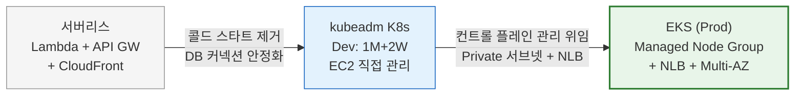

| 항목 | 서버리스 (Phase 1) | kubeadm (Phase 2, Dev) | EKS (Phase 3, Prod) |
| --- | --- | --- | --- |
| 컨트롤 플레인 | AWS 관리 (Lambda) | 자체 관리 (Master EC2) | **AWS 관리 (EKS)** |
| Worker 노드 | 없음 (Lambda) | 퍼블릭 서브넷 EC2 | **프라이빗 서브넷 (Managed Node Group)** |
| 네트워크 진입 | CloudFront + API GW | hostNetwork Ingress (노드 IP 직접 노출) | **NLB → Ingress-NGINX (노드 비노출)** |
| AZ 분산 | Lambda ENI 자동 분산 | 단일 AZ (c7i-flex.large 제약) | **멀티 AZ (2a + 2b) Pod 분산** |
| 콜드 스타트 | 3~10초 (VPC ENI + SSM) | 없음 | 없음 |
| DB 커넥션 | Lambda별 독립 풀 (폭발 위험) | Pod 수 제어 (예측 가능) | Pod 수 제어 (예측 가능) |
| etcd 관리 | 해당 없음 | **자체 관리 (백업 미설정)** | AWS 관리 (EKS) |
| 파일 스토리지 | EFS 마운트 | S3 (PVC 제거) | **S3 (PVC 없음, AZ 무관)** |

### 1.4 서비스 특성과 인프라 요구사항

| 서비스 특성 | 인프라 요구사항 | 핵심 대응 |
| --- | --- | --- |
| **읽기 중심 워크로드** (~80%) | DB 읽기 부하 분산 | RDS Read Replica 고려, Redis 캐싱 가능 |
| **이미지 업로드** (게시글당 최대 5장) | 파일 저장소 내구성 + AZ 비종속 | S3 (99.999999999% 내구성, PVC 제거) |
| **FULLTEXT 검색** (한국어 ngram) | DB CPU 부하 | MySQL FULLTEXT INDEX, 대규모 시 Elasticsearch 고려 |
| **실시간 알림** (WebSocket) | 연결 관리, 상태 공유 | Redis Pub/Sub, 폴링 자동 폴백 |
| **인증 토큰 관리** | 토큰 정합성, 브루트포스 방어 | DB 행 잠금, Redis Rate Limiter |
| **동시 쓰기** (좋아요·북마크·댓글) | 경쟁 상태 방지 | UNIQUE 제약, READ COMMITTED 격리 |
| **DM 쪽지** (1:1 비공개 메시지) | soft delete, 차단 연동 | WebSocket 실시간 전달 + 폴링 폴백 |
| **위키** (커뮤니티 지식 베이스) | 슬러그 기반 URL, 태그 필터 | 전용 테이블 + FULLTEXT 검색 |
| **패키지 리뷰** (1~5점 평점 + 리뷰) | 1인 1리뷰 제약, 평균 평점 집계 | UNIQUE 제약, AVG 집계 쿼리 |
| **추천 피드** (개인화 정렬) | 사용자 행동 기반 점수 계산 | user_post_score 테이블, CronJob 재계산 |
| **소셜 로그인** (GitHub OAuth) | OAuth 프로바이더 연동 | social_account 테이블, 팩토리 패턴 |

---

## 2. 시스템 아키텍처 설계도

### 2.1 전체 구성도 (Prod — EKS)

사용자 요청은 Route53 → NLB → Ingress-NGINX를 거쳐 EKS 프라이빗 서브넷의 Pod에 도달합니다. kubeadm 환경(Dev)과 달리, 노드 IP가 인터넷에 노출되지 않으며 NLB가 L4 수준 헬스 체크와 AZ 간 로드밸런싱을 수행합니다.

```mermaid
flowchart TD
    Browser["브라우저<br/>Vanilla JS MPA"]

    subgraph DNS["DNS · 인증서"]
        direction LR
        R53["Route 53<br/>my-community.shop"]
        CertMgr["cert-manager<br/>Let's Encrypt 자동 갱신"]
    end

    Browser -- "HTTPS" --> R53

    subgraph AWS_Edge["AWS 네트워크 엣지"]
        NLB["NLB (Internet-facing)<br/>AZ 2a + 2b 교차 배치<br/>L4 TCP 전달"]
    end

    R53 -->|"A 레코드 (Alias)"| NLB

    subgraph EKS["EKS Cluster v1.31 (Private Subnets · 2 AZ)"]
        Ingress["Ingress-NGINX<br/>TLS 종단 · 경로 라우팅"]

        subgraph AppNS["app namespace"]
            FE["Frontend Pod ×2<br/>nginx · AZ 2a + 2b"]
            API["API Pod ×2~4<br/>FastAPI + Uvicorn<br/>HPA (CPU 70%)<br/>AZ 2a + 2b"]
            WS["WS Pod ×2<br/>WebSocket Server<br/>AZ 분산 (soft)"]
            CronJobs["CronJobs<br/>토큰 정리 (1시간)<br/>피드 재계산 (30분)<br/>ECR 토큰 갱신 (6시간)"]
            PDB["PDB ×3<br/>minAvailable: 1"]
        end

        subgraph DataNS["data namespace"]
            RedisPod["Redis<br/>Rate Limiter · WS Pub/Sub"]
        end

        subgraph MonNS["monitoring namespace"]
            Prom["Prometheus + Grafana<br/>kube-prometheus-stack"]
            AlertMgr["Alertmanager<br/>→ Slack #infra-alerts"]
            Metrics["metrics-server<br/>HPA 메트릭"]
        end

        subgraph ArgoNS["argocd namespace"]
            ArgoCD["ArgoCD<br/>App-of-Apps · GitHub SSO"]
        end

        Ingress --> FE
        Ingress --> API
        Ingress --> WS
        Ingress -->|"argocd.my-community.shop"| ArgoCD
        API --> RedisPod
        WS --> RedisPod
    end

    NLB --> Ingress

    subgraph AWS_Managed["AWS 관리형 서비스"]
        RDS["RDS MySQL 8.0.44<br/>Multi-AZ · 동기 복제<br/>db.t3.medium"]
        S3["S3<br/>업로드 · 감사 로그"]
        ECR["ECR<br/>컨테이너 이미지"]
        SES["SES<br/>이메일 발송"]
        CT["CloudTrail<br/>멀티리전 · 90일"]
    end

    API -- "TCP 3306" --> RDS
    API -- "STORAGE_BACKEND=s3" --> S3
    API -- "SMTP" --> SES
    ECR -.->|"이미지 Pull"| EKS

    subgraph Deploy["GitOps CD"]
        GHA["GitHub Actions<br/>OIDC 인증"]
        InfraRepo["Infra Repo<br/>kustomization.yaml<br/>newTag: sha-XXXX"]
    end

    GHA -- "Docker Push" --> ECR
    GHA -- "kustomize edit set image" --> InfraRepo
    InfraRepo -- "webhook → sync" --> ArgoCD
    ArgoCD -- "kubectl apply" --> AppNS

    style EKS fill:#e8f5e9,stroke:#2e7d32,stroke-width:2px
    style AWS_Managed fill:#e3f2fd,stroke:#1565c0
    style AWS_Edge fill:#fff3e0,stroke:#e65100
    style Deploy fill:#eceff1,stroke:#455a64
```

#### 컴포넌트별 설계 근거

| 컴포넌트 | 역할 | 설계 근거 |
| --- | --- | --- |
| **NLB** | L4 로드밸런싱, AZ 간 트래픽 분산 | kubeadm의 hostNetwork DaemonSet 대비 노드 IP 비노출, AWS 관리형 HA |
| **Ingress-NGINX** | HTTPS 종단, 경로 기반 라우팅 | cert-manager + Let's Encrypt로 TLS 자동 갱신, NLB 뒤에서 L7 처리 |
| **EKS 컨트롤 플레인** | K8s API 서버, etcd, 스케줄러 | AWS 관리형이므로 etcd 백업·업그레이드·패치 자동 처리 (kubeadm 대비 운영 부담 제거) |
| **Managed Node Group** | Worker 노드 생명주기 관리 | ASG 연동 + Cluster Autoscaler 자동 확장 (min 2 / max 4), 롤링 업데이트 지원, 프라이빗 서브넷 배치로 보안 강화 |
| **API Pod (HPA)** | FastAPI 앱, CPU 70% 기준 2~4개 자동 조절 | Topology Spread로 AZ 간 균등 배치, PDB로 유지보수 시 최소 가용성 보장 |
| **WS Pod** | WebSocket 실시간 알림 | Redis Pub/Sub로 Pod 간 이벤트 브로드캐스트, 2 replica로 단일 장애점 제거 |
| **FE Pod** | nginx 정적 파일 서빙 | 2 replica AZ 분산, CDN 없이 직접 서빙 (현재 규모에 적합) |
| **RDS Multi-AZ** | AWS 관리형 MySQL | 동기 복제로 RPO ~0, 자동 페일오버 60~120초, 14일 백업, 삭제 보호 |
| **S3** | 파일 업로드 (PVC 대체) | 99.999999999% 내구성, AZ 비종속으로 Pod 스케줄링 제약 없음, 버전 관리 활성화로 실수 삭제 복구 가능 |
| **ArgoCD** | GitOps CD, App-of-Apps 패턴 | Git을 단일 진실 공급원으로 사용, SSH 접근 불필요 |

### 2.2 네트워크 토폴로지 (Prod)

EKS Prod 환경에서 Worker 노드는 프라이빗 서브넷에 배치됩니다. kubeadm Dev 환경과 달리 노드가 인터넷에 직접 노출되지 않으며, NLB가 퍼블릭 서브넷에서 트래픽을 수신하여 프라이빗 서브넷의 Ingress-NGINX로 전달합니다.

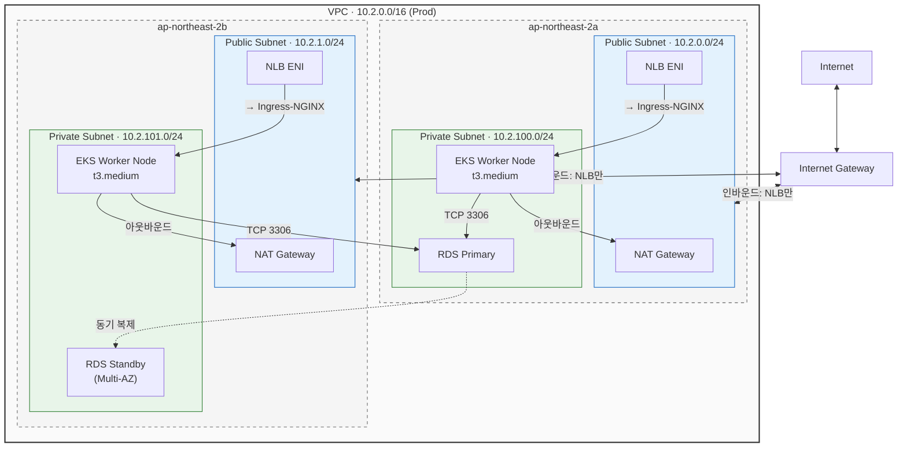

#### kubeadm(Dev) vs EKS(Prod) 네트워크 설계 비교

| 항목 | kubeadm (Dev) | EKS (Prod) | 변경 근거 |
| --- | --- | --- | --- |
| Worker 서브넷 | 퍼블릭 (노드 IP 노출) | **프라이빗** (인터넷 비노출) | 보안 강화: 공격 표면 최소화 |
| 트래픽 진입 | hostNetwork DaemonSet (노드 IP 직접) | **NLB → Ingress-NGINX** | AWS 관리형 HA, 헬스 체크 자동화 |
| NAT Gateway | 1개 (단일 AZ) | **2개 (AZ당 1개)** | AZ 장애 시 아웃바운드 유지 |
| 노드 AZ | 단일 AZ (2b) | **멀티 AZ (2a + 2b)** | AZ 장애 내성 확보 |
| DNS 매핑 | A 레코드 → Worker EIP | **A 레코드 (Alias) → NLB** | 노드 교체 시 DNS 변경 불필요 |

#### 보안 그룹 트래픽 흐름

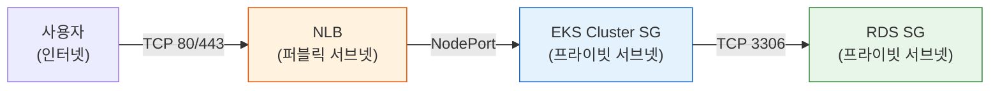

**설계 근거**:

- EKS Cluster SG는 AWS가 자동 생성하며, 노드 ↔ 컨트롤 플레인 간 통신을 관리합니다. kubeadm의 자기 참조(self-referencing) Internal SG와 달리 AWS가 규칙을 자동으로 구성합니다.
- RDS SG는 **EKS Cluster SG**에서만 인바운드를 허용합니다 (`rds_from_eks` 접착 리소스). kubeadm 환경의 k8s-worker SG 기반 접근과 구분됩니다.
- Worker 노드가 프라이빗 서브넷에 있으므로 SSH SG가 불필요합니다. SSM이나 `kubectl exec`으로 접근합니다.

### 2.3 Pod 토폴로지 설계

Pod AZ 분산은 단순히 "여러 노드에 뿌리면 되는" 문제가 아닙니다. **스토리지 바인딩, 안티어피니티, Topology Spread 제약이 서로 상충할 수 있으며**, 이 세 가지를 동시에 만족시키는 설계가 필요합니다.

#### PVC가 AZ 분산을 차단한 사례

S3 스토리지 전환 이전, API Pod는 `local-storage` PV 기반 uploads PVC를 마운트하고 있었습니다. `local-storage`는 nodeAffinity로 특정 노드에 바인딩되므로, Topology Spread Constraint가 `DoNotSchedule`이어도 PVC 바인딩이 우선하여 모든 API Pod가 동일 노드(동일 AZ)에 집중되었습니다.

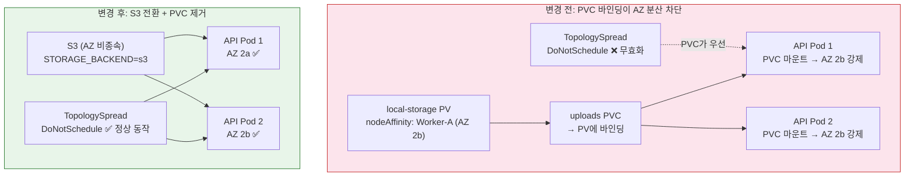

이 사례에서 얻은 교훈: **K8s에서 스토리지 설계는 스케줄링 설계와 분리할 수 없습니다.** PVC가 nodeAffinity를 가진 PV에 바인딩되면, 그 위에 어떤 Topology Spread를 설정해도 의미가 없습니다.

#### 현재 Pod 배치 상태

| Deployment | Replicas | Topology Spread | Anti-Affinity | PDB | 실제 AZ 분포 |
| --- | --- | --- | --- | --- | --- |
| **community-api** | 2 (HPA 2~4) | `DoNotSchedule` (zone) | Preferred (hostname) | minAvailable: 1 | **AZ 2a + 2b** |
| **community-fe** | 2 | `DoNotSchedule` (zone) | Preferred (hostname) | minAvailable: 1 | **AZ 2a + 2b** |
| **community-ws** | 2 | `DoNotSchedule` (zone) | Preferred (hostname) | minAvailable: 1 | AZ 2b (soft preference) |
| **redis** | 1 | — | — | — | 단일 Pod |

**WS Pod의 AZ 편중**: WS의 TopologySpread는 `DoNotSchedule`이지만, 현재 2 replica이므로 maxSkew=1을 충족하면 양쪽 AZ에 분배됩니다. 다만 노드 리소스 상황에 따라 한쪽에 집중될 수 있습니다. API/FE와 달리 WS는 WebSocket 연결 상태를 Redis Pub/Sub로 공유하므로, AZ 편중의 영향은 제한적입니다.

#### PDB 설계 근거

PDB(PodDisruptionBudget)는 자발적 중단(노드 drain, 롤링 업데이트) 시 최소 가용 Pod 수를 보장합니다. 3개 Deployment 모두 `minAvailable: 1`로 설정한 이유는 다음과 같습니다.

- 2 replica 환경에서 `minAvailable: 1`은 1개 Pod의 자발적 중단을 허용하되, 최소 1개는 반드시 서비스를 유지합니다.
- `minAvailable: 2`로 설정하면 노드 drain이 차단되어 EKS 노드 업그레이드가 불가능해집니다.
- `maxUnavailable: 1`도 동일한 효과이지만, `minAvailable`이 의도를 더 명확히 표현합니다.

### 2.4 리소스 할당 설계

| Pod | CPU Request | CPU Limit | Memory Request | Memory Limit | 설계 근거 |
| --- | --- | --- | --- | --- | --- |
| **API** | 250m | 500m | 512Mi | 1Gi | 비동기 I/O 기반이므로 CPU 비중 낮음, aiomysql 커넥션 풀 메모리 고려 |
| **FE** | 50m | 100m | 64Mi | 128Mi | 정적 파일 서빙, 리소스 최소화 |
| **WS** | 100m | 250m | 256Mi | 512Mi | WebSocket 연결 유지 메모리 + Redis Pub/Sub |

**현재 리소스 사용률**: Node CPU ~5%, Node Memory ~55%. 현재 트래픽 대비 충분한 여유가 있으며, HPA가 트리거되지 않는 수준입니다. t3.medium(2 vCPU, 4GB) × 2노드 기준으로 현재 Pod 리소스 합계는 약 850m CPU, 1.5GB Memory 수준입니다.

### 2.5 CI/CD 배포 흐름 (ArgoCD GitOps)

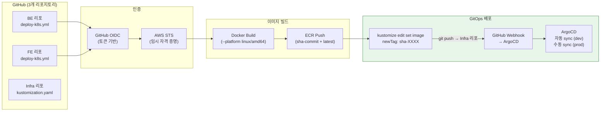

**설계 근거**:

- **OIDC 인증**: 장기 자격 증명(AWS Access Key) 없이 임시 토큰으로 AWS 인증. 자격 증명 유출 위험을 제거합니다.
- **GitOps (ArgoCD)**: Git을 단일 진실 공급원(Single Source of Truth)으로 사용. 배포 이력이 Git 커밋으로 자동 기록되며, `git revert`로 즉시 롤백이 가능합니다.
- **App-of-Apps 패턴**: root-app이 환경별 Application CRD를 관리. dev는 자동 sync, prod는 수동 sync로 배포 안전성을 확보합니다.
- **Prod sync 수동 제한 이유**: 자동 sync는 Git push 즉시 프로덕션에 반영되므로, 검증되지 않은 변경이 즉시 서비스에 영향을 줄 위험이 있습니다.

---

## 3. 예상 트래픽 기반 장애 시나리오

### 3.1 트래픽 가정

#### 현재 규모 (학교 커뮤니티)

| 지표 | 추정치 | 근거 |
| --- | --- | --- |
| 등록 사용자 | ~100명 | AWS AI School 수강생 규모 |
| 일일 활성 사용자(DAU) | ~30명 | 수강생의 30% 일일 접속 가정 |
| 피크 동시 접속 | ~10명 | 수업 후 시간대 집중 |
| 일일 게시글 | ~20건 | 학습 공유, 질문 |
| 일일 API 요청 | ~3,000건 | DAU × 평균 100 요청 |

#### 성장 시나리오

| 단계 | DAU | 피크 동시 접속 | 일일 API 요청 | 트리거 이벤트 |
| --- | --- | --- | --- | --- |
| **현재** | 30 | 10 | 3,000 | — |
| **Stage 1** | 300 | 50 | 30,000 | 교육 기관 확대 |
| **Stage 2** | 3,000 | 500 | 300,000 | 외부 공개 |
| **Stage 3** | 30,000 | 5,000 | 3,000,000 | 바이럴 성장 |

### 3.2 병목 지점 분석

#### 3.2.1 EKS 노드 리소스 한계

| 지표 | 현재 설정 | 한계 |
| --- | --- | --- |
| Worker 노드 | t3.medium × 2 (2 vCPU, 4 GB 각) | 총 4 vCPU, 8 GB |
| API Pod (HPA) | min 2 → max 4 (CPU 250m~500m) | 4 Pod × 500m = 2 vCPU (이론적 한도) |
| ASG 설정 | min 2, max 4 | **Cluster Autoscaler 설치 완료** |

**자동 노드 확장**: Cluster Autoscaler가 설치되어 HPA가 Pod를 확장할 때 노드 리소스가 부족하면 ASG를 통해 자동으로 노드를 추가합니다. IRSA(IAM Roles for Service Accounts)로 IAM 권한을 관리하며, ASG autodiscovery로 노드 그룹을 자동 감지합니다. 스케일 다운 쿨다운은 10분으로 설정되어 불필요한 노드 진동을 방지합니다.

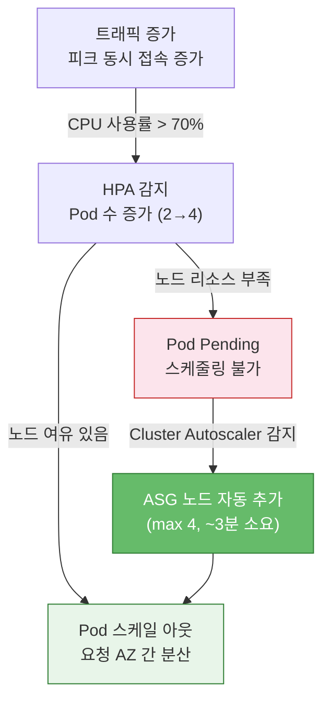

#### 3.2.2 RDS 단일 인스턴스 병목

| 지표 | Dev | Staging | Prod | 한계 |
| --- | --- | --- | --- | --- |
| 인스턴스 | db.t3.micro | db.t3.micro | db.t3.medium | vCPU 2, RAM 4GB |
| 최대 커넥션 (추정) | ~60 | ~60 | ~120 | `max_connections` = RAM 의존 |
| 스토리지 (gp3) | 20 GB 고정 | 20~100 GB | 50~200 GB | 자동 확장 |
| IOPS (gp3 기본) | 3,000 | 3,000 | 3,000 | 프로비저닝 가능 |
| Multi-AZ | 비활성화 | 비활성화 | **활성화** | 자동 페일오버 |

**K8s의 DB 커넥션 관리 장점**: Lambda 환경에서는 인스턴스마다 독립적인 커넥션 풀을 생성하여 폭발 위험이 있었습니다. EKS에서는 HPA로 Pod 수가 제어되므로 커넥션 수를 예측할 수 있습니다.

```text
EKS Pod 수 × 풀 크기 = 예측 가능한 DB 커넥션 수
    4     ×   10 (기본) =     40 (RDS t3.medium 한도 ~120의 33%)
```

**Stage 2 이상 병목**: 읽기 요청이 80%를 차지하므로, 단일 RDS 인스턴스의 CPU가 FULLTEXT 검색(ngram)과 대량 SELECT로 포화됩니다. Read Replica 도입 시점입니다.

#### 3.2.3 Redis 단일 Pod 장애점

Redis는 Rate Limiter와 WebSocket Pub/Sub를 담당합니다. 현재 단일 Pod로 운영되므로 Redis 장애 시 Rate Limiter가 무력화되고, WebSocket 멀티 Pod 브로드캐스트가 중단됩니다.

| 항목 | 현재 | 영향 |
| --- | --- | --- |
| Rate Limiter | Redis 키 기반 | 장애 시 무제한 요청 허용 (보안 위험) |
| WS Pub/Sub | Redis 채널 기반 | 장애 시 WS Pod 간 메시지 동기화 불가 |
| 세션 데이터 | 휘발성 | 재시작 시 전체 손실 (허용 가능) |

**완화**: Redis 장애 시에도 핵심 API(게시글 CRUD, 인증)는 RDS만으로 동작합니다. Rate Limiter 우회는 일시적이며, WS는 폴링 자동 폴백이 있습니다.

### 3.3 장애 전파 구조

#### 시나리오 1: RDS Primary 장애 (Prod — Multi-AZ 자동 페일오버)

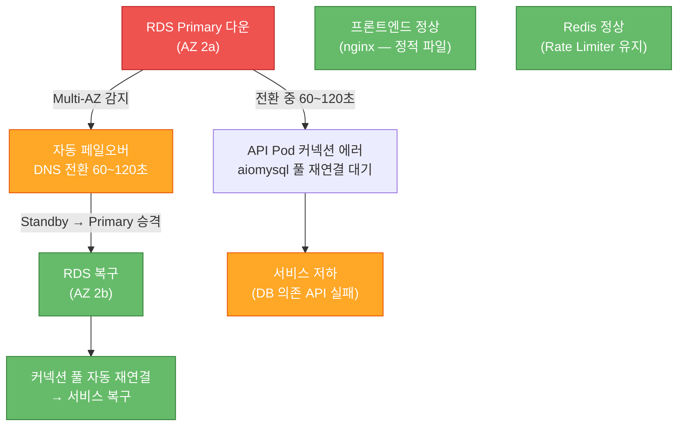

| 항목 | 값 |
| --- | --- |
| **영향 범위** | DB 의존 API 60~120초 장애 |
| **RPO** | ~0 (동기 복제) |
| **RTO** | 60~120초 (DNS 전환 + 커넥션 풀 재연결) |
| **자동 복구** | Multi-AZ 자동 페일오버 + aiomysql 풀 자동 재연결 |

#### 시나리오 2: 단일 Worker 노드 장애

kubeadm 환경에서는 API Pod가 한 노드에 집중되어 있어 해당 노드 장애 시 전면 중단이었습니다. EKS + Topology Spread 적용 후에는 **장애 즉시 다른 AZ의 Pod가 서비스를 유지**합니다.

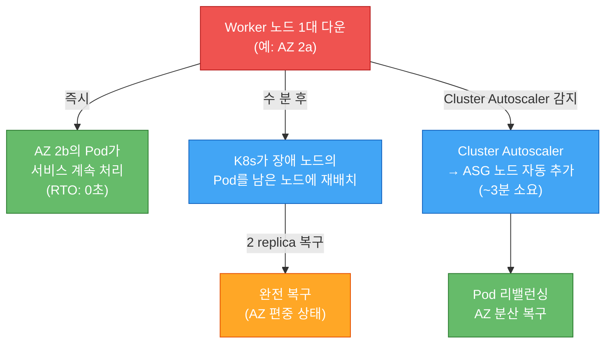

| 항목 | 변경 전 (단일 노드 집중) | 변경 후 (AZ 분산) |
| --- | --- | --- |
| **RTO** | 2~5분 (Pod 재스케줄링 대기) | **0초** (다른 AZ Pod 즉시 처리) |
| **RPO** | 0 (Stateless) | 0 (Stateless) |
| **서비스 영향** | 전면 중단 | 성능 저하만 (50% 용량) |
| **복구 방식** | K8s 재스케줄링 | 즉시 서비스 + Cluster Autoscaler 노드 자동 복구 |

#### 시나리오 3: AZ 장애 (ap-northeast-2a 전체)

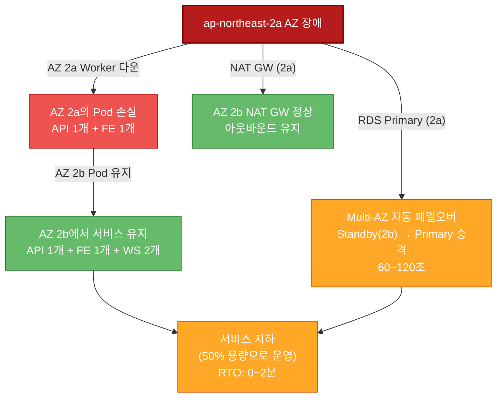

**AZ 장애 대응 비교 (kubeadm vs EKS)**:

| 항목 | kubeadm (Dev, 단일 AZ) | EKS (Prod, 멀티 AZ) |
| --- | --- | --- |
| K8s 컨트롤 플레인 | **전면 중단** (Master도 같은 AZ) | **정상** (AWS 관리, 멀티 AZ) |
| App Pod | 전면 중단 | **50% 용량으로 서비스 유지** |
| RDS | Primary 정상 (다른 AZ) | Multi-AZ 자동 페일오버 |
| NAT Gateway | 아웃바운드 중단 | AZ별 NAT로 아웃바운드 유지 |
| **RTO** | **수 시간** (AZ 복구 또는 재구성) | **0~2분** |

#### 시나리오 4: 트래픽 급증 (Stage 2 전환기)

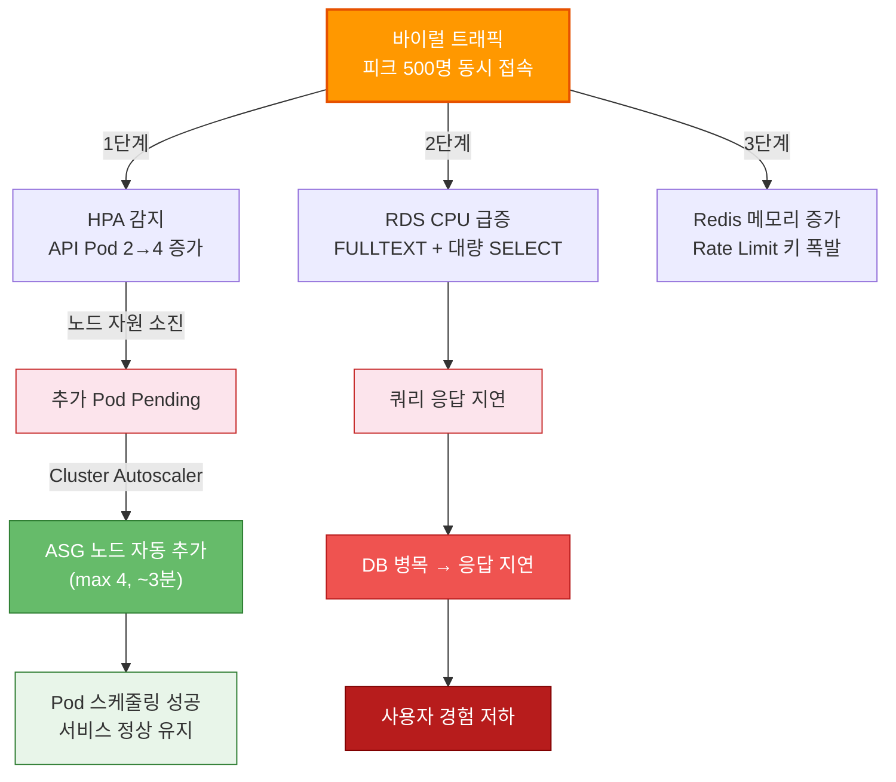

| 병목 지점 | 현재 한도 | 포화 시점 | 완화 방안 |
| --- | --- | --- | --- |
| Worker 노드 CPU | 4 vCPU (2대, CA로 max 4대 자동 확장) | Stage 2 (~500 동시) | Cluster Autoscaler 설치 완료 (ASG max 4 자동 활용) |
| RDS CPU | 2 vCPU (t3.medium) | Stage 2 | Read Replica 도입 |
| RDS 커넥션 | ~120 (t3.medium) | Stage 2 (Pod 증가 시) | 인스턴스 스케일 업 |
| Redis 메모리 | ~256 MB (기본) | Stage 3 | maxmemory-policy 설정, 스케일 업 |

---

## 4. 고가용성 구현 방안

### 4.1 현재 HA 구현 현황 (환경별)

| 항목 | Dev (kubeadm) | Prod (EKS) |
| --- | --- | --- |
| **컨트롤 플레인** | 단일 Master (자체 관리) | **AWS 관리 (멀티 AZ, 자동 복구)** |
| **Worker 노드** | 2대 (퍼블릭, 단일 AZ) | **2대 (프라이빗, 멀티 AZ 2a+2b)** |
| **트래픽 진입** | hostNetwork DaemonSet | **NLB (멀티 AZ, AWS 관리형 HA)** |
| **API Pod** | HPA 2~4, 단일 AZ | **HPA 2~4, AZ 분산 (TopologySpread)** |
| **FE Pod** | 1 replica | **2 replica, AZ 분산** |
| **WS Pod** | 1 replica | **2 replica, Anti-Affinity** |
| **PDB** | 미설정 | **3개 (API, FE, WS — minAvailable: 1)** |
| **NAT Gateway** | 1개 | **2개 (AZ당 1개)** |
| **RDS** | db.t3.micro, 단일 AZ | **db.t3.medium, Multi-AZ, 14일 백업** |
| **RDS 삭제 보호** | 비활성화 | **활성화** |
| **etcd 관리** | 자체 관리 **(백업 미설정)** | **AWS 관리 (자동)** |
| **파일 스토리지** | S3 (PVC 제거) | **S3 (PVC 없음)** |
| **모니터링** | Prometheus + Grafana | **Prometheus + Grafana + Alertmanager (Slack 알림)** |
| **ArgoCD sync** | 자동 | **수동** |
| **CloudTrail 보존** | 30일 | **90일** |
| **ECR 이미지 보존** | 3개 | **20개** |

### 4.2 AZ 분산 전략 — 설계 결정의 연쇄 관계

AZ 분산은 단일 설정으로 달성되지 않습니다. 다음 다이어그램은 현재 Prod 환경에서 AZ 분산을 실현하기 위해 필요했던 **연쇄적 설계 결정**을 보여줍니다.

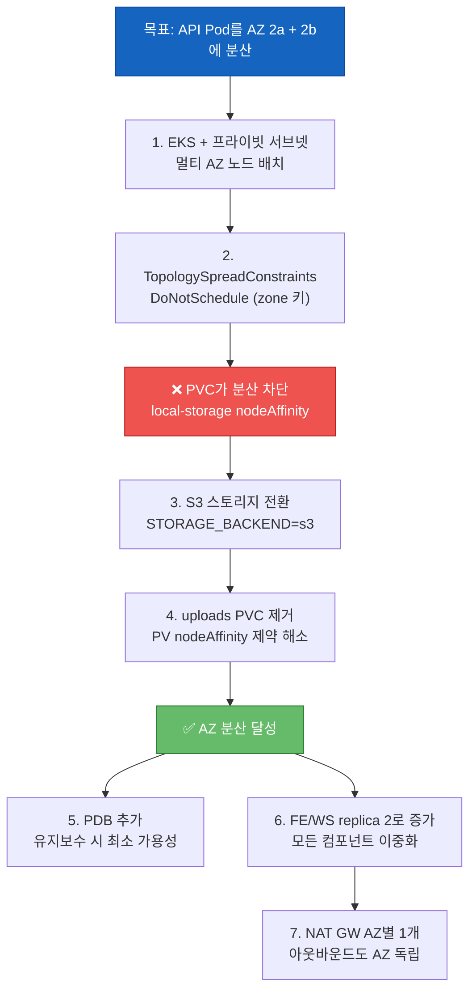

**교훈**: 고가용성은 단일 기능이 아니라 **인프라 계층 전체의 설계 정합성**에서 나옵니다. 스토리지(S3), 스케줄링(TopologySpread), 네트워크(NAT GW per AZ), 운영(PDB) 모두가 일관되게 AZ 분산을 지원해야 합니다.

### 4.3 Auto Scaling 현황과 한계

#### 현재 Auto Scaling 계층

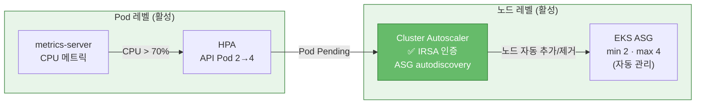

**2계층 Auto Scaling 완성**: HPA(Pod 수준)와 Cluster Autoscaler(노드 수준)가 모두 활성화되어, 트래픽 증가 시 Pod 확장 → 노드 자동 추가까지 완전 자동화되었습니다. Cluster Autoscaler는 IRSA(IAM Roles for Service Accounts)로 Terraform 관리 IAM Role을 사용하며, ASG autodiscovery로 노드 그룹을 자동 감지합니다. 스케일 다운 쿨다운은 10분으로 설정되어 빈번한 노드 추가/제거를 방지합니다.

| 항목 | 설정 |
| --- | --- |
| 노드 수 | 2~4대 (동적) |
| Pod Pending 대응 | Cluster Autoscaler 자동 감지 + 노드 추가 (~3분) |
| 스케일 다운 | 부하 감소 시 자동 노드 제거 (쿨다운 10분) |
| 비용 | 부하 비례 ~$70~$140/월 (t3.medium × 2~4) |
| IAM 인증 | IRSA (Terraform 관리 IAM Role) |

### 4.4 데이터 이중화 및 백업 전략

#### 데이터 계층별 현황

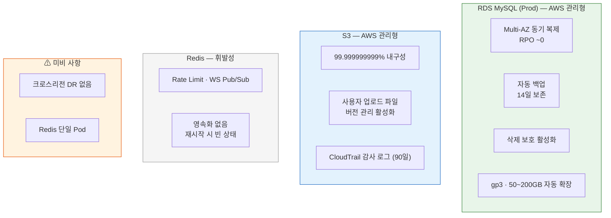

#### 백업 전략 상세

| 데이터 | 백업 방식 | RPO | 보존 기간 | 위치 |
| --- | --- | --- | --- | --- |
| **RDS (Prod)** | AWS 자동 백업 + Multi-AZ 동기 복제 | ~0 | 14일 | AWS 관리 |
| **RDS (Dev)** | AWS 자동 백업 | 최대 24시간 | 1일 | AWS 관리 |
| **사용자 업로드** | S3 직접 저장 (실시간) + 버전 관리 활성화 | 0 (실수 삭제 시 이전 버전 복구 가능) | 무기한 | S3 |
| **Terraform State** | S3 버전 관리 + DynamoDB 잠금 | 0 | 무기한 | S3 |
| **CloudTrail 로그** | AWS 자동 수집 (멀티리전) | 0 | 90일 (Prod) | S3 |
| **Redis** | 없음 (휘발성 데이터) | 전체 손실 | — | — |

### 4.5 장애 복구 전략 (RTO/RPO)

#### 컴포넌트별 RTO/RPO 매트릭스 (Prod 기준)

| 장애 유형 | RPO | RTO | 복구 메커니즘 | 자동/수동 |
| --- | --- | --- | --- | --- |
| **Pod crash** | 0 | ~30초 | K8s 자동 재시작 (liveness probe) | 자동 |
| **단일 노드 장애** | 0 | **0초** | 다른 AZ Pod가 즉시 처리 | 자동 |
| **RDS Primary 장애** | ~0 | 60~120초 | Multi-AZ 자동 페일오버 | 자동 |
| **단일 AZ 장애** | ~0 | 0~2분 | 다른 AZ Pod + RDS 페일오버 | 자동 |
| **NLB 장애** | 0 | 자동 | AWS 관리형 HA | 자동 |
| **Redis 장애** | 전체 손실 | ~30초 | K8s 자동 재시작 (빈 상태) | 자동 |
| **리전 장애** | 최대 24시간 | 수 시간 | **크로스리전 DR 없음** | 수동 |

#### 단일 노드 장애 RTO 개선 상세

이번 설계 변경에서 가장 큰 개선은 **단일 노드 장애 시 RTO가 2~5분에서 0초로 단축**된 것입니다.

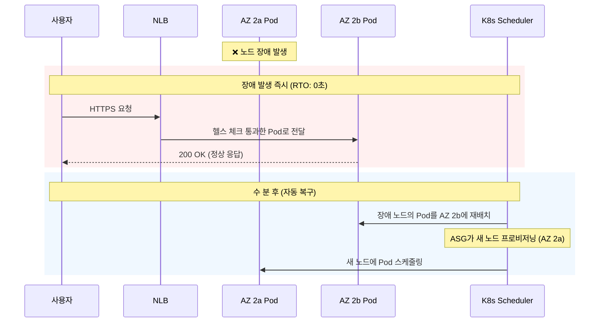

이 개선은 다음 변경의 **복합 효과**입니다:

1. **PVC 제거** → API Pod가 특정 노드에 바인딩되지 않음
2. **TopologySpread DoNotSchedule** → Pod가 반드시 다른 AZ에 분산
3. **NLB 헬스 체크** → 장애 노드를 자동으로 트래픽에서 제외
4. **PDB minAvailable: 1** → 유지보수 시에도 1개 Pod 보장

#### RDS 장애 복구 절차 (Prod — Multi-AZ 자동)

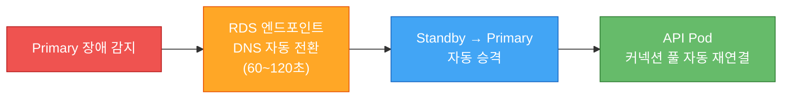

#### K8s 배포 롤백 (ArgoCD)

```bash
# ArgoCD를 통한 롤백: infra repo의 이전 커밋으로 revert
git revert HEAD  # 태그 커밋 되돌리기
git push origin main  # ArgoCD가 자동 감지 → 이전 이미지로 sync

# 긴급 수동 롤백 (ArgoCD 우회)
kubectl -n app rollout undo deployment/community-api
```

- **RTO**: ~30초 (Pod 재생성) — ArgoCD 경유 시 webhook 포함 ~1분
- **RPO**: 0 (Stateless)

#### 모니터링 → 알림 → 대응 플로우

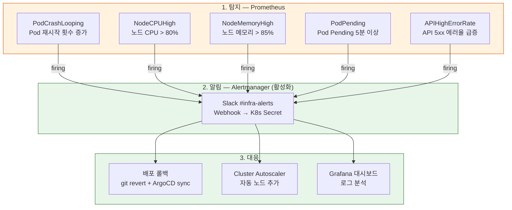

**Alertmanager 설정 완료**: Prometheus가 탐지한 이상 징후를 Alertmanager가 Slack `#infra-alerts` 채널로 즉시 전달합니다. 알림 규칙 5개(PodCrashLooping, PodPending, NodeCPUHigh, NodeMemoryHigh, APIHighErrorRate)가 정의되어 있으며, Slack webhook URL은 K8s Secret으로 관리됩니다. 알림 경로: Prometheus → Alertmanager → Slack.

---

## 5. 결론 및 개선 로드맵

### 5.1 현재 아키텍처의 강점

| 강점 | 설명 |
| --- | --- |
| **AZ 분산 완성** | TopologySpread + PVC 제거로 API·FE Pod가 2개 AZ에 분산. 단일 노드/AZ 장애 시 RTO 0초 |
| **2계층 Auto Scaling** | HPA(Pod) + Cluster Autoscaler(노드)로 트래픽 증가 시 Pod 확장 → 노드 자동 추가까지 완전 자동화 |
| **관리형 컨트롤 플레인** | EKS로 etcd 백업·업그레이드·패치 자동화. kubeadm 대비 운영 부담 대폭 감소 |
| **네트워크 보안 강화** | 프라이빗 서브넷 + NLB. 노드 IP 비노출, kubeadm의 퍼블릭 노드 대비 공격 표면 최소화 |
| **예측 가능한 DB 커넥션** | HPA로 Pod 수 제어 → 커넥션 풀 폭발 위험 제거 |
| **데이터 내구성** | RDS Multi-AZ (RPO ~0) + S3 (11 nines, 버전 관리 활성화) + 14일 자동 백업 |
| **장애 알림 자동화** | Alertmanager → Slack 알림 (5개 규칙), 야간 장애 즉시 인지 가능 |
| **GitOps CD** | ArgoCD App-of-Apps 패턴, OIDC 인증, Git revert 즉시 롤백 |
| **IaC 완전 관리** | Terraform 12개 모듈 + Kustomize overlay로 전체 인프라 코드화 |
| **PDB 보호** | 3개 Deployment에 PDB 적용, 유지보수 시 최소 가용성 보장 |

### 5.2 현재 아키텍처의 약점과 위험도

| 약점 | 영향 | 위험 시점 | 심각도 |
| --- | --- | --- | --- |
| ~~Alertmanager 미설정~~ | ✅ **해소** — Slack 알림 5개 규칙 활성화 | — | ~~Critical~~ |
| ~~Cluster Autoscaler 미설치~~ | ✅ **해소** — IRSA + ASG autodiscovery, min 2 / max 4 | — | ~~High~~ |
| ~~S3 버전 관리 미활성화~~ | ✅ **해소** — 업로드 버킷 버전 관리 활성화 | — | ~~Medium~~ |
| **Redis 단일 Pod** | Rate Limiter 무력화, WS 브로드캐스트 중단 | 즉시 (Redis 장애 시) | **Medium** |
| **K8s Secrets 수동 관리** | Secret 변경 시 수동 apply, 이력 관리 불가 | 운영 복잡도 증가 | **Medium** |
| **크로스리전 DR 없음** | 서울 리전 장애 시 전면 중단 | 리전 장애 시 | Low |

### 5.3 개선 로드맵

#### 즉시 (비용 0~$5/월) — ✅ 전항목 완료

| 항목 | 작업 | 효과 | 상태 |
| --- | --- | --- | --- |
| ✅ **Alertmanager 설정** | Slack 알림 규칙 5개 정의 (PodCrashLooping, PodPending, NodeCPUHigh, NodeMemoryHigh, APIHighErrorRate) | 장애 즉시 인지, 야간 대응 가능 | Critical → **해소** |
| ✅ **Cluster Autoscaler 설치** | IRSA + ASG autodiscovery, min 2 / max 4, 스케일 다운 쿨다운 10분 | Pod Pending 자동 해소 (ASG max 4 활용) | High → **해소** |
| ✅ **S3 버전 관리 활성화** | 업로드 버킷 versioning 활성화 (Terraform) | 실수 삭제 시 이전 버전 복구 가능 (RPO 0) | Medium → **해소** |

#### 단기 — Stage 1 (DAU 300, 월 ~$20 추가)

| 항목 | 작업 | 효과 | 비용 |
| --- | --- | --- | --- |
| **External Secrets Operator** | AWS Secrets Manager 연동 | Secret 자동 동기화, 이력 관리 | Secrets Manager 비용 |
| **Redis Sentinel** | Redis HA 구성 (3 Pod) | Redis 단일 장애점 제거 | 0 (Pod 추가) |

#### 중기 — Stage 2 (DAU 3,000, 월 ~$100 추가)

| 항목 | 작업 | 효과 | 비용 |
| --- | --- | --- | --- |
| **RDS Read Replica** | 읽기 전용 복제본 | 읽기 부하 80% 분산 | ~$49/월 |
| **CDN 도입** | CloudFront → FE Pod 캐싱 | 정적 파일 응답 속도 개선, FE Pod 부하 감소 | ~$10/월 |
| **ASG max 확장** | max 4 → max 6 | Stage 2 트래픽 대응 여유 | ~$70/대·월 |

#### 장기 — Stage 3 (DAU 30,000)

| 항목 | 작업 | 효과 |
| --- | --- | --- |
| **Aurora Serverless v2** | RDS → Aurora | 자동 스케일링, 최대 128 ACU |
| **Elasticsearch** | MySQL FULLTEXT → ES | 한국어 검색 성능 대폭 개선 |
| **크로스리전 DR** | S3 크로스리전 복제 + RDS 스냅샷 | 리전 장애 시 복구 가능 |
| **Karpenter** | Cluster Autoscaler 대체 | 더 빠른 노드 프로비저닝, 스팟 인스턴스 활용 |

---

> **요약**: kubeadm → EKS 전환과 Pod 토폴로지 재설계를 통해, 단일 노드 장애 시 RTO를 2~5분에서 **0초**로 단축했습니다. PVC 제거 → S3 전환 → TopologySpread 적용 → PDB 추가의 연쇄적 설계 결정이 이 결과를 만들었습니다. RDS Multi-AZ(RPO ~0, RTO 60~120초), NLB 멀티 AZ, NAT GW per AZ로 모든 계층에서 AZ 수준 장애 내성을 확보했습니다. "즉시" 우선순위 항목(Alertmanager 설정, Cluster Autoscaler 설치, S3 버전 관리 활성화)이 **전항목 완료**되어, 장애 알림 자동화(Slack), 노드 자동 확장(IRSA + ASG autodiscovery), 파일 삭제 복구(S3 versioning)가 모두 운영 상태입니다. **다음 개선 과제는 "단기" 항목인 External Secrets Operator(Secret 자동 동기화)와 Redis Sentinel(Redis 단일 장애점 제거)**입니다.
